# Existing Technology 2: Ground-Based InSAR (GB-InSAR)

> **Document Type:** Research & Benchmark Analysis  
> **Problem Statement ID:** SIH25071  
> **Problem Statement Title:** AI-Based Rockfall Prediction and Alert System for Open-Pit Mines  
> **Organization:** Ministry of Mines | **Category:** Software | **Theme:** Disaster Management  
> **Prepared For:** Smart India Hackathon (SIH 2025) Research & Development Documentation  
> **Target File:** `docs/02_Ground_Based_InSAR_GB_InSAR.md`

---

## Executive Summary

Ground-Based Interferometric Synthetic Aperture Radar (GB-InSAR) is an active terrestrial remote-sensing technology that provides continuous, wide-area, sub-millimeter surface displacement monitoring for open-pit highwalls, natural rock slopes, and critical mining infrastructure. Unlike point-based geotechnical sensors or narrow-beam real-aperture radars, GB-InSAR moves a radar sensor along a linear rail to synthesize a large antenna aperture, generating high-resolution 2D and 3D deformation heatmaps covering entire mine sectors.

This report delivers a rigorous technical evaluation of GB-InSAR as an **existing monitoring technology**. It dissects the physics of microwave interferometry, phase unwrapping, and time-series kinematics; benchmarks commercial and open-source implementations; evaluates operational and physical limitations; and formulates a concrete strategy for **adopting GB-InSAR principles into our multi-modal AI-driven rockfall prediction and alert platform for SIH25071**.

---

## 1. Introduction to GB-InSAR

### Definition and Core Concept
**GB-InSAR (Ground-Based Interferometric Synthetic Aperture Radar)** is an active radar remote sensing technique that uses repeated radar observations along a fixed ground track and interferometric phase analysis to estimate line-of-sight surface deformation with sub-millimeter precision.

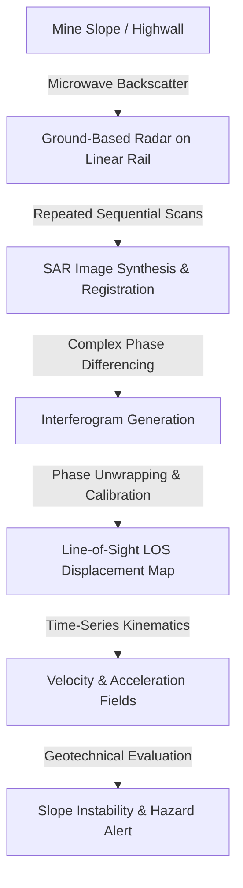
*Figure 1.1: High-level data transformation flow in a GB-InSAR monitoring workflow.*

### What Does "InSAR" Mean?
* **SAR (Synthetic Aperture Radar):** High spatial azimuth resolution normally requires a very large physical antenna dish. SAR overcomes this physical constraint by moving a small physical antenna along a baseline (such as a 2 to 3-meter linear motorized mechanical rail). By combining multiple radar signals transmitted and received along the trajectory, signal processing algorithms "synthesize" a virtual antenna aperture several meters long, yielding sharp spatial resolution.
* **Interferometry (In):** The practice of superimposing (interfering) two coherent electromagnetic wave acquisitions captured at different times ($t_1$ and $t_2$) to measure the optical path length difference through phase comparison.

### Why is GB-InSAR Useful for Open-Pit Mines?
1. **Full-Field Spatial Visibility:** Instead of tracking isolated points, GB-InSAR maps millions of square meters of steep, inaccessible highwalls from a safe stand-off distance across the pit (from 50 m up to 4 km).
2. **Sub-Millimeter Sensitivity:** Capable of detecting microscopic pre-failure dilation ($\pm 0.1\text{ mm}$ under high coherence), providing earliest detection of primary and secondary rock creep.
3. **Continuous 24/7 Operation:** Operates independently of ambient daylight and penetrates light rain, dust, and haze far more effectively than optical cameras.

### Distinguishing GB-InSAR from Satellite InSAR and Conventional Radar / SSR

| Parameter | Satellite InSAR (e.g., Sentinel-1, TerraSAR-X) | Conventional Radar / SSR (Real-Aperture Radar) | Ground-Based InSAR (GB-InSAR) |
| :--- | :--- | :--- | :--- |
| **Platform** | Spaceborne satellite constellation orbiting at ~700 km altitude. | Terrestrial mobile trailer with rotating physical dish antenna. | Terrestrial stationary base with a radar head translating along a linear rail. |
| **Temporal Revisit** | 6 to 12 days between satellite passes. | 1 to 5 minutes per scanning sector. | 2 to 10 minutes per synthetic aperture rail scan. |
| **Operational Role** | Macro regional subsidence, historical baseline, and tailing dam auditing. | Tactical, fast-response bench failure early warning. | High-resolution wide-area highwall deformation mapping and creep monitoring. |
| **Life-Safety Suitability**| **Unsuitable for emergency alerts** due to multi-day latency. | **High** for localized target benches. | **High** for pit-wide slope stability and progressive failure tracking. |

---

## 2. Basic Working Principle

The GB-InSAR operational lifecycle follows a sequential physical and algorithmic pipeline from microwave illumination to actionable hazard alerting:

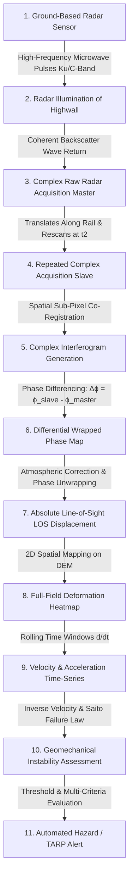
*Figure 2.1: End-to-end processing pipeline of Ground-Based InSAR for slope stability assessment.*

### Step-by-Step Explanation:
1. **Radar Illumination:** The sensor emits frequency-modulated continuous-wave (FMCW) or pulsed microwaves toward the open-pit rock face.
2. **Synthetic Aperture Motion:** The radar head moves smoothly along a high-precision linear mechanical rail, transmitting and receiving signals at regular spatial increments.
3. **Master & Slave Acquisitions:** An initial scan at time $t_1$ establishes the "Master" image. A subsequent scan at time $t_2$ establishes the "Slave" image.
4. **Interferogram Generation:** The complex conjugate multiplication of the Master and Slave images creates an interferogram, isolating the phase change for every pixel.
5. **Phase Correction & Unwrapping:** Atmospheric variations and phase ambiguities (modulo $2\pi$) are corrected to produce continuous displacement fields.
6. **Kinematic & Geotechnical Assessment:** Derivatives yield surface velocity and acceleration, feeding failure-forecasting models.

---

## 3. What is Interferometry?

### Conceptual Explanation for Engineering Students
Radar waves are sinusoidal electromagnetic waves characterized by **Amplitude** (wave height / signal strength) and **Phase** (the exact point along the wave's cycle, between $0^\circ$ and $360^\circ$ or $0$ to $2\pi$ radians).

```
Wave Cycle:
   Peak (+)       Peak (+)
     /\             /\
    /  \           /  \
---/----\---------/----\--- Baseline
         \  /           \  /
          \/             \/
       Trough (-)     Trough (-)
   |<- 1 Wavelength (λ) ->|
```

When a radar signal travels to a rock wall at distance $R$ and returns, it completes a huge number of full wave cycles plus a fractional cycle remaining at the end. That fractional cycle is the **Phase ($\phi$)**.

```text
Observation 1 (Time t1):
Radar ══════════════════════════════════════════════> Rock Wall [Distance R1]
Return Wave Phase: ϕ1 = 120°

Observation 2 (Time t2 - Rock moved closer by 2 mm):
Radar ════════════════════════════════════════> Rock Wall [Distance R2 < R1]
Return Wave Phase: ϕ2 = 75°

Phase Difference: Δϕ = ϕ2 - ϕ1 = -45°
             ↓
Directly converts to metric Line-of-Sight Displacement (dLUS = -2.1 mm)
```

Because the microwave wavelength $\lambda$ is very small (e.g., $17.4\text{ mm}$ for Ku-band), a tiny fraction of a phase shift corresponds to **fractions of a millimeter** of physical ground motion.

---

## 4. Important Mathematical Concept

### The Phase-Displacement Relationship
The fundamental geometric and interferometric relationship governing GB-InSAR line-of-sight displacement is:

$$d_{\text{LOS}} = \frac{\lambda \cdot \Delta \phi_{\text{def}}}{4\pi}$$

Where:
* $d_{\text{LOS}}$ = Surface displacement along the radar's Line of Sight ($\text{mm}$).
* $\lambda$ = Radar carrier wavelength ($\text{mm}$) — e.g., $\lambda \approx 17.4\text{ mm}$ at $17.2\text{ GHz}$ (Ku-band), or $\lambda \approx 31.5\text{ mm}$ at $9.5\text{ GHz}$ (X-band).
* $\Delta \phi_{\text{def}}$ = Phase shift strictly caused by physical rock mass deformation ($\text{radians}$).
* The factor $4\pi$ represents the round-trip signal propagation ($2 \times 2\pi$ radians per full wavelength round-trip).

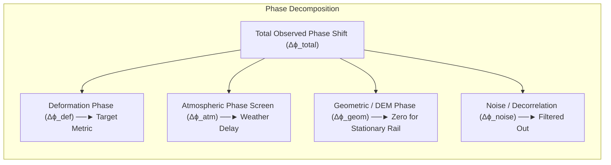
*Figure 4.1: Decomposition of raw interferometric phase components.*

### Practical Processing Caveats
In practical mine environments, the total observed phase difference is a composite:
$$\Delta \phi_{\text{total}} = \Delta \phi_{\text{def}} + \Delta \phi_{\text{atm}} + \Delta \phi_{\text{geom}} + \Delta \phi_{\text{noise}} + 2k\pi$$

1. **Atmospheric Correction ($\Delta \phi_{\text{atm}}$):** Fluctuations in air temperature, humidity, and barometric pressure alter the refractive index of air, causing false phase shifts. Advanced GB-InSAR algorithms estimate this using Permanent Scatterers (PS) on known stable ground.
2. **Phase Unwrapping ($2k\pi$ Ambiguity):** Radar phase is measured modulo $2\pi$ (wrapped between $-\pi$ and $+\pi$). If the rock moves by more than $\lambda/4$ (~4.4 mm in Ku-band) between consecutive scans, the wave cycle repeats, requiring 2D spatial-temporal unwrapping algorithms (such as Goldstein or Minimum Cost Flow) to recover true continuous displacement.

---

## 5. Why GB-InSAR Is Useful for Mines

GB-InSAR provides critical safety monitoring across multiple geotechnical zones in open-cast operations:

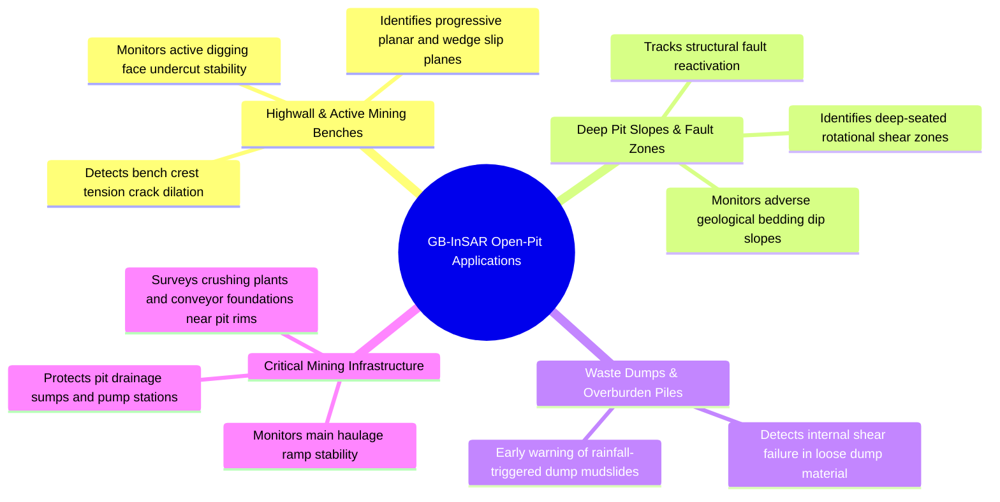
*Figure 5.1: Geotechnical monitoring domains of GB-InSAR across open-pit mine operations.*

---

## 6. Spatial Deformation Mapping

A primary advantage of GB-InSAR is its capability to generate dense **spatial deformation heatmaps** rather than single-point time series. Every radar resolution cell (e.g., $0.5\text{m} \times 0.5\text{m}$) across the highwall provides an independent displacement vector.

### Conceptual Mine Wall Spatial Risk Grid

```text
+---------------------------------------------------------------+
|                    OPEN-PIT HIGHWALL SECTOR C-4               |
+---------------------------------------------------------------+
| [Crest]   🟢 Stable   🟢 Stable   🟡 Creep    🟡 Creep   🟢 Stable |
| [Bench 1] 🟢 Stable   🟡 Creep    🟠 High     🟠 High    🟡 Creep  |
| [Bench 2] 🟢 Stable   🟠 High     🔴 CRITICAL 🔴 CRITICAL 🟠 High  |
| [Toe]     🟢 Stable   🟢 Stable   🟠 Bulging  🟠 Bulging 🟢 Stable |
| [Haul Rd] ─── Safe ─────────────── ⚠️ HAZARD ZONE ──────── Safe ───|
+---------------------------------------------------------------+
```

### Risk Level Color Legend:
* 🟢 **Green (Stable):** Baseline background motion ($< 1.0\text{ mm/day}$).
* 🟡 **Yellow (Low / Early Movement):** Primary to secondary creep ($1.0 - 5.0\text{ mm/day}$).
* 🟠 **Orange (Significant Deformation):** Accelerating secondary creep / tension crack dilation ($5.0 - 25.0\text{ mm/day}$).
* 🔴 **Red (Critical Deformation):** Rapid tertiary creep / imminent structural detachment ($> 25.0\text{ mm/day}$).

> **Dashboard Transfer Note:** In our proposed SIH25071 platform, this spatial grid concept is mapped directly onto the 3D Digital Elevation Model (DEM) in a WebGPU canvas, color-coding mine benches dynamically.

---

## 7. Time-Series Deformation Analysis

Repeated GB-InSAR scans over hours, days, and weeks produce detailed deformation time-series curves that reveal the structural health of the rock mass.

> **Important Data Disclaimer:**  
> *The following table and graphs represent **Synthetic / Illustrative Data** designed solely to explain geotechnical time-series concepts. They do not represent real-world measurements from any specific mine.*

### Illustrative Synthetic Dataset

| Observation Epoch | Elapsed Time ($t$, hours) | Cumulative LOS Displacement ($d_{\text{LOS}}$, mm) | Incremental Movement ($\Delta d$, mm) | Interval Velocity ($v$, mm/hr) | Inverse Velocity ($1/v$, hr/mm) |
| :---: | :---: | :---: | :---: | :---: | :---: |
| **$T_1$** | 0.0 | 0.00 | — | — | — |
| **$T_2$** | 4.0 | 0.80 | 0.80 | 0.20 | 5.00 |
| **$T_3$** | 8.0 | 1.60 | 0.80 | 0.20 | 5.00 |
| **$T_4$** | 12.0 | 2.80 | 1.20 | 0.30 | 3.33 |
| **$T_5$** | 16.0 | 5.20 | 2.40 | 0.60 | 1.67 |
| **$T_6$** | 18.0 | 9.00 | 3.80 (in 2 hr) | 1.90 | 0.53 |

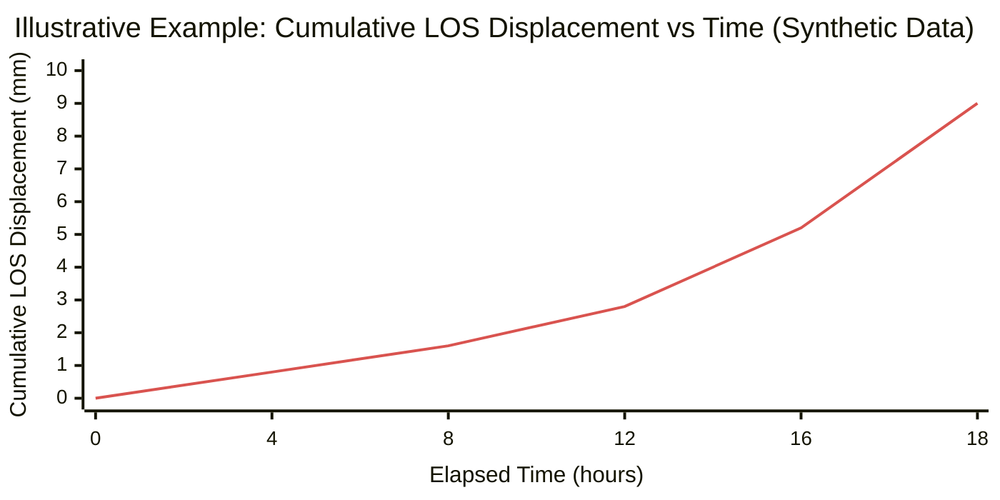
*Figure 7.1: Illustrative cumulative displacement curve showing secondary linear creep transitioning into accelerating tertiary creep.*

### Geomechanical Interpretation:
* **$T_1$ to $T_3$ (0 to 8 hours):** The slope undergoes constant linear displacement rate ($0.20\text{ mm/hr}$), indicating stable secondary creep.
* **$T_4$ to $T_6$ (12 to 18 hours):** The curve bends upward sharply. The velocity surges from $0.30\text{ mm/hr}$ to $1.90\text{ mm/hr}$ (nearly a 6.3x acceleration), confirming the onset of critical tertiary creep where internal shear surfaces are coalescing.

---

## 8. Velocity and Deformation Rate

Displacement alone does not convey the urgency of a slope hazard. A bench moving $10\text{ mm}$ over $30\text{ days}$ is geotechnically manageable, whereas $10\text{ mm}$ over $30\text{ minutes}$ signifies catastrophic failure.

$$\text{Deformation Velocity: } v(t) = \frac{d(d_{\text{LOS}})}{dt} \approx \frac{\Delta d_{\text{LOS}}}{\Delta t}$$

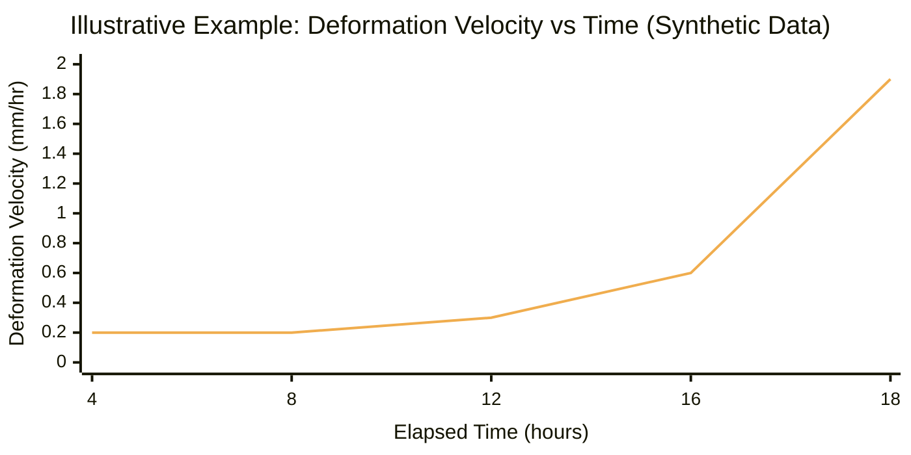
*Figure 8.1: Illustrative deformation velocity surge curve.*

### Velocity States in Slope Monitoring:
1. **Steady Creep ($v \approx \text{const}$):** Rock joints dilate slowly under self-weight stress.
2. **Regressive Velocity ($dv/dt < 0$):** Slope decelerates and stabilizes following load shedding or drainage.
3. **Progressive Velocity ($dv/dt > 0$):** Slope accelerates exponentially toward failure.

---

## 9. Inverse Velocity Method in GB-InSAR

Integrating the **Saito-Fukuzono Inverse Velocity model** into GB-InSAR time series provides an analytical tool for forecasting the failure time window ($t_f$).

$$\text{Inverse Velocity: } \frac{1}{v(t)} = \frac{1}{d(d_{\text{LOS}})/dt}$$

During tertiary creep:
$$\frac{1}{v(t)} = A(t_f - t)$$

As failure approaches ($t \to t_f$), velocity accelerates toward infinity ($v(t) \to \infty$), causing the **inverse velocity to linearly trend to zero ($\frac{1}{v} \to 0$)**.

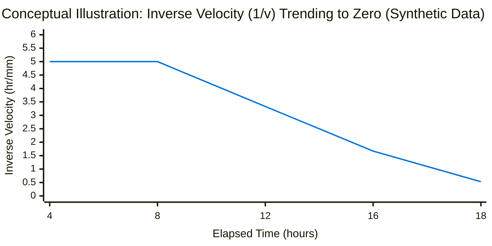
*Figure 9.1: Conceptual trajectory of inverse velocity trending toward the zero-intercept failure point.*

> **Scientific Disclaimer:** Inverse velocity linear extrapolation provides an **estimate of failure trajectory**, not an absolute guarantee. In-situ joint stepping, rainfall pulses, or blast shocks can cause sudden deviations.

---

## 10. GB-InSAR Data Products

| Data Product | Physical Description | Format / Dimension | Proposed SIH25071 Utilization |
| :--- | :--- | :--- | :--- |
| **Radar Amplitude / Reflectivity** | Intensity of the reflected microwave power backscattered from rock faces. | 2D Grayscale Matrix (dB) | Assesses rock surface roughness, moisture changes, and coherence stability. |
| **Interferometric Phase ($\phi$)** | Fractional cycle of the returned microwave signal. | 2D Phase Matrix ($-\pi$ to $+\pi$) | Fundamental input for interferogram generation and phase differencing. |
| **Coherence ($\gamma$)** | Cross-correlation similarity coefficient between Master and Slave images ($0.0 \le \gamma \le 1.0$). | 2D Floating Point Matrix | Quality metric: filters out noisy pixels caused by vegetation, dust, or blast flyrock. |
| **Line-of-Sight Displacement ($d_{\text{LOS}}$)** | Cumulative distance change along the radar line of sight. | 2D Georeferenced Grid ($\text{mm}$) | Primary input for 3D digital twin deformation heatmaps. |
| **Deformation Velocity ($v_{\text{LOS}}$)** | Rate of displacement change over rolling time windows. | $\text{mm/hr}$ or $\text{mm/day}$ | Key engineered feature for AI/ML hazard classification models. |
| **Time-Series Matrix** | Historical sequence of displacement for every spatial pixel over time. | 3D Array $(X, Y, t)$ | Feeds LSTM / Temporal Convolutional Networks for sequence prediction. |

---

## 11. GB-InSAR Processing Pipeline

```mermaid
flowchart LR
    subgraph Signal Processing Core
        A[Raw Radar Scans] --> B[Image Co-Registration]
        B --> C[Interferogram Formation]
        C --> D[Spatial-Temporal Phase Differencing]
        D --> E[Adaptive Goldstein Filtering]
        E --> F[2D/3D Phase Unwrapping]
    end

    subgraph Calibration & Conversion
        F --> G[Atmospheric APS Correction via Permanent Scatterers]
        G --> H[LOS Metric Displacement Calculation]
    end

    subgraph Analytics & Decision Engine
        H --> I[Time-Series Kinematic Derivative Analysis]
        I --> J[Velocity, Acceleration & Inverse Velocity 1/v]
        J --> K[Geotechnical Instability & TARP Alert]
    end
```
*Figure 11.1: Detailed algorithmic pipeline of GB-InSAR signal processing.*

### Detailed Pipeline Stages:
1. **Image Co-Registration:** Sub-pixel alignment of Master and Slave radar acquisitions ensuring spatial coordinates match perfectly.
2. **Interferogram Formation:** Calculating the complex interferogram: $I = S_{\text{master}} \cdot S_{\text{slave}}^*$, extracting raw wrapped phase.
3. **Adaptive Filtering:** Applying Goldstein phase filters to suppress high-frequency noise while preserving sharp deformation boundaries.
4. **Phase Unwrapping:** Solving the spatial-temporal $2\pi$ integer ambiguity to convert wrapped phase ($-\pi$ to $+\pi$) into continuous phase.
5. **Atmospheric Correction (APS):** Using Permanent Scatterers (stable rock outcrops or corner reflectors) to subtract atmospheric delay fluctuations.
6. **Time-Series Analysis:** Deriving rolling kinematic trends for geotechnical evaluation.

---

## 12. Comparison: Conventional SSR vs. GB-InSAR

| Feature / Dimension | Conventional Radar / SSR (Real-Aperture) | Ground-Based InSAR (GB-InSAR) |
| :--- | :--- | :--- |
| **Primary Antenna Architecture** | Physical parabolic dish rotating mechanically in azimuth and elevation. | Small radar antenna moving along a 2 to 3-meter motorized linear rail (Synthetic Aperture). |
| **Measurement Principle** | Real-Aperture Radar with differential phase tracking. | Synthetic Aperture Radar (SAR) with 2D interferometry. |
| **Azimuth Spatial Resolution** | Degrades with distance ($R \cdot \theta_{\text{beam}}$); coarser at long ranges (>1 km). | High cross-range resolution maintained over long distances due to synthesized aperture. |
| **Scan Time per Cycle** | 1 to 5 minutes per target sector. | 2 to 10 minutes per synthetic rail traverse. |
| **Phase Unwrapping Sensitivity** | High frequency reduces phase wrapping risk between short scans. | Prone to phase unwrapping failure if displacement exceeds $\lambda/4$ between rail passes. |
| **System Mobility** | Heavy 4WD diesel generator trailer. | Fixed stationary concrete pillar or heavy-duty tripod on stable ground. |
| **Typical Frequency Band** | X-band (~9.5 GHz) or Ku-band (~17 GHz). | Ku-band (~17.2 GHz) or C-band (~5.8 GHz). |
| **Cost Profile** | High Capex (₹3.5 Cr – ₹8 Cr). | High Capex (₹4.0 Cr – ₹10 Cr). |

---

## 13. Advantages of GB-InSAR

* **Remote, Non-Contact Operation:** Monitors hazardous, inaccessible highwalls from distances up to 4 km without risking personnel.
* **Massive Spatial Coverage:** Continuously surveys millions of points across wide pit sectors from a single vantage point.
* **Sub-Millimeter Displacement Resolution:** Detects microscopic pre-failure dilation down to $\pm 0.1\text{ mm}$.
* **All-Weather, Day-and-Night Operation:** Microwaves penetrate darkness, fog, and light dust.
* **2D Spatial Deformation Heatmaps:** Directly maps structural displacement boundaries onto mine topographies.
* **Continuous Creep Monitoring:** Ideal for tracking long-term slope degradation and deep-seated movements.

---

## 14. Limitations of GB-InSAR

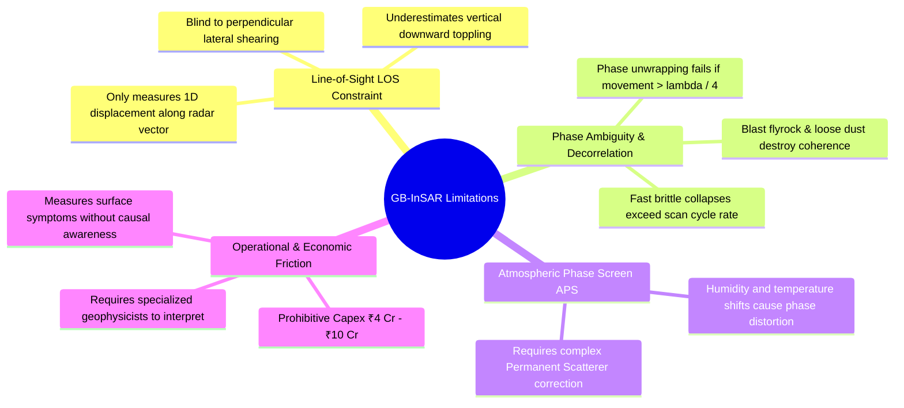
*Figure 14.1: Structural, operational, and physical limitations of GB-InSAR.*

1. **1D Line-of-Sight (LOS) Restriction:** Like all single-sensor radars, it only detects displacement towards or away from the sensor. Perpendicular movements are undetected.
2. **Phase Unwrapping Breakdown in Rapid Failures:** If a rock mass accelerates rapidly between scans ($> \lambda/4 \approx 4.4\text{ mm}$ in 5 minutes for Ku-band), the phase wraps multiple times, resulting in loss of tracking at the exact moment of failure.
3. **High Capital & Maintenance Barrier:** Systems cost ₹4.0–10.0 Crores, placing them out of reach for >95% of small and mid-sized open-cast mines in India.
4. **Lack of Causal Intelligence:** Radar records surface movement but cannot measure pore-water pressure surges, rainfall infiltration, or blast shockwave triggers.

---

## 15. Existing Open-Source Research & Software Toolkits

While commercial GB-InSAR software (e.g., IDS IBIS Guardian) is closed-source and proprietary, several prominent open-source scientific toolkits demonstrate transferable SAR and InSAR interferometric processing algorithms:

### Benchmarked Open-Source InSAR Frameworks

| Project / Repository | Organization / Origin | Primary Language & Libraries | Core Functional Capabilities | License | Research Transferability to SIH25071 |
| :--- | :--- | :--- | :--- | :--- | :--- |
| **[ISCE2 / ISCE3](https://github.com/isce-framework/isce2)** | NASA-JPL / Caltech | Python, C++, Cython, CUDA | Comprehensive SAR data processing, interferogram generation, phase filtering, and geometric co-registration. | Apache 2.0 | Core algorithms for complex interferogram generation and spatial phase filtering. |
| **[MintPy](https://github.com/insarlab/MintPy)** | University of Miami / InSAR Lab | Python, NumPy, SciPy, HDF5 | Small Baseline Subset (SBAS) and Persistent Scatterer (PS) time-series deformation analysis. | GPL-3.0 | Time-series velocity inversion, atmospheric phase screen (APS) correction, and inverse velocity calculation. |
| **[GMTSAR](https://github.com/gmtsar/gmtsar)** | UC San Diego / Scripps | C, Shell, GMT | InSAR processing system for phase unwrapping (SNAPHU integration), topography subtraction, and geocoding. | LGPL-3.0 | 2D phase unwrapping logic and DEM ray-casting for projecting LOS displacement into 3D. |
| **[SNAP Engine](https://github.com/senbox-org/snap-engine)** | European Space Agency (ESA) | Java, C++ | Multi-mission radar tool for interferometry, coherence estimation, and terrain correction. | GPL-3.0 | Coherence estimation and noise filtering workflows transferable to terrestrial radar grids. |
| **[pyGBInSAR (Research)](https://github.com/topics/insar)** | Academic Research Community | Python, OpenCV, SciPy | Ground-based interferometric phase unwrapping and permanent scatterer tracking on terrestrial datasets. | Open Research | Direct reference for terrestrial geometry and atmospheric phase removal in open-pit environments. |

> **Note on Commercial vs. Open-Source:** Commercial systems (IDS GeoRadar, GroundProbe) utilize specialized proprietary DSP firmware on dedicated FPGA hardware. The open-source toolkits above provide the academic algorithms used for time-series extraction and phase analysis in research contexts.

---

## 16. Concepts Adopted from GB-InSAR for SIH25071

Our SIH25071 system adopts the following scientific and architectural principles from GB-InSAR:

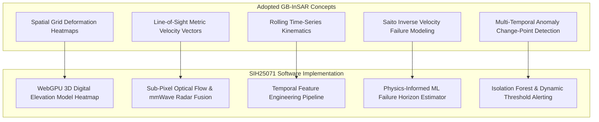
*Figure 16.1: Translation of GB-InSAR concepts into SIH25071 software modules.*

### Detailed Adopted Concepts:
* **A. Spatial Deformation Heatmaps:** Dividing highwalls into discrete spatial grid cells and generating dynamic color-coded hazard zones.
* **B. Kinematic Derivative Analysis:** Calculating velocity ($v = \Delta d/\Delta t$) and acceleration ($a = \Delta v/\Delta t$) across rolling time windows.
* **C. Inverse Velocity Time-to-Failure Modeling:** Implementing linear and polynomial $1/v$ regression as an engineered feature in the machine learning pipeline.
* **D. Multi-Temporal Baseline Differencing:** Continuously comparing current slope observations against baseline epochs to filter out transient vibrations.

---

## 17. How GB-InSAR Concepts Enhance Our SIH System

Our SIH25071 architecture bridges the critical gap in single-sensor monitoring by integrating GB-InSAR-style spatial kinematics with multi-modal geotechnical and environmental triggers:

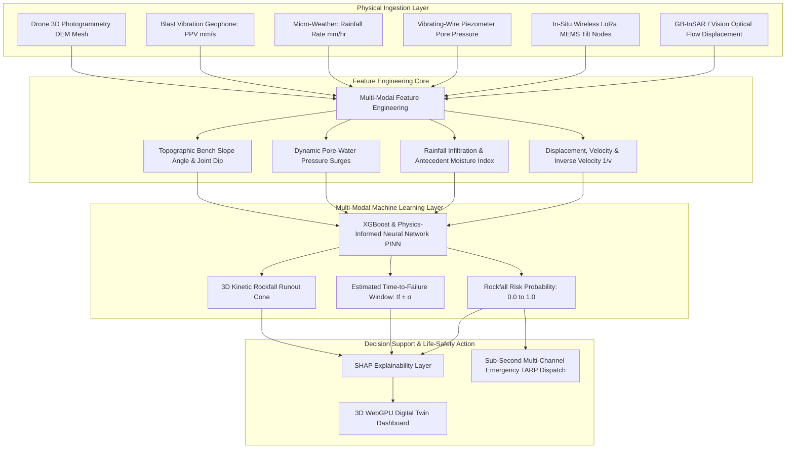
*Figure 17.1: Multi-modal fusion architecture combining GB-InSAR spatial kinematics with environmental and geotechnical triggers.*

---

## 18. Machine Learning & Feature Engineering Pipeline

### Proposed Input Feature Vector
For every monitored bench sector $i$ at epoch $t$, the feature vector $\mathbf{x}_i(t)$ comprises:

| Feature Name | Symbol | Unit | Data Source | Geotechnical Significance |
| :--- | :--- | :--- | :--- | :--- |
| **Cumulative Displacement** | $d(t)$ | $\text{mm}$ | GB-InSAR / Vision Flow | Total magnitude of rock mass deformation. |
| **Deformation Velocity** | $v(t)$ | $\text{mm/hr}$ | First Derivative ($dd/dt$) | Current kinetic rate of surface movement. |
| **Acceleration** | $a(t)$ | $\text{mm/hr}^2$ | Second Derivative ($dv/dt$) | Identifies transition into tertiary creep. |
| **Inverse Velocity** | $1/v(t)$ | $\text{hr/mm}$ | Reciprocal ($1/v$) | Diagnostic indicator for impending collapse. |
| **Pore-Water Pressure** | $u(t)$ | $\text{kPa}$ | Piezometer Telemetry | Destabilizing hydrostatic force reducing effective stress. |
| **Rainfall Intensity** | $I(t)$ | $\text{mm/hr}$ | Micro-Weather Station | Primary environmental trigger for rapid failure. |
| **Antecedent Moisture** | $\text{AMI}_{7d}$ | $\text{mm}$ | 7-day Cumulative Rain | Saturation state of rock joints and soil matrix. |
| **Peak Particle Velocity** | $\text{PPV}$ | $\text{mm/s}$ | Blast Geophone Array | Dynamic seismic loading from production blasting. |
| **Bench Slope Angle** | $\beta$ | $\text{degrees}$ | Drone 3D DEM | Gravitational driving force component. |

### Evaluated Model Architectures
1. **XGBoost / LightGBM Ensembles:** Optimized for structured time-series feature tables, delivering microsecond inference latency on edge hardware with robust handling of missing sensor packets.
2. **Physics-Informed Neural Networks (PINNs):** Neural network constrained by the Mohr-Coulomb shear strength criterion ($\tau = c' + (\sigma - u) \tan\phi'$) and Saito inverse velocity laws, ensuring physical plausibility.
3. **Temporal Convolutional Networks (TCN):** Captures multi-scale temporal dependencies across time-series displacement and rainfall histories.

---

## 19. Anomaly Detection for Unusual Deformation Regimes

Before a high-level hazard model issues a red alert, an unsupervised **Anomaly Detection Layer** flags abnormal deviation from baseline creep:

```text
Normal Steady-State Creep:
1.00 mm ──► 1.10 mm ──► 1.20 mm ──► 1.30 mm  (Linear Trend: Residuals < 0.05 mm)

Abnormal Progressive Anomaly:
1.00 mm ──► 1.20 mm ──► 1.80 mm ──► 4.50 mm ──► 9.00 mm  (Exponential Surge: Anomaly Flagged)
```

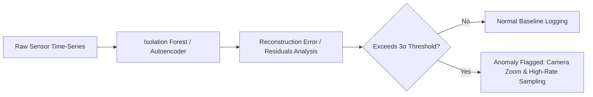
*Figure 19.1: Unsupervised anomaly detection workflow for early creep deviation.*

### Methods Evaluated:
* **Isolation Forests:** Rapidly partitions outlier velocity vectors on edge hardware.
* **Autoencoders:** Neural networks trained on stable slope sequences; high reconstruction error signals sudden anomalous joint dilation.
* **Bayesian Change-Point Detection:** Statistically identifies the exact timestamp when a slope transitions from secondary to tertiary creep.

---

## 20. Explainable AI (XAI) for Mining Safety Officers

A critical flaw in standard AI alerting is the "black box" problem. Mine managers require clear geotechnical justifications before halting production shovels or evacuating a pit.

### SHAP (SHapley Additive exPlanations) Diagnostic Output
Our system utilizes SHAP tree explainers to decompose the exact percentage contribution of each feature to the final risk score:

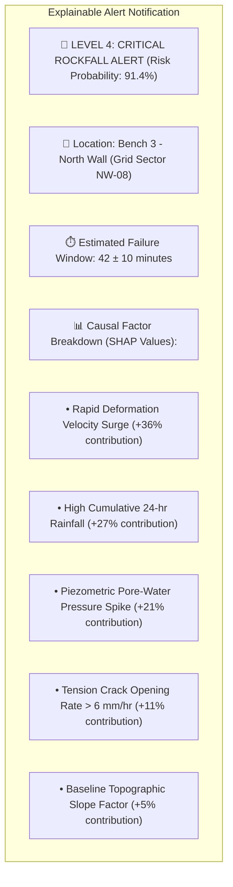
*Figure 20.1: Conceptual explainable alert card displaying SHAP causal factor breakdown.*

---

## 21. Proposed SIH Decision-Support Dashboard

The proposed GeoShield AI dashboard delivers a unified operational interface:

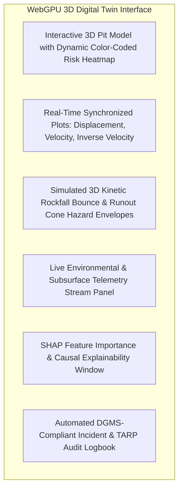
*Figure 21.1: Functional architecture of the proposed 3D decision-support dashboard.*

---

## 22. Existing GB-InSAR vs. Proposed SIH25071 System

| Feature / Dimension | Typical Existing GB-InSAR Systems | Proposed SIH25071 Multi-Modal Platform |
| :--- | :--- | :--- |
| **Primary Sensing Hardware** | Specialized Ku/C-band synthetic aperture radar on mechanical rail. | Multi-camera Edge Computer Vision + Wireless LoRa IoT Sensor Mesh. |
| **Capital Expenditure (Capex)** | **₹4.0 Crore – ₹10.0 Crore** (Extremely high). | **₹2.0 Lakh – ₹5.0 Lakh** (>95% cost reduction). |
| **Interferometric / Spatial Principles**| Core defining physical mechanism. | Adopted as core algorithmic and visualization concept. |
| **Line-of-Sight Displacement** | Directly measured via microwave phase. | Derived via sub-pixel optical flow and low-cost radar fusion. |
| **Environmental Sensor Fusion** | External standalone weather data (not integrated). | Fully synchronized real-time rainfall, moisture, and temperature coupling. |
| **Subsurface Geotechnical Awareness** | Blind to subsurface conditions. | Ingests real-time vibrating-wire piezometers and subsurface tilt. |
| **Machine Learning Core** | Basic numerical thresholding. | Multi-modal XGBoost + Physics-Informed Neural Networks. |
| **Anomaly Detection & Explainability** | Not inherently available. | Integrated Isolation Forests + SHAP feature attribution. |
| **3D Kinetic Trajectory Simulation** | None (measures highwall displacement only). | Real-time 3D rigid-body rockfall bounce and runout cone modeling. |
| **Emergency Alerting Mechanism** | Software visual alarm / manual siren triggering. | Autonomous sub-second multi-channel dispatch (Sirens, VHF Radio, SMS). |
| **Accessibility for Indian Mines** | Limited to <5% large tier-1 mines. | Universally deployable across all 800+ open-cast mines in India. |

---

## 23. Research Gap & SIH Innovation Opportunity

### Identified Research Gap
Existing GB-InSAR systems are world-class **measurement instruments**, but they are not **autonomous predictive disaster-management systems**. They measure *where* and *how much* a slope has deformed, but they fail to integrate the underlying environmental and geotechnical causes, cannot simulate 3D boulder trajectory runouts, and remain cost-prohibitive for the vast majority of mines.

```
+---------------------------------------------------------------------------------------------------+
|                                    BRIDGING THE RESEARCH GAP                                      |
+---------------------------------------------------------------------------------------------------+
|  [ Traditional GB-InSAR Paradigm ]         [ Proposed SIH25071 Innovation ]                       |
|  - Expensive Specialized Hardware           - Accessible Edge Vision + LoRa IoT Mesh               |
|  - Surface Kinematics Only                  - Multi-Modal Fusion (Kinematics + Rain + Piezometers) |
|  - Manual Geotechnical Interpretation       - Physics-Informed ML (Saito + Mohr-Coulomb)           |
|  - Rigid Threshold Alarms                   - Explainable AI (SHAP) + Dynamic 3D Runout Cones      |
|  - Manual Human Decision Chains             - Autonomous Sub-Second TARP Evacuation Dispatch       |
+---------------------------------------------------------------------------------------------------+
```

---

## 24. Final Proposed System Architecture

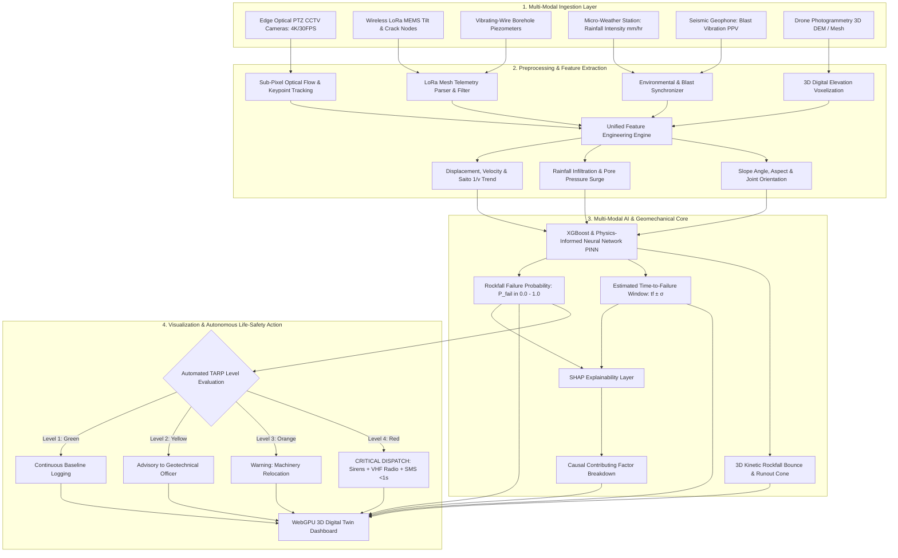
*Figure 24.1: Comprehensive end-to-end architecture of the proposed SIH25071 Rockfall Prediction and Alert System.*

---

## 25. Summary of Visualizations Included

This document includes the following dedicated technical visualizations:
1. **Figure 1.1:** GB-InSAR data transformation workflow flowchart (Mermaid).
2. **Figure 2.1:** Detailed step-by-step radar-to-alert processing pipeline (Mermaid).
3. **Section 3:** Radar sinusoidal wave cycle and interferometric phase shift diagrams (ASCII / Text).
4. **Figure 4.1:** Phase component decomposition flowchart (Mermaid).
5. **Figure 5.1:** Open-pit geotechnical monitoring domains mindmap (Mermaid).
6. **Section 6:** Spatial deformation risk grid representation.
7. **Figure 7.1:** Cumulative LOS displacement vs. time graph (Mermaid xychart — synthetic data).
8. **Figure 8.1:** Deformation velocity surge vs. time graph (Mermaid xychart — synthetic data).
9. **Figure 9.1:** Inverse velocity ($1/v$) linear regression trending to failure graph (Mermaid xychart — synthetic data).
10. **Figure 11.1:** Detailed GB-InSAR signal processing pipeline (Mermaid).
11. **Figure 14.1:** GB-InSAR limitations mindmap (Mermaid).
12. **Figure 16.1:** Translation of GB-InSAR concepts into SIH25071 software modules (Mermaid).
13. **Figure 17.1:** Multi-modal data fusion architecture (Mermaid).
14. **Figure 19.1:** Unsupervised anomaly detection workflow (Mermaid).
15. **Figure 20.1:** Explainable AI (SHAP) alert breakdown card (Mermaid).
16. **Figure 21.1:** 3D decision-support dashboard architecture (Mermaid).
17. **Figure 24.1:** Master end-to-end system architecture flowchart (Mermaid).

---

## 26. Conclusion

Ground-Based InSAR (GB-InSAR) has demonstrated the immense value of **continuous spatial deformation mapping, sub-millimeter displacement resolution, and time-series kinematic analysis** for open-pit slope stability monitoring.

However, its high cost, line-of-sight constraints, vulnerability to phase unwrapping breakdown in rapid brittle failures, and lack of integration with environmental triggers have limited its adoption across standard mining operations.

Our proposed **SIH25071 solution** does not claim to manufacture commercial GB-InSAR radar hardware. Instead, we extract its **core scientific principles—spatial grid deformation mapping, time-series velocity kinematics, and inverse velocity failure forecasting—and fuse them with low-cost edge vision, wireless IoT telemetry, and explainable AI**. This delivers radar-grade spatial intelligence at a fraction of the cost, directly advancing the disaster-management mission of the Ministry of Mines.

---

## 27. References

1. **Leva, D., Nico, G., Tarchi, D., Fortuny-Guasch, J., & Sieber, A. J.** (2003). *Temporal analysis of a ground-based SAR dataset over the Tessina landslide*. IEEE Transactions on Geoscience and Remote Sensing, 41(11), pp. 2452–2460. [DOI: 10.1109/TGRS.2003.817203](https://doi.org/10.1109/TGRS.2003.817203) — *Foundational paper demonstrating terrestrial GB-InSAR for continuous slope deformation tracking.*
2. **Monserrat, O., Crosetto, M., & Luzi, G.** (2014). *A review of ground-based SAR interferometry for deformation measurement*. ISPRS Journal of Photogrammetry and Remote Sensing, 93, pp. 40–48. [DOI: 10.1016/j.isprsjprs.2014.04.001](https://doi.org/10.1016/j.isprsjprs.2014.04.001) — *Comprehensive review of GB-InSAR processing algorithms, atmospheric phase correction, and geotechnical applications.*
3. **Casagli, N., Frodella, W., Morelli, S., Tofani, V., Ciampalini, A., Intrieri, E., Raspini, F., Rossi, G., Tanteri, L., & Lu, P.** (2017). *Spaceborne, airborne and ground-based InSAR technologies for mapping, monitoring and early warning of landslides: A review*. Earth-Science Reviews, 167, pp. 115–149. [DOI: 10.1016/j.earscirev.2017.02.001](https://doi.org/10.1016/j.earscirev.2017.02.001) — *Examines multi-scale InSAR integration for geological early-warning systems.*
4. **Intrieri, E., Gigli, G., Mugnai, F., Fanti, R., & Casagli, N.** (2012). *Design and implementation of a landslide early warning system based on GB-InSAR monitoring*. Natural Hazards and Earth System Sciences, 12(6), pp. 2109–2126. [DOI: 10.5194/nhess-12-2109-2012](https://doi.org/10.5194/nhess-12-2109-2012) — *Practical framework linking GB-InSAR kinematic thresholds to operational warning levels.*
5. **Caduff, R., Schlunegger, F., Kos, A., & Wiesmann, A.** (2015). *A review of terrestrial radar interferometry for measuring surface change in the geosciences*. Earth Surface Processes and Landforms, 40(2), pp. 208–228. [DOI: 10.1002/esp.3656](https://doi.org/10.1002/esp.3656) — *In-depth analysis of phase unwrapping, atmospheric filtering, and line-of-sight geometric corrections.*
6. **Goldstein, R. M., & Werner, C. L.** (1998). *Radar interferogram filtering for geophysical applications*. Geophysical Research Letters, 25(21), pp. 4035–4038. [DOI: 10.1029/1998GL900033](https://doi.org/10.1029/1998GL900033) — *Defines the adaptive frequency filtering algorithm used across modern InSAR pipelines.*
7. **Chen, C. W., & Zebker, H. A.** (2001). *Two-dimensional phase unwrapping with use of statistical models for cost functions in nonlinear optimization*. Journal of the Optical Society of America A, 18(2), pp. 338–351. [DOI: 10.1364/JOSAA.18.000338](https://doi.org/10.1364/JOSAA.18.000338) — *Establishes Minimum Cost Flow phase unwrapping algorithms utilized in radar deformation mapping.*
8. **Directorate General of Mines Safety (DGMS).** (2021). *DGMS Circular No. 06 of 2021: Implementation of Safety Management Plans (SMP) and Trigger Action Response Plans (TARP) in Open-Cast Mines*. Ministry of Labour & Employment, Government of India. — *Statutory regulatory guidelines governing early warning and TARP dispatch.*
9. **Lundberg, S. M., Erion, G., Chen, H., DeGrave, A., Prutkin, J. M., Nair, B., Katz, R., Himmelfarb, J., Bansal, N., & Lee, S.-I.** (2020). *From local explanations to global understanding with explainable AI for trees*. Nature Machine Intelligence, 2(1), pp. 56–67. [DOI: 10.1038/s42256-019-0138-9](https://doi.org/10.1038/s42256-019-0138-9) — *Theoretical foundation for TreeSHAP explainability in geotechnical risk scoring.*
