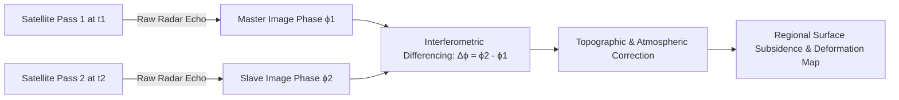

# Existing Technology 3: Satellite InSAR (D-InSAR / PS-InSAR / SBAS)

> **Document Type:** Research & Benchmark Analysis  
> **Problem Statement ID:** SIH25071 | **Ministry of Mines** | **Category:** Software  
> **Prepared For:** Smart India Hackathon (SIH 2025)

---

## 1. Background & Working Principle

Satellite Synthetic Aperture Radar Interferometry (Satellite InSAR) uses Earth-observation satellites (e.g., ESA Sentinel-1 C-band, TerraSAR-X X-band, ALOS-2 L-band, and NASA-ISRO NISAR) orbiting at ~700 km altitude to illuminate the Earth's surface with microwaves and capture the reflected phase.

### Core Mathematical Formula
$$d_{\text{LOS}} = \frac{\lambda}{4\pi} \Delta \phi_{\text{def}}$$
where $\lambda$ is satellite radar wavelength (e.g., $5.6\text{ cm}$ for Sentinel-1 C-band).

---

## 2. Advanced Techniques: D-InSAR, PS-InSAR & SBAS
* **D-InSAR (Differential InSAR):** Direct phase subtraction between two temporal passes.
* **PS-InSAR (Persistent Scatterer InSAR):** Tracks point-like stable reflectors (rock outcrops, engineered structures) across dozens of historical passes to achieve millimeter-per-year precision.
* **SBAS (Small Baseline Subset):** Minimizes spatial and temporal decorrelation by connecting pairs with small baseline geometry.

---

## 3. Advantages & Strengths
* **Zero On-Site Hardware Footprint:** Requires no physical equipment inside the dangerous mine pit.
* **Regional Macro-Scale Coverage:** Simultaneously monitors the entire open-cast lease, tailing storage facilities (TSF), overburden dumps, and surrounding villages.
* **Open-Access Historical Archive:** Sentinel-1 provides free historical radar data since 2014, allowing retrospective geological deformation analysis.

---

## 4. Limitations & Why It Fails Alone in the Market
* **Severe Revisit Latency (6 to 12 Days):** Completely useless for immediate life-safety evacuation alerts; a rockfall evolving over hours occurs unrecorded between passes.
* **Pit Wall Radar Geometric Distortion:** Steep highwalls suffer from **Layover**, **Foreshortening**, and **Radar Shadowing**.
* **Blasting Decorrelation:** Active blasting and excavation continually alter the surface, causing total loss of phase coherence.

---

## 5. What is Doable & How We Adopt It for SIH25071

| Feature | Satellite InSAR Approach | Our Proposed SIH25071 Implementation |
| :--- | :--- | :--- |
| **Real-Time Evacuation Alerts** | ❌ Not doable (6-12 day latency) | ✅ Replaced by real-time Edge Computer Vision & LoRa IoT nodes. |
| **Macro Regional Baseline** | ✅ Highly doable via open Sentinel-1 API | ✅ Ingested as a macro regional geological stress prior to prioritize camera zooming. |
| **Historical Pre-Failure Auditing** | ✅ Doable via Copernicus Open Access | ✅ Integrated into our GIS dashboard for seasonal slope creep baselines. |

---

## 6. References
1. **Ferretti, A., Prati, C., & Rocca, F.** (2001). *Permanent scatterers in SAR interferometry*. IEEE Transactions on Geoscience and Remote Sensing, 39(1), pp. 8–20.
2. **Berardino, P., et al.** (2002). *A new algorithm for surface deformation monitoring based on small baseline differential SAR interferograms (SBAS)*. IEEE TGRS, 40(11), pp. 2375–2383.
