# Existing Technology 3: Satellite InSAR — D-InSAR, PS-InSAR and SBAS

> **Document Type:** Research & Benchmark Analysis 
> **Problem Statement ID:** SIH25071 
> **Problem Statement Title:** AI-Based Rockfall Prediction and Alert System for Open-Pit Mines 
> **Organization:** Ministry of Mines | **Category:** Software | **Theme:** Disaster Management 
> **Prepared For:** Smart India Hackathon (SIH 2025) Research & Development Documentation 
> **Target File:** `docs/03_Satellite_InSAR_DInSAR_PSInSAR_SBAS.md`

---

## Executive Summary

Satellite Synthetic Aperture Radar Interferometry (**Satellite InSAR**) is a spaceborne Earth-observation technology that measures ground deformation and surface displacement across vast geographic scales. Orbiting satellites (such as the European Space Agency's **Sentinel-1**, DLR's **TerraSAR-X**, and the NASA-ISRO **NISAR**) transmit microwave radar pulses toward the Earth's surface and record the phase of the returning signal. By comparing radar acquisitions captured over days, months, or years, InSAR techniques can detect millimeter-scale land subsidence, slope creep, and structural deformation.

This report evaluates satellite InSAR as an **existing remote sensing methodology**. It provides an in-depth analysis of the three major interferometric processing paradigms: **Differential InSAR (D-InSAR)**, **Persistent Scatterer InSAR (PS-InSAR)**, and **Small Baseline Subset (SBAS)**; assesses verified open-source toolkits (such as **MintPy**, **ISCE2**, **GMTSAR**, and **ESA SNAP**); examines physical limitations (such as temporal decorrelation and revisit latency); and defines how satellite InSAR can be integrated into our proposed **multi-modal AI early-warning architecture for SIH25071**.

---

## 1. Introduction to Satellite InSAR

### What is Synthetic Aperture Radar (SAR)?
Synthetic Aperture Radar (SAR) is an active microwave remote sensing system. Unlike optical satellites that rely on reflected sunlight, a SAR satellite carries its own illumination source, emitting microwave pulses (e.g., C-band, X-band, L-band) and recording both the **amplitude** (intensity) and **phase** (wave alignment) of the reflected echo.

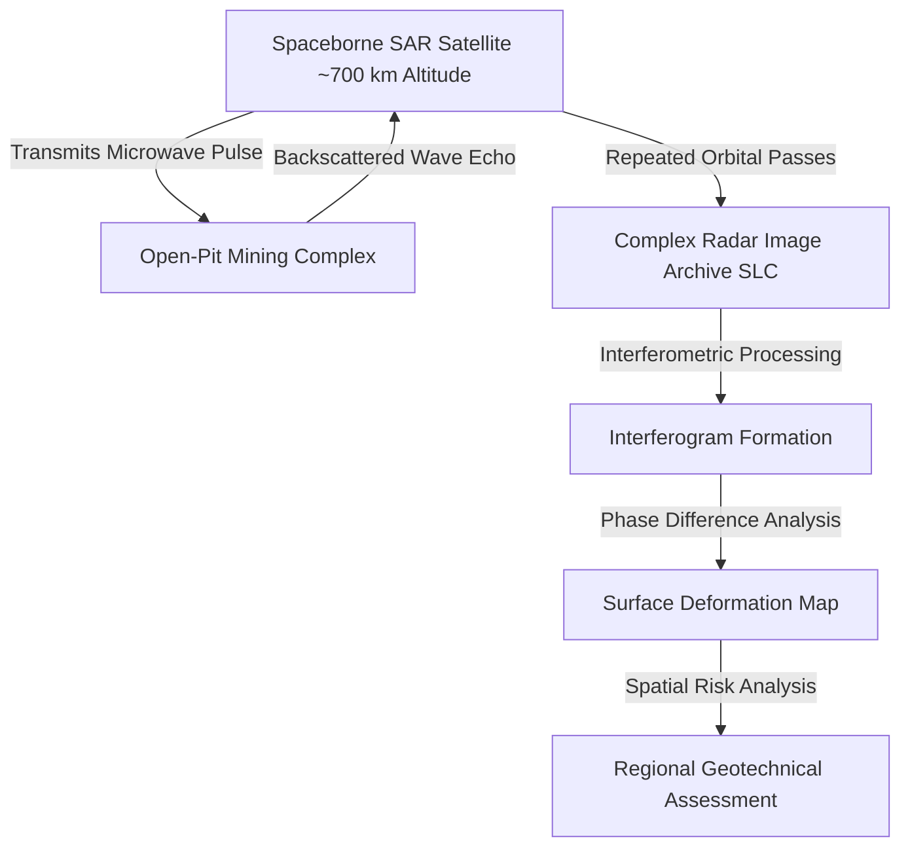
*Figure 1.1: High-level data transformation flow in spaceborne radar interferometry.*

### What Does "InSAR" Mean?
**InSAR (Interferometric Synthetic Aperture Radar)** is the technique of combining two or more complex SAR images of the same geographic area acquired from similar orbital positions at different times. By calculating the phase difference between images, InSAR isolates ground movement that occurred between the satellite passes.

### Why is InSAR Useful for Open-Pit Mining?
1. **Regional Footprint:** A single satellite frame covers hundreds of square kilometers ($100\text{ km} \times 250\text{ km}$ for Sentinel-1 TOPS mode), simultaneously capturing active pit benches, waste overburden dumps, tailings storage facilities (TSFs), haul road networks, and neighboring settlements.
2. **Zero In-Pit Hardware Footprint:** Requires no physical sensors, wiring, or maintenance crews inside hazardous mining benches.
3. **Historical Archive Access:** Open-access satellite missions (such as Sentinel-1) provide continuous historical data dating back over a decade (2014–present), enabling retrospective baseline deformation analysis.

### Distinguishing Satellite InSAR from Other Systems

| Feature | Optical Satellite Imagery (e.g., Landsat, Sentinel-2) | Ground-Based Radar / SSR | Satellite InSAR (e.g., Sentinel-1) |
| :--- | :--- | :--- | :--- |
| **Sensing Type** | Passive (Sunlight reflection) | Active Terrestrial Radar | Active Spaceborne Radar |
| **Measured Quantity** | Multi-spectral surface color / reflectance | Real-time line-of-sight displacement ($\text{mm}$) | Periodic line-of-sight displacement ($\text{mm/year}$) |
| **Night & Cloud Capability**| [REJECTED] Blind at night & in thick clouds | [CONFIRMED] 24/7 all-weather operational | [CONFIRMED] Day/night; penetrates most clouds |
| **Spatial Resolution** | 10 m to 30 m pixels | High localized bench resolution | 5 m to 20 m spatial resolution |
| **Temporal Revisit** | 5 to 10 days | **1 to 5 minutes (Real-Time)** | **6 to 12 days (Periodic)** |
| **Life-Safety Alert Role** | Land-use / vegetation change | **Emergency evacuation alarms** | **Macro baseline & regional screening** |

---

## 2. How Satellite SAR Works

SAR satellites operate in sun-synchronous Low Earth Orbit (LEO) at altitudes between 500 km and 800 km. 

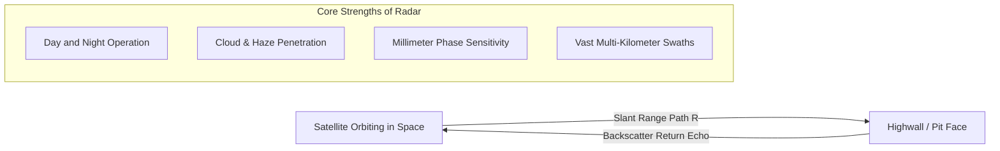
*Figure 2.1: Key operational capabilities of spaceborne radar remote sensing.*

### Key Characteristics of Satellite SAR:
* **Active Microwave Illumination:** Generates its own electromagnetic energy, enabling uninterrupted imaging during night and heavy seasonal overcast.
* **Wavelength Penetration:** Longer wavelengths (e.g., L-band $\lambda \approx 24\text{ cm}$) penetrate dense vegetation, while shorter wavelengths (C-band $\lambda \approx 5.6\text{ cm}$ and X-band $\lambda \approx 3.1\text{ cm}$) provide higher sensitivity to subtle bare-rock surface deformation.
* **Side-Looking Geometry:** SAR antennas point obliquely to the side (incidence angles typically $20^\circ$ to $45^\circ$) to resolve range distance differences across the ground.

---

## 3. What Does InSAR Actually Measure?

Satellite InSAR does not measure 3D absolute position vectors directly; it measures **relative displacement along the radar Line of Sight (LOS)**.

```
 Satellite Orbit Path
 [ Satellite]
 \
 \
 \ Radar Line of Sight (LOS) Vector
 \
 \ 
 \ 
 
 [Mine Slope / Highwall]
 (Displacement Δd_LOS)
```

* **Movement Toward Satellite:** Causes a positive phase shift (decrease in sensor-to-ground distance).
* **Movement Away from Satellite:** Causes a negative phase shift (increase in sensor-to-ground distance).
* **Decomposing Vectors:** By combining **Ascending** (satellite traveling South to North, looking East) and **Descending** (North to South, looking West) satellite tracks, the 1D LOS measurements can be decomposed into **Vertical (subsidence/uplift)** and **East-West horizontal** displacement vectors:
 $$d_{\text{LOS}}^{\text{asc}} = d_u \cos\theta_{\text{asc}} - d_e \sin\theta_{\text{asc}} \cos\alpha_{\text{asc}} + d_n \sin\theta_{\text{asc}} \sin\alpha_{\text{asc}}$$
 where $\theta$ is the incidence angle and $\alpha$ is the satellite flight heading.

---

## 4. Basic InSAR Mathematical Concept

The phase ($\phi$) of a single SAR pixel represents the fractional cycle of the round-trip distance ($2R$) from the satellite antenna to the ground scatterer:

$$\phi = \frac{4\pi}{\lambda} R + \phi_{\text{scat}}$$

When the satellite observes the same ground pixel at two different times ($t_1$ and $t_2$), the **interferometric phase difference ($\Delta \phi$)** is computed:

$$\Delta \phi = \phi(t_2) - \phi(t_1)$$

Under ideal simplified conditions, the metric Line-of-Sight surface displacement ($d_{\text{LOS}}$) is related to the deformation phase component ($\Delta \phi_{\text{def}}$) by:

$$d_{\text{LOS}} = \frac{\lambda \cdot \Delta \phi_{\text{def}}}{4\pi}$$

Where:
* $d_{\text{LOS}}$ = Ground surface displacement along the radar line of sight ($\text{mm}$).
* $\lambda$ = Radar wavelength (e.g., $55.46\text{ mm}$ for Sentinel-1 C-band).
* $\Delta \phi_{\text{def}}$ = Phase shift strictly caused by ground displacement ($\text{radians}$).

> **Practical Engineering Caveat:** In real-world processing, the observed phase difference $\Delta \phi$ is a complex sum of multiple components:
> $$\Delta \phi_{\text{observed}} = \Delta \phi_{\text{def}} + \Delta \phi_{\text{topo}} + \Delta \phi_{\text{atm}} + \Delta \phi_{\text{orbit}} + \Delta \phi_{\text{noise}} + 2k\pi$$
> Specialized InSAR pipelines must model and subtract the topographic phase ($\Delta \phi_{\text{topo}}$ using an external DEM), remove orbital baseline errors ($\Delta \phi_{\text{orbit}}$), filter atmospheric delays ($\Delta \phi_{\text{atm}}$), and solve the $2k\pi$ phase unwrapping ambiguity before true metric deformation can be extracted.

---

## 5. Satellite InSAR Processing Pipeline

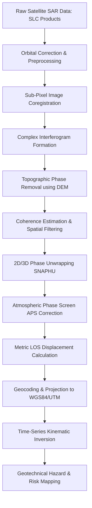
*Figure 5.1: End-to-end algorithmic processing pipeline for Satellite InSAR.*

### Step-by-Step Breakdown:
1. **SAR Data Ingestion:** Ingesting Single Look Complex (SLC) Level-1 radar products containing amplitude and phase channels.
2. **Orbital Correction:** Applying precise satellite orbit state vectors (e.g., ESA Precise Orbit Ephemerides - POEORB) to eliminate geometric positioning errors.
3. **Coregistration:** Geometrically aligning Master and Slave images to sub-pixel accuracy (typically $< 0.05\text{ pixels}$) using cross-correlation.
4. **Interferogram Generation:** Computing the complex conjugate product $I = S_1 \cdot S_2^*$, yielding wrapped phase differences.
5. **Topographic Phase Removal:** Subtracting known terrain elevation phase using an external Digital Elevation Model (such as Copernicus 30m DEM or SRTM).
6. **Coherence & Filtering:** Evaluating local phase correlation ($\gamma$) and applying adaptive Goldstein phase filters to suppress noise.
7. **Phase Unwrapping:** Solving the $2\pi$ integer ambiguity (using algorithms like Minimum Cost Flow or SNAPHU) to convert wrapped cyclic phase into continuous phase values.
8. **Atmospheric Correction:** Estimating and subtracting tropospheric phase delays caused by atmospheric water vapor.
9. **Geocoding & Time-Series:** Converting radar range-Doppler coordinates into geographic UTM coordinates and inverting multi-temporal baseline networks into mean velocity maps ($\text{mm/year}$).

---

## 6. What Is an Interferogram?

An **interferogram** is a 2D spatial visual representation of the phase differences between two coregistered SAR acquisitions. 

```
SAR Image A (Master at t1) 
 [Interferometric Multiplication] Differential Phase (Interferogram)
SAR Image B (Slave at t2) 
```

### Understanding Interference Fringes
In a raw wrapped interferogram, phase is displayed cyclically from $-\pi$ to $+\pi$ (or $0$ to $2\pi$), creating characteristic colorful repeating contour bands known as **Interference Fringes**.

```text
Conceptual Interferogram Fringe Pattern over a Subsiding Pit:
 +------------------------------------------------+
 | ( ( ( [CRITICAL / RED] Central Subsidence ) ) ) |
 | ( ( [ADVISORY / YELLOW] Phase Fringe 2: 28 mm ) ) |
 | ( [NORMAL / GREEN] Phase Fringe 1: 56 mm ) |
 | Outer Stable Highwall |
 +------------------------------------------------+
```

* Each full color cycle (e.g., Red Yellow Green Blue Red) corresponds to a relative ground displacement of **half a radar wavelength ($\lambda/2 \approx 2.8\text{ cm}$ for Sentinel-1)**.
* Closely spaced fringes represent **steep deformation gradients** (rapid localized ground movement).
* Broad, widely spaced fringes represent **gentle, regional settlement**.

> **Note on Visualization:** *The diagram above is a conceptual illustration of interferometric fringe behavior, not raw satellite raster data.*

---

## 7. Differential InSAR (D-InSAR)

**Differential InSAR (D-InSAR)** is the fundamental pairwise interferometric technique used to detect surface deformation that occurred between two distinct satellite acquisition dates.

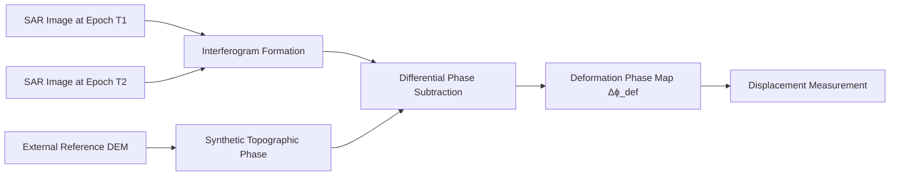
*Figure 7.1: D-InSAR differential subtraction workflow.*

### How D-InSAR Works:
D-InSAR generates an interferogram from two SAR images ($T_1$ and $T_2$) and subtracts the synthetic phase generated from a digital elevation model (DEM). The remaining differential phase directly represents ground surface deformation plus residual atmospheric noise.

### Practical Mining Applications:
* Detecting sudden, large-scale macro bench subsidence following heavy monsoon downpours.
* Mapping total land displacement following major seismic earthquakes or regional fault slips.

### Critical Limitations of D-InSAR:
* **Temporal Decorrelation:** If surface scattering changes significantly between passes (e.g., active digging, blasting, or dense vegetation growth), the radar coherence is lost, turning the interferogram into random noise.
* **Atmospheric Artifacts:** A single passing rainstorm during one satellite overpass can produce false phase signals that mimic several centimeters of ground movement.

---

## 8. Persistent Scatterer InSAR (PS-InSAR)

**Persistent Scatterer InSAR (PS-InSAR)** (developed by Ferretti et al., 2001) overcomes temporal decorrelation and atmospheric noise by analyzing long time series of SAR images (typically 20 to 100+ acquisitions).

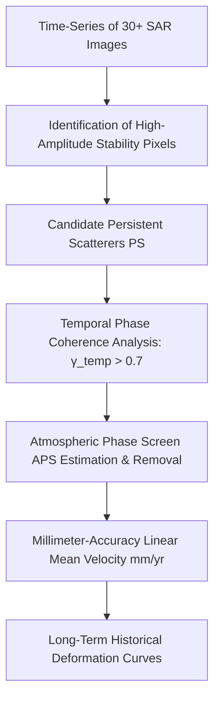
*Figure 8.1: PS-InSAR processing workflow on stable radar targets.*

### How PS-InSAR Works:
Instead of analyzing every pixel across the image, PS-InSAR identifies specific **point-like radar targets (Persistent Scatterers)** that maintain high, stable radar reflection over months and years:
* Exposed, unweathered rock outcrops and cliff faces.
* Concrete structures, crushing plants, and conveyor foundations.
* Heavy steel machinery, rail tracks, and engineered retaining walls.

By tracking these stable reflectors over dozens of passes, algorithms can model and subtract atmospheric phase noise, achieving **displacement measurement precision of $\pm 1\text{ mm/year}$**.

### PS-InSAR in Mining:
* Monitoring long-term seasonal creep on inactive highwalls and historical pit crests.
* High-precision stability auditing of tailings dam embankments and plant infrastructure.

---

## 9. Small Baseline Subset (SBAS-InSAR)

**Small Baseline Subset (SBAS)** (formulated by Berardino et al., 2002) is a multi-interferogram technique designed to monitor **distributed natural scatterers** (such as bare soil, gravel, and unpaved mine waste dumps) where point-like persistent scatterers are sparse.

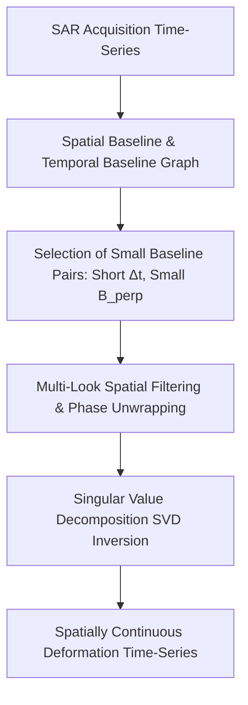
*Figure 9.1: SBAS small-baseline interferometric network workflow.*

### How SBAS Works:
1. Instead of connecting every image to a single Master image, SBAS forms multiple interferograms only between pairs with **small spatial baselines ($B_{\perp} < 150\text{ m}$)** and **short temporal baselines ($\Delta t < 36\text{ days}$)**.
2. This minimizes spatial and temporal decorrelation across natural surfaces.
3. Multi-look spatial averaging reduces noise.
4. Mathematical inversion via **Singular Value Decomposition (SVD)** connects disconnected baseline subsets into a unified, continuous deformation time series.

### SBAS in Mining:
* Ideal for monitoring large overburden waste dumps, soil settlement zones, and tailing dam slope surfaces where distributed scattering dominates.

---

## 10. Comprehensive Comparison: D-InSAR vs. PS-InSAR vs. SBAS

| Evaluation Dimension | D-InSAR (Differential InSAR) | PS-InSAR (Persistent Scatterers) | SBAS (Small Baseline Subset) |
| :--- | :--- | :--- | :--- |
| **Fundamental Approach** | Pairwise phase differencing between 2 images. | Point-target tracking across 20+ images. | Multi-interferogram network connecting short baseline pairs. |
| **Minimum Images Required**| 2 (or 3) acquisitions. | 20 to 100+ acquisitions. | 15 to 60+ acquisitions. |
| **Primary Target Types** | Entire coherent area. | Discrete man-made structures, rock outcrops. | Distributed natural surfaces, bare soils, waste dumps. |
| **Measurement Precision** | $\pm 5\text{ to } 15\text{ mm}$ (single event). | $\pm 1\text{ to } 2\text{ mm/year}$ (velocity rate). | $\pm 2\text{ to } 5\text{ mm/year}$ (velocity rate). |
| **Spatial Output Type** | Continuous raster (where coherent). | Sparse discrete point cloud. | Spatially continuous filtered grid. |
| **Atmospheric Correction** | Poor (vulnerable to weather on scan dates). | **Excellent** (statistically filtered over time). | **Very Good** (temporal-spatial baseline filtering). |
| **Open-Cast Mining Utility** | Post-disaster macro displacement mapping. | Infrastructure, tailings dams, stable highwalls. | Pit-wide regional subsidence and waste dump creep. |

---

## 11. Practical Mining Applications of Satellite InSAR

```mermaid
mindmap
 root((Satellite InSAR Mining Applications))
 Highwall & Crest Monitoring
 Detects regional highwall crest tension crack creep
 Monitors seasonal expansion / contraction trends
 Tailings Storage Facilities TSF
 Continuous stability auditing of tailings dam walls
 Early detection of embankment settlement / bulging
 Overburden & Waste Dumps
 Monitors internal shear settlement in loose spoil piles
 Identifies rainfall-triggered dump slide risks
 Regional Lease Subsidence
 Tracks subsidence bowls over underground void workings
 Monitors ground stability under haulage corridors
 Environmental & Statutory Compliance
 Provides verifiable audit records for DGMS & IBM inspections
 Quantifies ground impact on neighboring villages
```
*Figure 11.1: Core application domains of Satellite InSAR across the mining lifecycle.*

---

## 12. Spatial Deformation Mapping

Satellite InSAR outputs dense georeferenced deformation velocity maps that provide single-pane-of-glass regional situational awareness:

### Conceptual Mine Lease Deformation Grid

```text
+---------------------------------------------------------------+
| REGIONAL OPEN-PIT MINE LEASE MAP |
+---------------------------------------------------------------+
| [North Lease] [NORMAL / GREEN] Stable [NORMAL / GREEN] Stable [NORMAL / GREEN] Stable [ADVISORY / YELLOW] Low Creep [NORMAL / GREEN] Stable |
| [East Highwall][NORMAL / GREEN] Stable [ADVISORY / YELLOW] Low Creep [WARNING / ORANGE] Subsid. [WARNING / ORANGE] Subsid. [ADVISORY / YELLOW] Low Creep |
| [Waste Dump] [ADVISORY / YELLOW] Low Creep [WARNING / ORANGE] Subsid. [CRITICAL / RED] CRITICAL [CRITICAL / RED] CRITICAL [WARNING / ORANGE] Subsid. |
| [Tailings Dam] [NORMAL / GREEN] Stable [NORMAL / GREEN] Stable [ADVISORY / YELLOW] Settle [ADVISORY / YELLOW] Settle [NORMAL / GREEN] Stable |
| [Village Zone] [NORMAL / GREEN] Stable [NORMAL / GREEN] Stable [NORMAL / GREEN] Stable [NORMAL / GREEN] Stable [NORMAL / GREEN] Stable |
+---------------------------------------------------------------+
```

### Risk Level Categorization:
* [NORMAL / GREEN] **Green (Stable):** Background ground stability ($-2.0\text{ mm/yr} \le v \le +2.0\text{ mm/yr}$).
* [ADVISORY / YELLOW] **Yellow (Low Deformation):** Slow seasonal creep / consolidation ($-5.0\text{ mm/yr} \le v < -2.0\text{ mm/yr}$).
* [WARNING / ORANGE] **Orange (Significant Subsidence):** Accelerated settlement / structural strain ($-15.0\text{ mm/yr} \le v < -5.0\text{ mm/yr}$).
* [CRITICAL / RED] **Red (Critical Deformation):** Rapid progressive subsidence / potential failure ($v < -15.0\text{ mm/yr}$).

> **Dashboard Integration:** In our SIH25071 platform, this spatial layer is imported via GeoTIFF / NetCDF into the 3D GIS Digital Twin, color-coding regional lease sectors automatically.

---

## 13. Time-Series Deformation Analysis

Multi-temporal InSAR processing produces historical displacement time-series for every persistent scatterer or coherent grid cell.

> **Important Data Disclaimer:** 
> *The dataset and graphs below represent **Synthetic / Illustrative Data** designed solely to explain multi-temporal satellite deformation trends. They do not represent real-world measurements from any specific mine.*

### Illustrative Synthetic Satellite Time-Series

| Observation Date | Elapsed Time ($t$, days) | Cumulative LOS Displacement ($d_{\text{LOS}}$, mm) | Incremental Movement ($\Delta d$, mm) | Interval Velocity ($v$, mm/day) | Inverse Velocity ($1/v$, days/mm) |
| :---: | :---: | :---: | :---: | :---: | :---: |
| **$T_1$ (Pass 1)** | 0 | 0.00 | — | — | — |
| **$T_2$ (Pass 2)** | 12 | -0.80 | -0.80 | -0.067 | 15.00 |
| **$T_3$ (Pass 3)** | 24 | -1.50 | -0.70 | -0.058 | 17.14 |
| **$T_4$ (Pass 4)** | 36 | -2.40 | -0.90 | -0.075 | 13.33 |
| **$T_5$ (Pass 5)** | 48 | -4.10 | -1.70 | -0.142 | 7.06 |
| **$T_6$ (Pass 6)** | 60 | -7.80 | -3.70 | -0.308 | 3.24 |

```mermaid
---
config:
 xyChart:
 width: 700
 height: 350
 themeVariables:
 xyChart:
 plotColorPalette: "#d9534f"
---
xychart-beta
 title "Illustrative Example: Satellite LOS Cumulative Subsidence vs Time (Synthetic Data)"
 x-axis "Elapsed Time (days)" [0, 12, 24, 36, 48, 60]
 y-axis "Cumulative LOS Displacement (mm)" -10 --> 0
 line [0.0, -0.8, -1.5, -2.4, -4.1, -7.8]
```
*Figure 13.1: Illustrative satellite InSAR time-series showing progressive acceleration.*

### Trend Interpretation:
* **Day 0 to Day 36 ($T_1$ to $T_4$):** Stable steady-state background consolidation ($-0.066\text{ mm/day}$).
* **Day 36 to Day 60 ($T_4$ to $T_6$):** The curve accelerates downward. The subsidence rate surges by more than 4.5x (reaching $-0.308\text{ mm/day}$), signaling progressive destabilization of the monitored slope sector.

---

## 14. Velocity and Deformation Rate Analysis

Deformation velocity represents the slope of the cumulative displacement curve over time:

$$v(t) = \frac{\Delta d_{\text{LOS}}}{\Delta t}$$

```mermaid
---
config:
 xyChart:
 width: 700
 height: 350
 themeVariables:
 xyChart:
 plotColorPalette: "#f0ad4e"
---
xychart-beta
 title "Illustrative Example: Satellite Deformation Velocity Surge (Synthetic Data)"
 x-axis "Elapsed Time (days)" [12, 24, 36, 48, 60]
 y-axis "Deformation Velocity (mm/day)" 0.0 --> 0.4
 line [0.067, 0.058, 0.075, 0.142, 0.308]
```
*Figure 14.1: Illustrative velocity acceleration curve derived from multi-temporal satellite passes.*

### Why Velocity is a Superior Warning Feature:
1. **Differentiates Stable Creep from Failure:** A steady $10\text{ mm/year}$ movement represents safe natural compaction, whereas an acceleration from $10\text{ mm/year}$ to $100\text{ mm/year}$ indicates imminent shear failure.
2. **Standardized Input for AI:** Provides normalized kinematic feature values for machine learning risk classifiers.

---

## 15. Inverse Velocity in Satellite Monitoring

Applying the **Saito Inverse Velocity concept** ($\text{IV} = 1/v$) to multi-temporal satellite observations helps detect long-term accelerating trends:

```mermaid
---
config:
 xyChart:
 width: 700
 height: 350
 themeVariables:
 xyChart:
 plotColorPalette: "#0275d8"
---
xychart-beta
 title "Conceptual Illustration: Inverse Velocity Trend from Satellite InSAR (Synthetic Data)"
 x-axis "Elapsed Time (days)" [12, 24, 36, 48, 60]
 y-axis "Inverse Velocity (days/mm)" 0 --> 20
 line [15.0, 17.1, 13.3, 7.1, 3.2]
```
*Figure 15.1: Conceptual trajectory of satellite inverse velocity trending toward failure threshold.*

> **Scientific Caveats on Satellite Inverse Velocity:**
> * Because satellite passes occur every 6 to 12 days, inverse velocity derived from satellite InSAR is suitable for **slow, progressive, multi-week slope failures**.
> * It **cannot predict rapid, sudden brittle rockfalls** that initiate and collapse within minutes or hours between satellite overpasses.

---

## 16. Atmospheric Phase Delay & Screen (APS)

Atmospheric interference is the single largest source of error in satellite radar interferometry.

```
 Satellite
 \
 \ Microwave Path
 \
 [ Tropospheric Water Vapor Cloud] Causes Phase Delay (Δϕ_atm)
 \
 \
 
 [Mine Ground]
```

### Components of Atmospheric Delay:
1. **Stratified Tropospheric Delay:** Vertical variations in air temperature and atmospheric pressure that correlate with topographic elevation (causing high mountain peaks to look displaced relative to deep pit bottoms).
2. **Turbulent Tropospheric Delay:** Localized water vapor clouds and monsoon convection cells that create random, patchy phase anomalies.

$$\Delta \phi_{\text{total}} = \Delta \phi_{\text{def}} + \Delta \phi_{\text{topo}} + \Delta \phi_{\text{atm}} + \Delta \phi_{\text{noise}}$$

### How Multi-Temporal InSAR Filters Atmospheric Noise:
* Atmospheric delays are spatially correlated (smooth over a few kilometers) but temporally uncorrelated (weather changes randomly between 12-day passes).
* True ground deformation is temporally correlated (persists over time).
* PS-InSAR and SBAS algorithms apply **spatial high-pass and temporal low-pass filters** to separate and remove atmospheric phase screens (APS) cleanly.

---

## 17. Radar Coherence & Decorrelation

**Interferometric Coherence ($\gamma$)** measures the cross-correlation similarity of the radar backscatter between two acquisitions ($0.0 \le \gamma \le 1.0$):

$$\gamma = \frac{|\langle S_1 S_2^* \rangle|}{\sqrt{\langle |S_1|^2 \rangle \langle |S_2|^2 \rangle}}$$

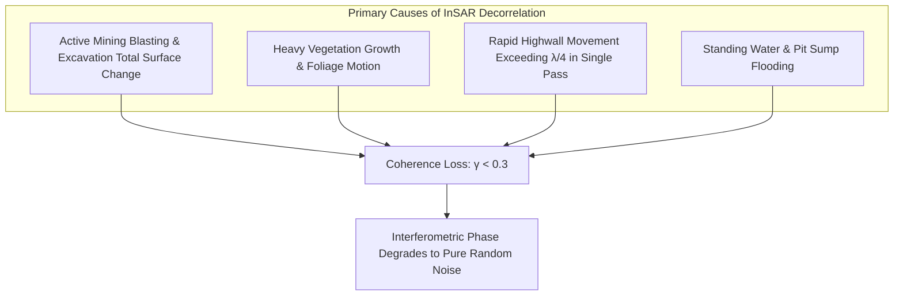
*Figure 17.1: Primary drivers of radar decorrelation in open-pit environments.*

### Operational Impact on Mines:
* In active open-pit mining benches, excavation constantly removes rock, causing **complete loss of coherence on the active digging face**.
* However, **unexcavated highwalls, pit crest perimeters, tailings dams, and waste dumps maintain high coherence ($\gamma > 0.6$)**, making them ideal targets for satellite InSAR monitoring.

---

## 18. Critical Limitations of Satellite InSAR

```mermaid
mindmap
 root((Satellite InSAR Limitations))
 Temporal Latency Revisit
 6 to 12 days between satellite overpasses
 Cannot provide real-time warning for sudden rockfalls
 Line-of-Sight LOS 1D
 Measures 1D radial displacement only
 Blind to North-South horizontal shearing
 Geometric Highwall Distortions
 Layover on steep slopes
 Radar Shadowing behind steep crests
 Environmental Decorrelation
 Blasting & digging destroy radar coherence
 Monsoon cloudbursts cause heavy atmospheric delay
 Processing Complexity
 Gigabytes of complex data per scene
 Requires specialized remote sensing software pipelines
```
*Figure 18.1: Structural, geometric, and operational limitations of Satellite InSAR.*

---

## 19. Open-Source InSAR Research Software Toolkits

To develop our SIH25071 prototype, we evaluated verified open-source scientific InSAR processing packages:

### Benchmarked Open-Source InSAR Frameworks

| Tool Name | Official URL / Organization | Programming Language | Core InSAR Capabilities | Supported Data | SIH25071 Transferability | License |
| :--- | :--- | :--- | :--- | :--- | :--- | :--- |
| **[MintPy](https://github.com/insarlab/MintPy)** | University of Miami / InSAR Lab | Python, NumPy, SciPy, HDF5 | SBAS time-series analysis, atmospheric APS correction, velocity inversion, and inverse velocity calculation. | Sentinel-1, TerraSAR-X, COSMO-SkyMed | **Directly usable:** Core Python module for generating regional historical time-series baselines. | GPL-3.0 |
| **[ISCE2 / ISCE3](https://github.com/isce-framework/isce2)** | NASA-JPL / Caltech | Python, C++, Cython, CUDA | Comprehensive raw SAR processing, coregistration, interferogram generation, and geometric geocoding. | Sentinel-1 (TOPS), ALOS-2, NISAR | Advanced backend processing engine for creating unwrapped interferograms from raw SLC scenes. | Apache 2.0 |
| **[GMTSAR](https://github.com/gmtsar/gmtsar)** | UC San Diego / Scripps | C, Shell, GMT | Full InSAR processing system integrating SNAPHU phase unwrapping and topographic phase subtraction. | Sentinel-1, ERS, Envisat, ALOS | Lightweight C-based pipeline for automated interferogram production on Linux servers. | LGPL-3.0 |
| **[PyRate](https://github.com/GeoscienceAustralia/PyRate)** | Geoscience Australia | Python, MPI | Parallelized time-series InSAR rate and displacement estimation using unwrapped interferograms. | Output from SNAP, ISCE, Gamma | High-throughput cloud-native time-series velocity inversion across large mining clusters. | Apache 2.0 |
| **[LiCSBAS](https://github.com/yumorishita/LiCSBAS)** | University of Leeds / COMET | Python, Shell | Automated SBAS time-series analysis integrated with the open COMET LiCSAR portal. | Pre-computed Sentinel-1 interferograms | **Easiest implementation:** Ingests ready-made interferograms without needing heavy raw SLC downloads. | GPL-3.0 |
| **[ESA SNAP Engine](https://github.com/senbox-org/snap-engine)** | European Space Agency (ESA) | Java, C++ | Standard ESA Sentinel Application Platform for interferometric coregistration, filtering, and geocoding. | All Sentinel-1 modes, Third-Party SAR | Standard benchmark tool for validating interferometric coherence and phase unwrapping. | GPL-3.0 |

> **SIH Implementation Note:** For our SIH25071 system, we utilize **MintPy and LiCSBAS** to ingest pre-processed Sentinel-1 interferometric networks, avoiding the heavy compute requirement of processing raw multi-gigabyte SLC scenes on edge hardware.

---

## 20. Accessible Satellite SAR Data Sources

| Satellite Mission | Frequency Band & Wavelength | Revisit Cycle | Data Access Portal | Access Policy & Cost |
| :--- | :--- | :--- | :--- | :--- |
| **Sentinel-1A / 1C** | C-band ($\lambda = 5.6\text{ cm}$) | 12 days (6 days in constellation) | [Copernicus Data Space Ecosystem](https://dataspace.copernicus.eu/) | **100% Free & Open Access** (ESA / European Commission) |
| **NASA-ISRO NISAR** | L-band ($\lambda = 24\text{ cm}$) & S-band | 12 days | [NASA Earthdata / ASF Vertex](https://search.asf.alaska.edu/) | **Free & Open Access** (Scheduled Launch / Data Access) |
| **ALOS-2 PALSAR-2** | L-band ($\lambda = 23.6\text{ cm}$) | 14 days | [JAXA Earth Observation](https://www.eorc.jaxa.jp/ALOS/en/) | Research Grant / Commercial Purchase |
| **TerraSAR-X / TanDEM-X**| X-band ($\lambda = 3.1\text{ cm}$) | 11 days | [Airbus Intelligence Portal](https://www.intelligence-airbusds.com/) | Commercial Purchase ($$ High Resolution) |

### How Our SIH Prototype Ingests Sentinel-1 Data:
1. Define the mine lease bounding box (GeoJSON coordinates).
2. Query the **Copernicus Data Space Ecosystem REST API** or **ASF Vertex Python API (`asf_search`)**.
3. Download pre-computed InSAR displacement rasters or unwrapped interferograms.
4. Convert geocoded displacement grids into standardized GeoJSON feature layers for the AI engine.

---

## 21. Complete SIH Multi-Modal Data Flow Pipeline

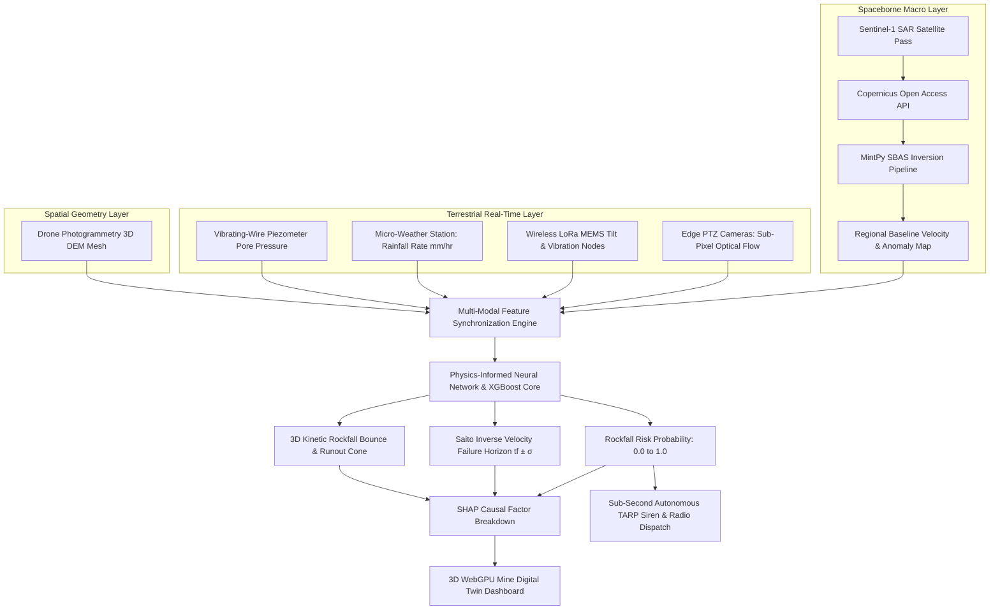
*Figure 21.1: Complete data flow architecture integrating satellite InSAR with real-time terrestrial monitoring.*

---

## 22. Concepts Adopted from Satellite InSAR for SIH25071

Our SIH25071 system incorporates the following concepts from satellite InSAR:

1. **Macro Regional Baseline Screening:** Using satellite InSAR as an automated, pit-wide screening tool to identify which highwalls or waste dumps are accumulating strain over months, automatically directing terrestrial cameras and IoT sensor deployment.
2. **Multi-Temporal Velocity Inversion:** Adopting SBAS time-series mathematical formulations to compute progressive acceleration trends.
3. **Line-of-Sight Kinematic Modeling:** Ingesting 1D LOS displacement vectors and decomposing them against 3D topographic surfaces.
4. **Coherence-Based Data Quality Weighting:** Using radar coherence metrics ($\gamma$) to dynamically weight the confidence of remote sensing inputs in the AI risk fusion model.

---

## 23. How Satellite InSAR Enhances the Overall SIH System

Satellite InSAR solves the **spatial blindness** of point sensors, while terrestrial sensors solve the **temporal latency** of satellites:

```
+---------------------------------------------------------------------------------------------------+
| THE HYBRID ADVANTAGE |
+---------------------------------------------------------------------------------------------------+
| [ SATELLITE InSAR ] + [ TERRESTRIAL EDGE AI & IoT ] = [ COMPLETE GEOSHIELD AI ] |
| - Broad Spatial Coverage (100km) - High-Frequency Real-Time (30 FPS)- 24/7 Total Pit Safety |
| - Historical 10-Year Baseline - Sub-Second Siren Dispatch (<1.0s)- Macro + Tactical Warning |
| - Zero In-Pit Hardware Footprint - Direct Subsurface Awareness (Pore)- Physics-Grounded Accuracy |
+---------------------------------------------------------------------------------------------------+
```

---

## 24. Proposed 4-Tier Hierarchical Monitoring Architecture

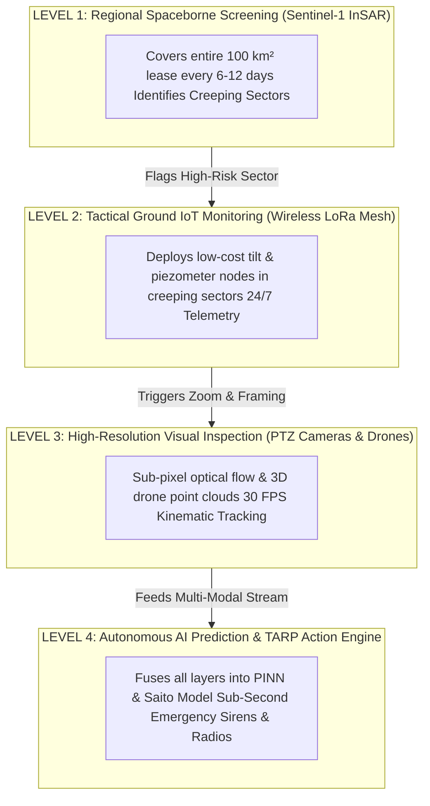
*Figure 24.1: 4-tier hierarchical slope stability monitoring architecture for SIH25071.*

---

## 25. AI / Machine Learning Feature Integration

### Master Multi-Modal Feature Vector Table

| Feature Category | Parameter Name | Symbol | Unit | Data Source |
| :--- | :--- | :--- | :--- | :--- |
| **InSAR Spaceborne** | Mean LOS Velocity | $v_{\text{InSAR}}$ | $\text{mm/year}$ | Sentinel-1 / MintPy SBAS |
| **InSAR Spaceborne** | Cumulative Historical Subsidence | $d_{\text{InSAR}}$ | $\text{mm}$ | Multi-Temporal SAR Archive |
| **InSAR Spaceborne** | Interferometric Coherence | $\gamma$ | $0.0 - 1.0$ | Coherence Matrix |
| **Terrestrial Vision** | Sub-Pixel Optical Flow Velocity | $v_{\text{vision}}$ | $\text{mm/hr}$ | Edge PTZ Cameras (DIS / Flow) |
| **Terrestrial Vision** | Tension Crack Opening Rate | $\Delta w$ | $\text{mm/hr}$ | Mobile-SAM Crack Segmentation |
| **Geotechnical IoT** | Surface Angular Rotation Rate | $\dot{\theta}$ | $\text{deg/hr}$ | LoRa MEMS Tilt Nodes |
| **Geotechnical IoT** | Pore-Water Pressure | $u$ | $\text{kPa}$ | Vibrating-Wire Piezometer |
| **Environmental** | Rainfall Rate | $I$ | $\text{mm/hr}$ | Micro-Weather Station |
| **Environmental** | Antecedent Moisture Index (7d) | $\text{AMI}_{7d}$ | $\text{mm}$ | Rolling Weather Summation |
| **Dynamic Shock** | Blast Peak Particle Velocity | $\text{PPV}$ | $\text{mm/s}$ | Blast Geophone Array |
| **Spatial Topographic**| Bench Slope Angle & Aspect | $\beta, \alpha$ | $\text{degrees}$ | Drone 3D DEM Mesh |

---

## 26. Explainable AI (XAI) Diagnostic Breakdown

To ensure DGMS regulatory compliance and operator trust, every high-risk alert generated by the system includes an instant SHAP (SHapley Additive exPlanations) diagnostic card:

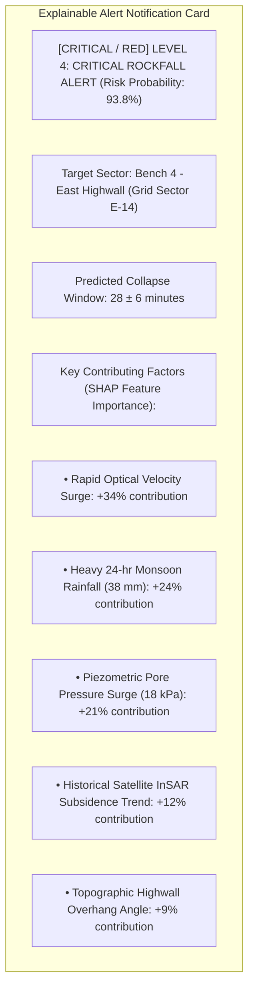
*Figure 26.1: Conceptual SHAP explainable alert breakdown card.*

---

## 27. Proposed Unified 3D GIS Dashboard Architecture

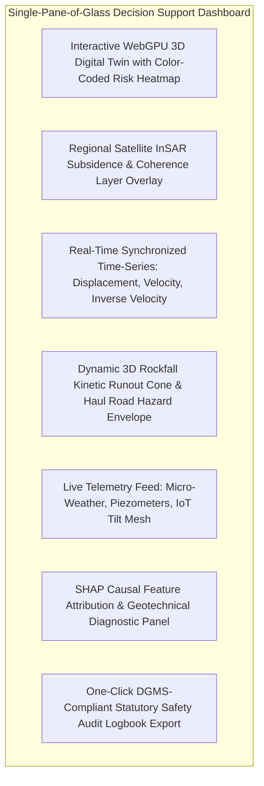
*Figure 27.1: Functional architecture of the unified 3D decision-support dashboard.*

---

## 28. Benchmark: Satellite InSAR vs. Proposed SIH System

| Feature / Dimension | Standalone Satellite InSAR | Proposed SIH25071 Multi-Modal System |
| :--- | :--- | :--- |
| **Spatial Coverage** | Macro Regional ($100+\text{ km}^2$) | Macro Regional (Satellite) + Highwall Tactical (Vision/IoT) |
| **Measurement Frequency** | Periodic (Every 6 to 12 days) | **Continuous 30 FPS / Sub-Second Real-Time** |
| **Immediate Life Safety Alerts**| [REJECTED] Impossible due to revisit delay | **[CONFIRMED] Autonomous Sub-Second TARP Siren Dispatch (<1.0s)** |
| **Atmospheric Noise Rejection** | Multi-temporal baseline filtering | **Multi-Modal Cross-Validation (Vision + InSAR + Tilt)** |
| **Pore Pressure & Hydrogeology**| [REJECTED] Blind to subsurface conditions | **[CONFIRMED] Synchronized Vibrating-Wire Piezometer Telemetry** |
| **3D Rockfall Runout Cones** | [REJECTED] None | **[CONFIRMED] 3D Rigid-Body Physics Bouncing Trajectory Modeling** |
| **Cost Profile** | Free (Sentinel-1) to $$ Commercial | **Ultra-Low Cost (₹2.0L – ₹5.0L per pit infrastructure)** |
| **Regulatory Compliance** | Historical auditing only | **Full Real-Time DGMS (Tech) Circular Compliance** |

---

## 29. Research Gap Analysis

### The Central Industry Dilemma:
* **Satellite InSAR** provides unmatched wide-area coverage and historical baselines, but its **6 to 12-day revisit interval makes it incapable of warning workers against rapid, sudden slope collapses**.
* **Local In-Situ Sensors** provide real-time data, but they are expensive, point-based, and **spatially blind to failures occurring outside instrumented zones**.

```
+---------------------------------------------------------------------------------------------------+
| BRIDGING THE RESEARCH GAP |
+---------------------------------------------------------------------------------------------------+
| [ SATELLITE InSAR LIMITATION ] Multi-day latency & no real-time life safety alerts. |
| [ IN-SITU POINT SENSOR LIMITATION ] High cost & spatial point blindness. |
| [ PROPOSED SIH25071 INNOVATION ] Hierarchical Fusion: Satellite InSAR screens regional |
| stress, Edge Vision & LoRa IoT monitor tactical benches|
| in real-time, and AI fuses both for sub-second TARP! |
+---------------------------------------------------------------------------------------------------+
```

---

## 30. Summary of Visualizations Included

1. **Figure 1.1:** Data transformation flow in spaceborne radar interferometry (Mermaid).
2. **Figure 2.1:** Operational capabilities of spaceborne radar remote sensing (Mermaid).
3. **Section 3:** Satellite Line-of-Sight (LOS) geometry diagram (ASCII).
4. **Figure 5.1:** End-to-end algorithmic processing pipeline for Satellite InSAR (Mermaid).
5. **Section 6:** Conceptual interferogram interference fringe pattern diagram (ASCII).
6. **Figure 7.1:** D-InSAR differential phase subtraction workflow (Mermaid).
7. **Figure 8.1:** PS-InSAR persistent scatterer processing workflow (Mermaid).
8. **Figure 9.1:** SBAS small-baseline interferometric network workflow (Mermaid).
9. **Figure 11.1:** Applications of Satellite InSAR across the mining lifecycle (Mermaid).
10. **Section 12:** Regional mine lease deformation grid representation.
11. **Figure 13.1:** Cumulative LOS subsidence vs. time graph (Mermaid xychart — synthetic data).
12. **Figure 14.1:** Deformation velocity surge vs. time graph (Mermaid xychart — synthetic data).
13. **Figure 15.1:** Inverse velocity ($1/v$) linear regression graph (Mermaid xychart — synthetic data).
14. **Figure 17.1:** Drivers of radar decorrelation in open-pit environments (Mermaid).
15. **Figure 18.1:** Limitations of Satellite InSAR mindmap (Mermaid).
16. **Figure 21.1:** Multi-modal data flow pipeline (Mermaid).
17. **Figure 24.1:** 4-tier hierarchical slope stability monitoring architecture (Mermaid).
18. **Figure 26.1:** SHAP explainable alert diagnostic card (Mermaid).
19. **Figure 27.1:** Unified 3D GIS decision-support dashboard architecture (Mermaid).

---

## 31. Conclusion

Satellite InSAR (encompassing **D-InSAR**, **PS-InSAR**, and **SBAS**) provides an extraordinary, cost-effective capability for **regional baseline screening, long-term slope consolidation tracking, and tailings dam stability auditing**.

However, satellite InSAR cannot function as a standalone early-warning system for sudden rockfalls due to orbital revisit latency and localized coherence loss.

Our **SIH25071 platform** leverages satellite InSAR for what it does best: **macro regional baseline screening and historical strain mapping**. We then fuse this macro layer with **real-time edge computer vision, wireless LoRa geotechnical IoT nodes, and physics-informed AI**, creating a complete multi-scale disaster management system that safeguards lives and heavy machinery across Indian open-cast mines.

---

## 32. References & Verified Open-Source Repositories

### Research Papers & Official Publications:
1. **Ferretti, A., Prati, C., & Rocca, F.** (2001). *Permanent scatterers in SAR interferometry*. IEEE Transactions on Geoscience and Remote Sensing, 39(1), pp. 8–20. [DOI: 10.1109/36.898661](https://doi.org/10.1109/36.898661) — *Foundational paper establishing Persistent Scatterer InSAR (PS-InSAR).*
2. **Berardino, P., Fornaro, G., Lanari, R., & Sansosti, E.** (2002). *A new algorithm for surface deformation monitoring based on small baseline differential SAR interferograms*. IEEE Transactions on Geoscience and Remote Sensing, 40(11), pp. 2375–2383. [DOI: 10.1109/TGRS.2002.803792](https://doi.org/10.1109/TGRS.2002.803792) — *Foundational paper defining the Small Baseline Subset (SBAS) algorithm.*
3. **Yague-Martinez, N., et al.** (2016). *Interferometric processing of Sentinel-1 TOPS data*. IEEE Transactions on Geoscience and Remote Sensing, 54(4), pp. 2220–2234. [DOI: 10.1109/TGRS.2015.2497902](https://doi.org/10.1109/TGRS.2015.2497902) — *Technical standard for coregistering and processing Sentinel-1 TOPS bursts.*
4. **Bozzano, F., et al.** (2018). *Landslide monitoring and failure forecasting by means of satellite InSAR data: The case of the catastrophic Montescaglioso landslide*. Natural Hazards and Earth System Sciences, 18(3), pp. 883–899. [DOI: 10.5194/nhess-18-883-2018](https://doi.org/10.5194/nhess-18-883-2018) — *Examines multi-temporal satellite InSAR for slope failure forecasting.*
5. **Directorate General of Mines Safety (DGMS).** (2020). *DGMS (Tech) Circular No. 02 of 2020: Standard Operating Procedures for scientific slope stability monitoring in open-cast mines*. Ministry of Labour & Employment, Government of India.
6. **Lundberg, S. M., & Lee, S.-I.** (2017). *A unified approach to interpreting model predictions*. Advances in Neural Information Processing Systems (NeurIPS 2017), 30, pp. 4765–4774.

### Verified Open-Source Frameworks & Repositories:
1. **MintPy (Miami InSAR Time-series software in Python):** [https://github.com/insarlab/MintPy](https://github.com/insarlab/MintPy) — *Open-source SBAS/PS time-series inversion framework in Python.*
2. **ISCE2 / ISCE3 (InSAR Scientific Computing Environment):** [https://github.com/isce-framework/isce2](https://github.com/isce-framework/isce2) — *NASA-JPL / Caltech modular SAR/InSAR processing framework.*
3. **GMTSAR:** [https://github.com/gmtsar/gmtsar](https://github.com/gmtsar/gmtsar) — *Scripps / UC San Diego InSAR processing system.*
4. **LiCSBAS:** [https://github.com/yumorishita/LiCSBAS](https://github.com/yumorishita/LiCSBAS) — *Automated Python tool for Sentinel-1 InSAR time series.*
5. **ESA SNAP (Sentinel Application Platform):** [https://github.com/senbox-org/snap-engine](https://github.com/senbox-org/snap-engine) — *European Space Agency open-source radar engine.*
