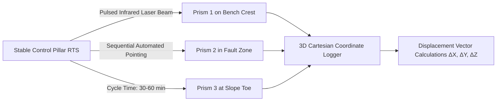

# Existing Technology 4: Robotic Total Station + Prism Monitoring (RTS)

> **Document Type:** Research & Benchmark Analysis  
> **Problem Statement ID:** SIH25071 | **Ministry of Mines** | **Category:** Software  
> **Prepared For:** Smart India Hackathon (SIH 2025)

---

## 1. Background & Working Principle

Robotic Total Stations (RTS) (e.g., Leica TM50, Trimble S9) are motorized optical-electronic surveying instruments permanently mounted on stable concrete pillars opposite mine highwalls.
* **Physical Principle:** Measures horizontal angle ($\theta$), vertical angle ($\alpha$), and Electronic Distance Measurement (EDM) slope distance ($d$) to an array of glass corner-cube prisms anchored into the rock benches:
  $$X = d \cdot \sin\alpha \cdot \cos\theta, \quad Y = d \cdot \sin\alpha \cdot \sin\theta, \quad Z = d \cdot \cos\alpha$$
* **Coordinate Output:** True 3D Cartesian vectors $(\Delta X, \Delta Y, \Delta Z)$ at millimeter accuracy ($\pm 1\text{ mm} \pm 1\text{ ppm}$).

---

## 2. Advantages & Industry Strengths
* **True 3D Vector Movement:** Outputs direct 3D displacement vectors rather than 1D line-of-sight measurements.
* **Millimeter-Level Accuracy:** Geodetic standard recognized worldwide and fully accepted under DGMS regulations.

---

## 3. Critical Limitations & Why It Fails Alone
* **Discrete Point-Only Blindness:** Only monitors exact spots where glass prisms are installed. A massive bench collapse occurring 3 meters away from a prism is completely undetected.
* **Blasting Destruction & Hazardous Replacement:** Prisms frequently shatter from blast flyrock. Replacing them forces surveyors to climb dangerous, unstable slopes.
* **Optical Occlusion:** Heavy coal/ore dust, fog, and diesel exhaust block the laser line-of-sight.
* **Sampling Latency (30–60 Minutes):** Cannot warn against sudden brittle rock detachments.

---

## 4. What is Doable & How We Adopt It for SIH25071

| RTS Concept | Traditional RTS Method | Proposed SIH25071 AI Innovation |
| :--- | :--- | :--- |
| **Prism Targets** | Physical glass prisms (₹10,000/prism) | **Virtual Prismless Tracking:** Vision AI tracks 100,000+ natural rock texture keypoints. |
| **3D Vector Coordinates** | Robotic laser angle/distance | Extracted by projecting 2D optical flow onto the drone 3D Digital Elevation Model (DEM). |
| **Maintenance Hazard** | Manual climbing on unstable slopes | **Zero in-pit maintenance:** 100% non-contact edge cameras outside the danger zone. |

---

## 5. References
1. **Rüeger, J. M.** (1996). *Electronic Distance Measurement: An Introduction*. Springer-Verlag.
2. **Directorate General of Mines Safety (DGMS).** (2020). *Circular on automated geodetic monitoring in deep open-cast mines*.
