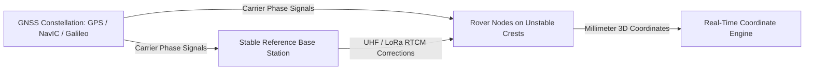

# Existing Technology 5: GNSS / GPS Slope Monitoring

> **Document Type:** Research & Benchmark Analysis  
> **Problem Statement ID:** SIH25071 | **Ministry of Mines** | **Category:** Software  
> **Prepared For:** Smart India Hackathon (SIH 2025)

---

## 1. Background & Working Principle

High-precision Dual-Frequency Real-Time Kinematic (RTK) GNSS receivers (e.g., Trimble SPS series, Leica GM30) use satellite constellations (GPS, GLONASS, Galileo, NavIC) to track 3D movements of slope crests.
* **Double-Differencing Formulation:**
  $$\nabla\Delta \Phi = \nabla\Delta \rho + \lambda \nabla\Delta N + \epsilon$$
  Carrier-phase double-differencing eliminates satellite/receiver clock biases to achieve $\pm 5\text{ mm}$ horizontal and $\pm 10\text{ mm}$ vertical accuracy in real-time.

---

## 2. Advantages & Industry Strengths
* **All-Weather 24/7 Continuity:** Immune to dust, dense fog, rain, and darkness.
* **Direct Global Coordinates:** Outputs georeferenced UTM coordinates without requiring optical line of sight across the pit.

---

## 3. Limitations in Open-Cast Mines
* **Deep Pit Satellite Masking:** In deep pits (>150m) with steep highwalls, the rock walls block the satellite constellation ("sky view obstruction"), degrading Dilution of Precision (DOP).
* **Multi-Path Reflection Errors:** Satellite signals bounce off opposite metallic/mineralized highwalls before hitting the antenna, generating false movement spikes of $\pm 20\text{ mm}$.
* **Cost Barrier:** ₹1.5L – ₹4.0L per node; deploying 20 nodes costs ₹40 Lakh – ₹60 Lakh.

---

## 4. What is Doable & How We Adopt It for SIH25071

| GNSS Concept | Traditional Implementation | Proposed SIH25071 AI Innovation |
| :--- | :--- | :--- |
| **High-Cost Hardware** | Commercial dual-frequency receivers | Low-cost multi-band RTK GNSS + 6-axis IMU connected via LoRaWAN ($45/node). |
| **Multi-Path Noise** | Post-processing baseline filters | **Edge Kalman Filter:** Fuses high-frequency IMU acceleration with GNSS carrier phase to reject multipath noise. |
| **Spatial Sparsity** | 5 to 10 points across pit | Fused with Computer Vision virtual surface grid to cover entire benches. |

---

## 5. References
1. **Hoffmann-Wellenhof, B., et al.** (2008). *GNSS – Global Navigation Satellite Systems*. Springer.
2. **Wang, G.** (2013). *Millimeter-accuracy GPS monitoring of active landslides*. Journal of Geodesy.
