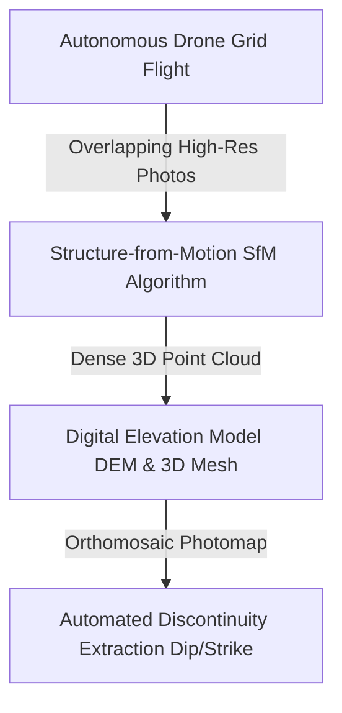

# Existing Technology 7: Drone / UAV Photogrammetry

> **Document Type:** Research & Benchmark Analysis  
> **Problem Statement ID:** SIH25071 | **Ministry of Mines** | **Category:** Software  
> **Prepared For:** Smart India Hackathon (SIH 2025)

---

## 1. Background & Working Principle

Survey drones (e.g., DJI Matrice 300 RTK) fly automated aerial grid paths over open-pit mines capturing hundreds of overlapping RGB photographs (75% forward, 70% lateral overlap).
* **Structure-from-Motion (SfM) Pipeline:** Solves collinearity equations across feature match points (SIFT/ORB) to simultaneously reconstruct 3D camera poses and 3D dense point clouds, generating Digital Elevation Models (DEMs) and high-resolution orthomosaics.

---

## 2. Strengths & Limitations

### Advantages:
* **Zero In-Pit Safety Hazard:** Completely non-contact; surveys sheer vertical highwalls without risking personnel.
* **Pit-Wide 3D Geometry:** Generates photorealistic 3D surface meshes of the entire open-cast lease.
* **Low Capex:** Drones cost ₹3 Lakh – ₹15 Lakh (vastly cheaper than SSR or terrestrial LiDAR).

### Limitations:
* **Processing Latency (2–6 Hours):** SfM bundle adjustment requires hours of processing; **cannot provide real-time warning during active rock movement**.
* **Weather & Night Restrictions:** Cannot fly in high winds (>35 km/h), heavy rain, dense fog, or darkness.

---

## 3. What is Doable & How We Adopt It for SIH25071

| Photogrammetry Concept | Conventional Drone Usage | Proposed SIH25071 Implementation |
| :--- | :--- | :--- |
| **Real-Time Warning** | ❌ Not possible (hours of lag) | Replaced by real-time fixed edge vision streams for second-by-second alerting. |
| **Base 3D Terrain Model** | ✅ Highly doable | Drone 3D DEM serves as the **base geometry for our WebGPU 3D Digital Twin**. |
| **Kinetic Trajectory Modeling** | Exported to CAD | Ingested directly into our real-time 3D rigid-body rockfall bounce physics engine. |

---

## 4. References
1. **Westoby, M. J., et al.** (2012). *‘Structure-from-Motion’ photogrammetry: A low-cost, effective tool for geoscience applications*. Geomorphology, 179, pp. 300–314.
2. **Salvini, R., et al.** (2018). *Use of unmanned aerial vehicle (UAV) photogrammetry for rockfall hazard analysis*. Landslides, 15(6), pp. 1163–1177.
