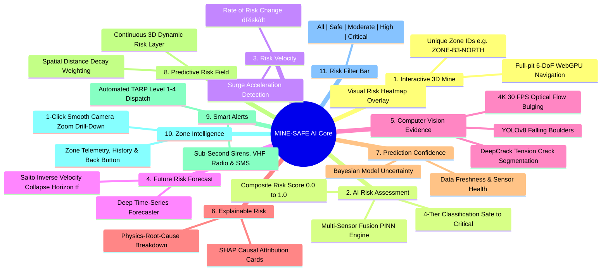
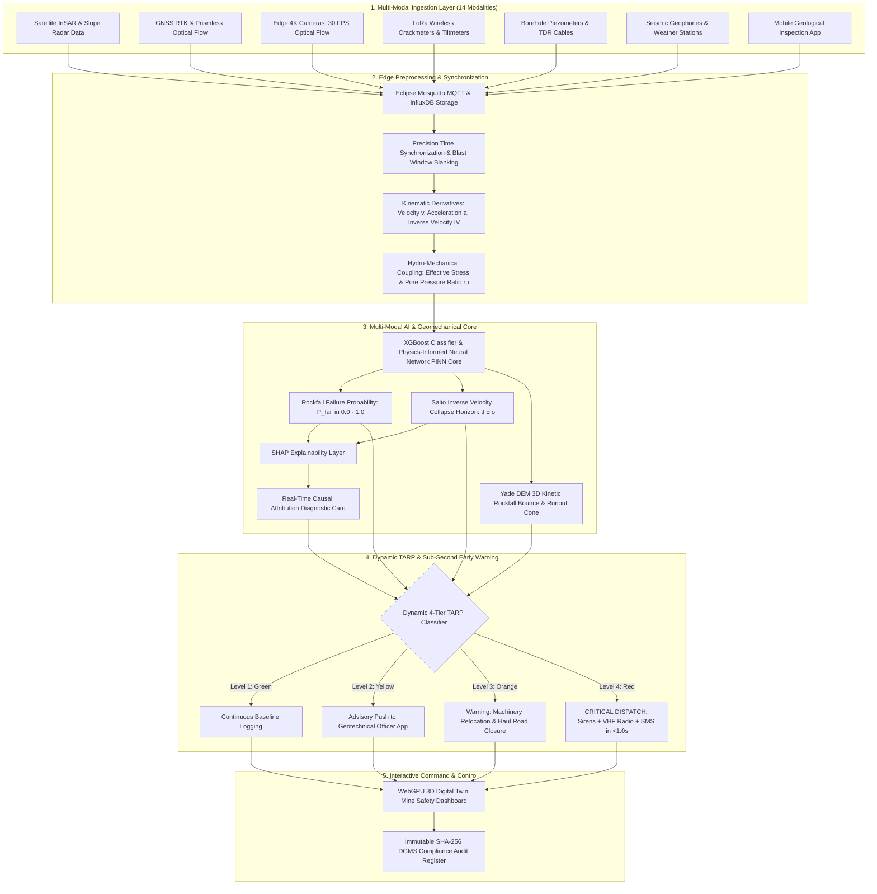

# 07. Proposed Solution: MINE-SAFE AI Architecture

> **Document Type:** Master Research & Architecture Report  
> **Problem Statement ID:** SIH25071  
> **Problem Statement Title:** AI-Based Rockfall Prediction and Alert System for Open-Pit Mines  
> **Organization:** Ministry of Mines | **Category:** Software | **Theme:** Disaster Management  
> **Target System:** MINE-SAFE AI Platform  
> **Target File:** `docs/07_PROPOSED_SOLUTION.md`

---

## 1. System Vision & Paradigm Shift

**MINE-SAFE AI** is an integrated software intelligence platform designed for the Ministry of Mines that transforms open-pit slope stability management from a fragmented, reactive monitoring task into an **autonomous, spatial, and predictive early-warning system**.

```
+---------------------------------------------------------------------------------------------------+
|                           THE CORE PHILOSOPHY OF MINE-SAFE AI                                     |
+---------------------------------------------------------------------------------------------------+
|                                                                                                   |
|                       RISK   ×   LOCATION   ×   TIME                                              |
|                                                                                                   |
|  Instead of overwhelming mine operators with isolated, raw sensor numbers (e.g. "Sensor #14 is    |
|  at 14.2 mm", "Sensor #8 is at 180 kPa"), MINE-SAFE AI converts heterogeneous data streams into   |
|  intuitive, actionable, zone-level geotechnical safety intelligence!                              |
+---------------------------------------------------------------------------------------------------+
```

```
+---------------------------------------------------------------------------------------------------+
|                        LEGACY MINING MONITORING vs. MINE-SAFE AI PLATFORM                         |
+---------------------------------------------------------------------------------------------------+
|  [ LEGACY MONITORING PRACTICES ]         │  [ PROPOSED MINE-SAFE AI PLATFORM ]                    |
|  - Disconnected vendor software silos    │  - Open-standard MQTT / InfluxDB unified data pipeline |
|  - Point sensors with spatial blindness  │  - Full-field 4K Edge AI Vision (100,000+ keypoints)   |
|  - Rigid static thresholds (False alarms)│  - Dynamic Kinematic Triggers & Risk Velocity (dRisk/dt)|
|  - Unconstrained "black box" neural nets │  - Physics-Informed AI + SHAP Causal Explainability    |
|  - Static 2D charts and PDF reports      │  - Interactive 3D WebGPU Digital Twin with Zone Intel  |
|  - 15 to 45 min manual evacuation delay  │  - Sub-second (<1.0s) Autonomous Multi-Channel TARP    |
|  - ₹5+ Crores radar Capex                │  - Low-cost Edge Vision + LoRa Mesh (95% cost saving)  |
+---------------------------------------------------------------------------------------------------+
```

---

## 2. The 11 Core Features of MINE-SAFE AI



### Detailed Feature Breakdown:
1. **Interactive 3D Mine `[PROTOTYPE]`:** Full 3D photogrammetry/LiDAR reality mesh rendered at 60 FPS in WebGPU/CesiumJS with geocoded Zone IDs.
2. **AI-Based Risk Assessment `[PROTOTYPE]`:** Multi-variate fusion computing a continuous Composite Risk Score ($\mathcal{R}_z \in [0.0, 1.0]$) categorized into **Safe, Moderate, High, and Critical**.
3. **Risk Velocity `[PROTOTYPE]`:** Calculates the first derivative of risk ($\mathcal{V}_{\text{risk}} = d\mathcal{R}_z / dt$) to flag rapidly deteriorating highwall sectors.
4. **Future Risk Forecast `[PROTOTYPE]`:** Deep time-series LSTM + **Saito Inverse Velocity ($\text{IV} = 1/v \to 0$)** computing the estimated failure horizon ($t_f \pm \sigma$).
5. **Computer Vision Evidence `[PROTOTYPE]`:** Live 4K optical camera analytics measuring sub-pixel optical flow bulging, YOLOv8 falling boulders, and DeepCrack tension fractures.
6. **Explainable Risk `[PROTOTYPE]`:** Local **SHAP (SHapley Additive exPlanations)** diagnostic cards decomposing risk into physical causal percentages.
7. **Prediction Confidence Index `[PROTOTYPE]`:** Reliability metric ($\mathcal{C}_{\text{pred}} \in [0\%, 100\%]$) based on sensor density, telemetry freshness ($<60\text{ s}$), and packet delivery ratio ($PDR$).
8. **Predictive Risk Field `[PROTOTYPE]`:** Continuous 3D dynamic scalar risk layer $\mathcal{R}(x, y, z, t)$ mapped across highwalls and intersecting active haul roads.
9. **Smart Alerts & TARP Early-Warning `[PROTOTYPE]`:** Automated 4-tier Trigger Action Response Plan with sub-second ($<1.0\text{ s}$) siren, VHF radio, and SMS dispatch.
10. **Zone Intelligence `[PROTOTYPE]`:** 1-click smooth camera zoom into any Zone ID opening deep telemetry charts, live camera crops, joint dip/strike, and a **[Back to Full Mine]** overview button.
11. **Unified Risk Filter Bar `[PROTOTYPE]`:** Global toolbar toggle to filter the 3D Digital Twin by status: **[All]**, **[Safe]**, **[Moderate]**, **[High]**, and **[Critical]**.

---

## 3. Explicit Statement of Innovation & Contribution

To maintain scientific integrity, we explicitly define our technical contributions:

```
+---------------------------------------------------------------------------------------------------+
|                                  OUR INNOVATION & CONTRIBUTIONS                                   |
+---------------------------------------------------------------------------------------------------+
|  WHAT WE DO NOT CLAIM:                                                                            |
|  - We do NOT claim to have invented Artificial Intelligence or Neural Networks.                   |
|  - We do NOT claim to have invented GNSS, InSAR, Radar, or Inclinometers.                         |
|  - We do NOT claim to have invented the concept of 3D Digital Twins or TARP.                     |
|                                                                                                   |
|  OUR GENUINE TECHNICAL CONTRIBUTIONS:                                                             |
|  1. HETEROGENEOUS MULTI-SENSOR FUSION LAYER: Ingesting optical, in-situ, hydrogeological, and     |
|     meteorological telemetry into a synchronized time-series feature store.                       |
|  2. VIRTUAL PRICELESS OPTICAL TRACKING: Replacing fragile physical glass total station prisms    |
|     with 100,000+ natural rock texture keypoints projected onto a 3D drone mesh.                  |
|  3. PHYSICS-INFORMED AI CORE: Enforcing Mohr-Coulomb mechanics and Saito inverse velocity in ML.  |
|  4. EXPLAINABLE GEOTECHNICAL REASONING: Real-time SHAP causal attribution cards for operators.   |
|  5. 3D SPATIAL ZONE INTELLIGENCE: Integrating risk velocity and 6-DoF interactive drill-down.    |
|  6. SUB-SECOND LIFE-SAFETY TARP ACTUATION: Direct autonomous hardware siren and VHF broadcast.    |
+---------------------------------------------------------------------------------------------------+
```

---

## 4. End-to-End Operational Workflow


*Figure 7.1: Master end-to-end system architecture synthesizing all 26 monitored technologies into the unified MINE-SAFE AI disaster management platform.*
