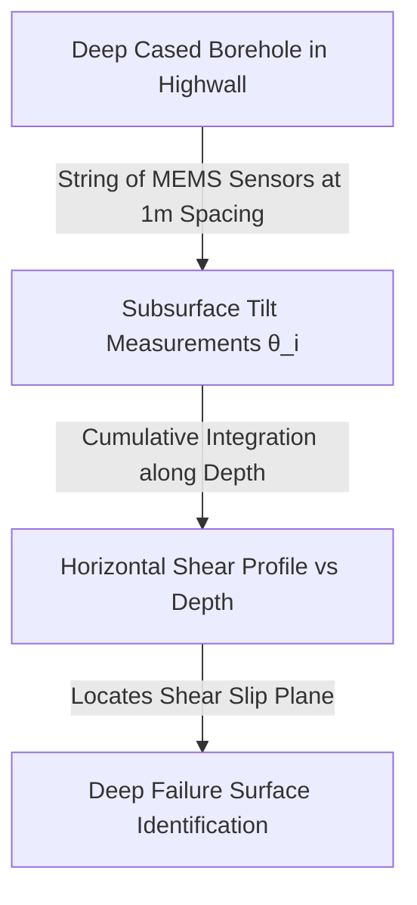

# Existing Technology 9: Inclinometers (Subsurface Borehole & In-Place)

> **Document Type:** Research & Benchmark Analysis  
> **Problem Statement ID:** SIH25071 | **Ministry of Mines** | **Category:** Software  
> **Prepared For:** Smart India Hackathon (SIH 2025)

---

## 1. Background & Working Principle

Inclinometers measure subsurface lateral horizontal displacement across borehole depths to locate deep shear slip planes.
* **Physics & Formula:** A vertical grooved casing is installed in a borehole past the failure surface. An In-Place Inclinometer (IPI) string of MEMS accelerometers measures tilt angle ($\theta_i$) at depth intervals $i$:
  $$\delta x_i = L \cdot \sin(\theta_i), \quad D_n = \sum_{i=1}^n \delta x_i$$
  where $L$ is gauge length and $D_n$ is cumulative horizontal displacement from the bottom stable anchor.

---

## 2. Strengths & Limitations

### Pros:
* **Deep Shear Plane Localization:** Accurately pinpoints the exact depth and thickness of underground slip surfaces before surface cracks appear.

### Cons:
* **Destructive Shear Failure:** When the slope undergoes significant shearing (>50 mm), the rock movement snaps or pinches the plastic casing, permanently destroying the instrument.
* **Single 1D Line:** Blind to slope failures occurring 15 meters away.
* **High Drilling Cost:** ₹5L – ₹15L per borehole.

---

## 3. What is Doable & How We Adopt It for SIH25071

| Inclinometer Concept | Conventional Inclinometer Usage | Proposed SIH25071 Implementation |
| :--- | :--- | :--- |
| **Deep Shear Calibration** | Isolated point logger | Data feeds directly into our **Physics-Informed Neural Network (PINN)** to constrain subsurface slip boundary conditions. |
| **Cost Reduction** | Full pit drilling arrays | Prioritize surface optical flow + IoT tilt mesh, utilizing existing exploratory borehole IPI data as ground truth. |

---

## 4. References
1. **Dunnicliff, J.** (1993). *Geotechnical Instrumentation for Monitoring Field Performance*. John Wiley & Sons.
