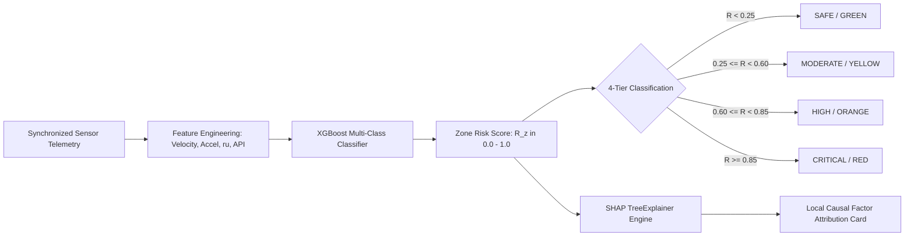

# 10. AI / ML Architecture & Explainability Engine

> **Document Type:** Master Research & Architecture Report  
> **Problem Statement ID:** SIH25071  
> **Problem Statement Title:** AI-Based Rockfall Risk Prediction & Early-Warning System for Open-Pit Mines  
> **Organization:** Ministry of Mines | **Category:** Software | **Theme:** Disaster Management  
> **Target System:** MINE-SAFE AI Platform  
> **Target File:** `docs/10_AI_ML_ARCHITECTURE.md`

---

## 1. Dual-Track AI Architecture Framework

To ensure the machine learning pipeline is technically robust, implementable within the student hackathon scope, and scientifically credible, the architecture is divided into two distinct tracks:

```
+---------------------------------------------------------------------------------------------------+
|                              DUAL-TRACK AI PIPELINE CLASSIFICATION                                |
+---------------------------------------------------------------------------------------------------+
|  [ TRACK 1: CORE AI ENGINE ] [PROTOTYPE - IMPLEMENTED IN STUDENT MVP]                             |
|  - Tabular Multi-Sensor Fusion: Gradient Boosted Trees (XGBoost / Random Forest)                  |
|  - Temporal Trend Forecasting: Recurrent Neural Network (LSTM / GRU) with Lag Features            |
|  - Kinematic Trend Analysis: Saito Inverse Velocity Model (1/v -> 0) Estimated Forecast Horizon   |
|  - Computer Vision Analytics: Sub-pixel Optical Flow Tracking & YOLO Boulder Detection            |
|  - Local Causal Explainability: SHAP (SHapley Additive exPlanations) Diagnostic Cards             |
|                                                                                                   |
|  [ TRACK 2: ADVANCED & FUTURE AI ] [RESEARCHED / FUTURE EXTENSIONS]                               |
|  - Physics-Informed Neural Networks (PINNs) with embedded elastoplastic stress constraints         |
|  - Bayesian Neural Networks with Monte Carlo Dropout for Epistemic Uncertainty Estimation          |
|  - Spatiotemporal Graph Attention Networks (GAT) across 3D Mine Topography                       |
+---------------------------------------------------------------------------------------------------+
```

---

## 2. Core AI Pipeline: Classification & Risk Scoring


*Figure 10.1: Core AI risk estimation and SHAP explainability workflow.*

### Mathematical Risk Formulation:
The Composite Zone Risk Score ($\mathcal{R}_z \in [0.0, 1.0]$) is estimated through a probabilistic ensemble model:

$$\mathcal{R}_z(t) = \sigma\left( \mathbf{w}^T \mathbf{\Phi}(t) + b \right)$$

where $\mathbf{\Phi}(t)$ represents the normalized feature vector:
$$\mathbf{\Phi}(t) = \left[ v_{\text{vision}}(t), \dot{w}_{\text{crack}}(t), \dot{\theta}_{\text{tilt}}(t), u_{\text{pore}}(t), I_{\text{rain}}(t), \text{PPV}_{\text{blast}}(t), \text{GSI}_z \right]^T$$

---

## 3. Temporal Trend Forecasting & Saito Collapse Horizon

For time-series deformation forecasting, a lightweight **LSTM network** models displacement trends over rolling forecast windows.

When accelerating deformation ($\ddot{d} > 0$) is observed, the system applies the established **Saito (1965) Inverse Velocity Model**:

$$\text{IV}(t) = \frac{1}{v(t)} = m \cdot t + c$$

Extrapolating $\text{IV}(t) \to 0$ yields an **Estimated Forecast Horizon ($t_f$)**:

$$t_f = -\frac{c}{m}$$

> **Scientific Cautionary Note:**  
> *"The Saito inverse velocity method is an established empirical technique that provides a mathematical trend indicator during accelerating creep. It does NOT guarantee an exact failure moment. It provides actionable decision-support information to help geotechnical teams prioritize evacuation before instability progresses."*

---

## 4. Explainable AI (XAI) via SHAP Causal Decomposition

To ensure mine personnel understand the reasoning behind an elevated risk score, the system computes local Shapley values:

$$\phi_i(x) = \sum_{S \subseteq F \setminus \{i\}} \frac{|S|!(|F| - |S| - 1)!}{|F|!} \left[ f(S \cup \{i\}) - f(S) \right]$$

```
+---------------------------------------------------------------------------------------------------+
|                        ILLUSTRATIVE SHAP OPERATOR DIAGNOSTIC CARD                                 |
+---------------------------------------------------------------------------------------------------+
|  ZONE: ZONE-B3-NORTH  |  CURRENT RISK SCORE: 0.88 (CRITICAL / RED)  |  STATUS: SYNTHETIC TEST     |
|  -----------------------------------------------------------------------------------------------  |
|  PRIMARY CAUSAL DRIVERS (Illustrative Breakdown):                                                 |
|  [========================] +44%  Optical Flow Creep Acceleration                                 |
|  [================]         +28%  Pore-Water Pressure Elevation                                   |
|  [=========]                +16%  Tension Crack Dilation Velocity                                 |
|  [======]                   +12%  Rainfall Infiltration                                           |
|  -----------------------------------------------------------------------------------------------  |
|  RECOMMENDED ACTION: Verify bench conditions with site geotechnical personnel; review TARP tier.  |
+---------------------------------------------------------------------------------------------------+
```
