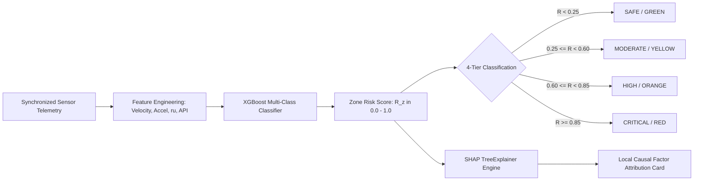

# 10. AI / ML Architecture & Explainability Engine

> **Document Type:** Master Research & Architecture Report  
> **Problem Statement ID:** SIH25071  
> **Problem Statement Title:** AI-Based Rockfall Prediction and Alert System for Open-Pit Mines  
> **Organization:** Ministry of Mines | **Category:** Software | **Theme:** Disaster Management  
> **Target System:** MINE-SAFE AI Platform  
> **Target File:** `docs/10_AI_ML_ARCHITECTURE.md`

---

## 1. Dual-Track AI Architecture Framework

To ensure the AI architecture is technically robust, implementable within the student hackathon scope, and scientifically credible, we divide the artificial intelligence pipeline into two distinct tracks:

```
+---------------------------------------------------------------------------------------------------+
|                              DUAL-TRACK AI PIPELINE CLASSIFICATION                                |
+---------------------------------------------------------------------------------------------------+
|  [ TRACK 1: CORE AI ENGINE ] [PROTOTYPE - IMPLEMENTED IN STUDENT MVP]                             |
|  - Tabular Multi-Sensor Fusion: Gradient Boosted Trees (XGBoost / LightGBM / Random Forest)       |
|  - Temporal Trend Forecasting: Recurrent Neural Network (LSTM / GRU) + Lag Feature Engineering     |
|  - Physical Creep Extrapolation: Saito Inverse Velocity Model (1/v -> 0) Estimated Horizon (tf)  |
|  - Computer Vision Analytics: 4K Lucas-Kanade Optical Flow + YOLOv8 Boulder Detachment Tracking    |
|  - Local Causal Explainability: SHAP (SHapley Additive exPlanations) Diagnostic Cards             |
|                                                                                                   |
|  [ TRACK 2: ADVANCED & FUTURE AI ] [RESEARCHED / FUTURE EXTENSIONS]                               |
|  - Physics-Informed Neural Networks (PINNs) embedding 2D Navier-Stokes & Mohr-Coulomb loss PDEs    |
|  - Bayesian Neural Networks with Monte Carlo Dropout for Epistemic Uncertainty Estimation          |
|  - Multi-Modal Spatiotemporal Graph Attention Transformers (GAT) across 3D Mine Meshes            |
+---------------------------------------------------------------------------------------------------+
```

---

## 2. Core AI Pipeline: Classification & Risk Scoring


*Figure 10.1: Core AI risk estimation and SHAP explainability workflow.*

### Mathematical Risk Formulation:
The Composite Zone Risk Score ($\mathcal{R}_z \in [0.0, 1.0]$) is computed as an ensemble probability:

$$\mathcal{R}_z(t) = \sigma\left( \mathbf{w}^T \mathbf{\Phi}(t) + b \right)$$

where $\mathbf{\Phi}(t)$ represents the normalized feature vector:
$$\mathbf{\Phi}(t) = \left[ v_{\text{vision}}(t), \dot{w}_{\text{crack}}(t), \dot{\theta}_{\text{tilt}}(t), u_{\text{pore}}(t), I_{\text{rain}}(t), \text{PPV}_{\text{blast}}(t), \text{GSI}_z \right]^T$$

---

## 3. Temporal Trend Forecasting & Saito Collapse Horizon

For time-series deformation forecasting, a lightweight **LSTM network** predicts displacement trends over rolling 1-hr, 6-hr, and 24-hr windows. 

When accelerating tertiary creep is detected ($\ddot{d} > 0$), the system fits the **Saito (1965) Inverse Velocity Model**:

$$\text{IV}(t) = \frac{1}{v(t)} = m \cdot t + c$$

Extrapolating $\text{IV}(t) \to 0$ yields the **Estimated Failure-Time Indicator ($t_f$)**:

$$t_f = -\frac{c}{m}$$

> **Scientific Cautionary Note:**  
> *"The Saito collapse horizon $t_f$ is an empirical indicator of accelerating creep and does NOT represent an infallible guarantee of exact collapse time. It serves as actionable decision support for progressive slope failure evacuation planning."*

---

## 4. Explainable AI (XAI) via SHAP Causal Decomposition

To ensure mine managers understand *why* an alert was generated, the system computes exact local Shapley values:

$$\phi_i(x) = \sum_{S \subseteq F \setminus \{i\}} \frac{|S|!(|F| - |S| - 1)!}{|F|!} \left[ f(S \cup \{i\}) - f(S) \right]$$

```
+---------------------------------------------------------------------------------------------------+
|                        ILLUSTRATIVE SHAP OPERATOR DIAGNOSTIC CARD                                 |
+---------------------------------------------------------------------------------------------------+
|  ZONE: ZONE-B3-NORTH  |  CURRENT RISK SCORE: 0.88 (CRITICAL / RED)  |  CONFIDENCE: 94.2%          |
|  -----------------------------------------------------------------------------------------------  |
|  PRIMARY CAUSAL DRIVERS:                                                                          |
|  [========================] +44%  Optical Flow Creep Acceleration (v = 18.5 mm/hr)                |
|  [================]         +28%  Hydrostatic Cleft Pore Pressure Surge (u = 215 kPa)             |
|  [=========]                +16%  Tension Crack Dilation Velocity (dw/dt = 4.2 mm/day)            |
|  [======]                   +12%  Monsoon Cloudburst Rainfall Infiltration (I = 42 mm/hr)         |
|  -----------------------------------------------------------------------------------------------  |
|  RECOMMENDED ACTION: Relocate heavy production shovel from Bench 3 toe; initiate Level 4 TARP.    |
+---------------------------------------------------------------------------------------------------+
```
