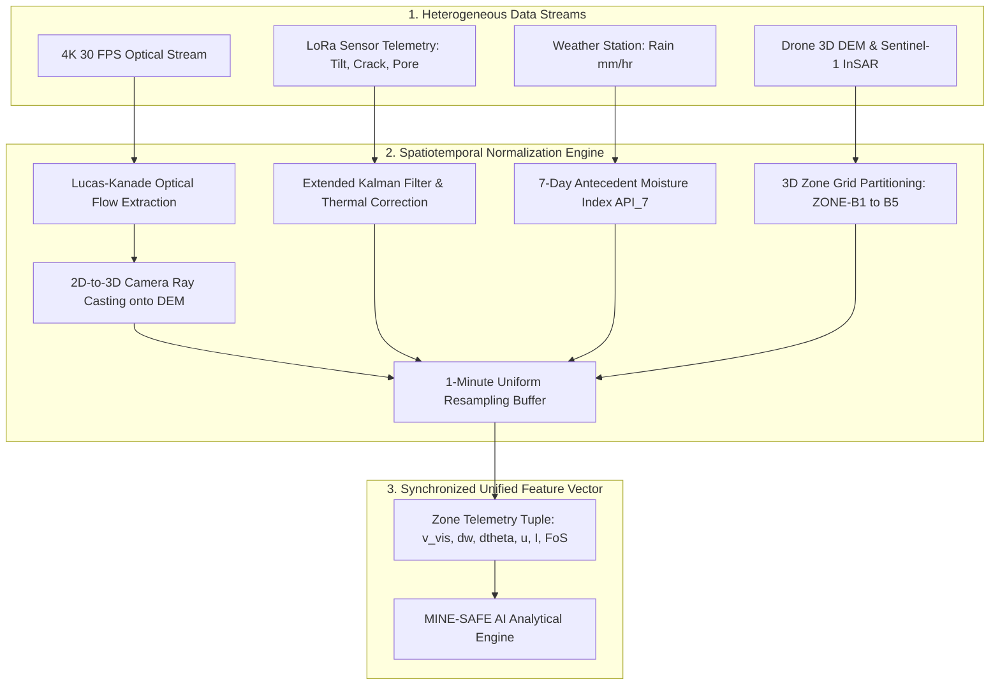

# 11. Multi-Source Sensor Fusion & Spatiotemporal Alignment

> **Document Type:** Master Research & Architecture Report  
> **Problem Statement ID:** SIH25071  
> **Problem Statement Title:** AI-Based Rockfall Prediction and Alert System for Open-Pit Mines  
> **Organization:** Ministry of Mines | **Category:** Software | **Theme:** Disaster Management  
> **Target System:** MINE-SAFE AI Platform  
> **Target File:** `docs/11_SENSOR_FUSION.md`

---

## 1. The Sensor Fusion Challenge in Open-Cast Mines

Open-pit mines deploy a wide array of monitoring instruments operating across fundamentally different physical principles, sampling rates, coordinate frames, and network latencies:

```
+---------------------------------------------------------------------------------------------------+
|                           HETEROGENEOUS SENSOR MODALITY CHARACTERISTICS                           |
+---------------------------------------------------------------------------------------------------+
|  SENSOR TYPE            | SAMPLING FREQUENCY    | SPATIAL DOMAIN        | DATA FORMAT / PROTOCOL  |
|  -----------------------|-----------------------|-----------------------|------------------------ |
|  4K CCTV Optical Stream | 30 FPS (33.3 ms)      | 2D Image Plane (Pixels)| RTSP H.264/H.265 Stream |
|  Seismic Geophones      | 100 Hz – 1000 Hz (1ms)| Point Vector (m/s)    | RS-485 Modbus Binary    |
|  MEMS Tiltmeters        | 10 Hz (100 ms)        | Point Angles (θx, θy) | LoRaWAN / JSON Payload  |
|  Piezometers & Cracks   | 1 Sample / minute     | Point Scalar (kPa, mm)| LoRaWAN / JSON Payload  |
|  Weather AWS            | 1 Sample / minute     | Point Scalar (mm/hr)  | MQTT / JSON Telemetry   |
|  Drone Photogrammetry   | Weekly Survey Flight  | 3D Textured Mesh      | GeoTIFF / OBJ 3D Tiles  |
|  Satellite InSAR (SBAS) | 6 to 12 Days          | Regional 2D Grid      | NetCDF / HDF5 Formats   |
+---------------------------------------------------------------------------------------------------+
```

---

## 2. Spatiotemporal Synchronization Architecture


*Figure 11.1: Multi-source spatiotemporal sensor fusion pipeline.*

---

## 3. Spatial Alignment: 2D-to-3D Pinhole Ray Casting

To merge 2D optical camera pixel motions ($u, v$) with the 3D highwall coordinate system ($X_w, Y_w, Z_w$), the system solves the **Perspective-n-Point (PnP)** calibration:

$$\begin{bmatrix} u \\ v \\ 1 \end{bmatrix} \sim \mathbf{K} \begin{bmatrix} \mathbf{R} & \mathbf{t} \end{bmatrix} \begin{bmatrix} X_w \\ Y_w \\ Z_w \\ 1 \end{bmatrix}$$

where:
* $\mathbf{K}$ is the $3 \times 3$ intrinsic camera calibration matrix.
* $\begin{bmatrix} \mathbf{R} & \mathbf{t} \end{bmatrix}$ is the extrinsic rotation and translation pose relative to the pit coordinate frame.

By casting optical flow motion vectors back onto the drone-derived **Digital Elevation Model (DEM)** surface mesh, pixel displacements ($\text{pixels/frame}$) are converted into metric rock mass velocities ($v_{\text{vision}}$ in $\text{mm/hr}$) assigned to specific **Zone IDs**.

---

## 4. Multi-Level Fusion Strategy

1. **Feature-Level Fusion `[PROTOTYPE]`:** Kinematic, hydrogeological, and meteorological metrics are concatenated into a unified tabular feature vector feeding the XGBoost risk model.
2. **Decision-Level Fusion `[PROTOTYPE]`:** Independent sub-models (Optical AI sentinel, In-Situ tilt trigger, Hydrostatic pore-pressure trigger) feed a master **TARP voting logic gate** to prevent single-sensor false alarms while ensuring zero missed detections.
