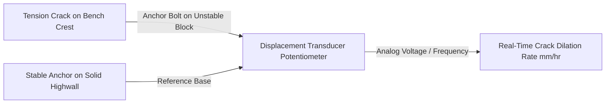

# Existing Technology 12: Crack & Joint Meters

> **Document Type:** Research & Benchmark Analysis  
> **Problem Statement ID:** SIH25071 | **Ministry of Mines** | **Category:** Software  
> **Prepared For:** Smart India Hackathon (SIH 2025)

---

## 1. Background & Working Principle

Crack and Joint Meters (potentiometric, LVDT, or vibrating wire) are mounted across visible surface tension cracks or structural discontinuities with anchor bolts on opposite sides of the fracture.
* **Measurement:** Continuously logs 1D crack opening/closing ($\Delta w$ in $\text{mm}$) and 3D shear offset $(\Delta X, \Delta Y, \Delta Z)$ at sub-0.1 mm resolution.

---

## 2. Strengths & Limitations

### Advantages:
* **Direct Failure Indicator:** Detects rapid tension crack dilation during tertiary creep.
* **Low Power:** Runs on simple lithium-battery micro-loggers.

### Critical Limitations:
* **Hazardous Installation:** Requires geotechnical personnel to work directly at the edge of unstable, collapsing highwall crests.
* **Spatial Blindness:** If a new tension crack forms 1 meter behind or beside the sensor, the instrument registers zero movement while the highwall collapses.

---

## 3. What is Doable & How We Adopt It for SIH25071

| Feature | Physical Crack Meter | Proposed SIH25071 AI Innovation |
| :--- | :--- | :--- |
| **Coverage** | 1 single monitored crack | **Pit-Wide AI Crack Segmentation:** Mobile-SAM / U-Net detects and traces crack propagation across entire benches non-contact. |
| **Physical Sensors** | ₹30,000 per crack node | High-zoom optical cameras with sub-pixel edge disparity replace physical contact hardware. |

---

## 4. References
1. **Hoek, E., & Bray, J. W.** (1981). *Rock Slope Engineering*. Institution of Mining and Metallurgy, London.
