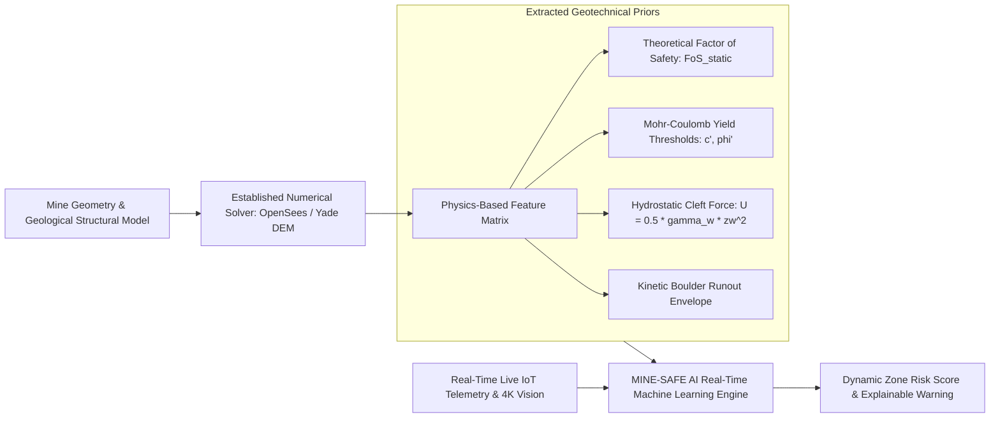

# 12. Integration of Numerical Slope Stability & Geomechanics

> **Document Type:** Master Research & Architecture Report  
> **Problem Statement ID:** SIH25071  
> **Problem Statement Title:** AI-Based Rockfall Prediction and Alert System for Open-Pit Mines  
> **Organization:** Ministry of Mines | **Category:** Software | **Theme:** Disaster Management  
> **Target System:** MINE-SAFE AI Platform  
> **Target File:** `docs/12_NUMERICAL_MODEL.md`

---

## 1. Clear Separation of Engineering Physics vs. AI Innovation

> **Mandatory Scientific Integrity Disclosure:**  
> *"Numerical slope stability analysis methods—including Limit Equilibrium Methods (Bishop, Spencer, Morgenstern-Price), Finite Element Methods (FEM), and Discrete Element Methods (DEM)—are established geotechnical engineering disciplines. Our SIH team did NOT invent these numerical methods. Our proposed innovation is the use of pre-computed numerical physics outputs as domain-informed features within an AI early-warning pipeline."*

```
+---------------------------------------------------------------------------------------------------+
|                        PHYSICS-BASED ENGINEERING vs. AI/ML COUPLING                               |
+---------------------------------------------------------------------------------------------------+
|  [ 1. ESTABLISHED NUMERICAL METHODS ]    │  [ 2. MINE-SAFE AI INTEGRATION ]                       |
|  - Limit Equilibrium Methods (LEM)       │  - Computes theoretical Factor of Safety (FoS) priors  |
|  - Finite Element Method (FEM SSR)       │  - Maps plastic yield zones and critical slip surfaces |
|  - Discrete Element Method (DEM)         │  - Simulates 3D kinetic rockfall bounce & runout cones |
|  - Hydrogeological Seepage (MODFLOW)     │  - Calculates dynamic pore-water pressure ratios (ru)  |
|  ----------------------------------------│------------------------------------------------------- |
|  ROLE: Ground truth geotechnical physics │  ROLE: Physics features feeding real-time AI inference |
+---------------------------------------------------------------------------------------------------+
```

---

## 2. The Physics-Informed AI Pipeline


*Figure 12.1: Physics-to-AI feature pipeline integrating geomechanical models with live sensor telemetry.*

---

## 3. Key Geomechanical Formulations Utilized as Features

### 3.1 Terzaghi Effective Stress & Mohr-Coulomb Shear Strength
The available shear strength ($\tau_f$) along a potential failure plane is governed by:

$$\tau_f = c' + (\sigma_n - u) \tan\phi'$$

where:
* $c'$ is effective cohesion ($\text{kPa}$).
* $\sigma_n$ is total normal stress ($\text{kPa}$).
* $u$ is pore-water pressure ($\text{kPa}$) measured in real time by piezometers.
* $\phi'$ is the effective friction angle ($\text{degrees}$).

As rainfall infiltrates and pore pressure $u$ rises, effective normal stress $\sigma' = \sigma_n - u$ diminishes, directly driving the Factor of Safety ($\text{FoS} = \tau_f / \tau_{\text{applied}}$) toward critical failure ($\text{FoS} \le 1.0$).

### 3.2 3D Kinetic Rockfall Runout Simulation (DEM)
Pre-computed **Yade DEM (Discrete Element Method)** kinetic simulations model detached boulder trajectories across terraced open-cast benches:

$$m \ddot{\mathbf{x}} = m \mathbf{g} + \mathbf{F}_c + \mathbf{F}_d$$

where $\mathbf{F}_c$ represents contact normal and tangential frictional restitution forces during bench impacts, and $\mathbf{F}_d$ represents aerodynamic drag. The resulting **runout reach envelope** is projected onto the 3D Digital Twin to highlight threatened haul roads and working benches.

---

## 4. Why AI Enhances Rather than Replaces Geotechnical Engineering

1. **Computational Latency Reduction:** Traditional 3D numerical models take hours to solve a single scenario. By pre-computing stability envelopes and feeding them as features to **XGBoost / neural regressors**, MINE-SAFE AI achieves sub-50 millisecond inference.
2. **Continuous Data Assimilation:** Numerical models are static snapshots; MINE-SAFE AI continuously updates the risk profile as 24/7 IoT sensors and 4K optical streams detect physical ground movement.
3. **Engineering Integrity:** The AI model is constrained by geomechanical laws, preventing unphysical hallucinations and ensuring full compliance with statutory DGMS safety standards.
