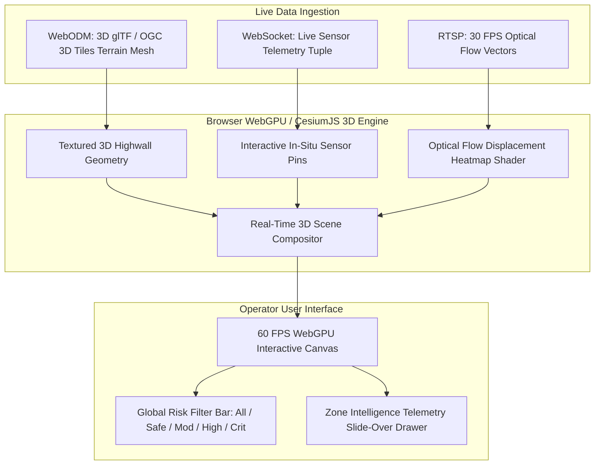

# 13. 3D Mine Monitoring & Digital Twin Prototype

> **Document Type:** Master Research & Architecture Report  
> **Problem Statement ID:** SIH25071  
> **Problem Statement Title:** AI-Based Rockfall Prediction and Alert System for Open-Pit Mines  
> **Organization:** Ministry of Mines | **Category:** Software | **Theme:** Disaster Management  
> **Target System:** MINE-SAFE AI Platform  
> **Target File:** `docs/13_DIGITAL_TWIN.md`

---

## 1. Terminology Clarification: 3D Visualization vs. Digital Twin

> **Scientific Definition & Terminology Distinction:**  
> *"A static 3D computer model or CAD drawing alone is NOT a Digital Twin. A true Digital Twin requires continuous, bidirectional data synchronization between the physical mine and its computational representation. In this project, our student implementation is positioned as an interactive **3D Mine Monitoring & Digital Twin Prototype**, which continuously renders live telemetry, optical flow vectors, and dynamic risk fields on a 3D reality mesh."*

```
+---------------------------------------------------------------------------------------------------+
|                        STATIC 3D CAD MODEL vs. ACTIVE DIGITAL TWIN PROTOTYPE                      |
+---------------------------------------------------------------------------------------------------+
|  [ STATIC 3D MINE CAD MODEL ]            │  [ MINE-SAFE AI DIGITAL TWIN PROTOTYPE ]               |
|  - Survey snapshot updated monthly/yearly│  - Continuous real-time IoT & 30 FPS vision streaming  |
|  - Disconnected from real-time sensors   │  - Live 3D sensor pins with interactive popups         |
|  - Zero predictive capability            │  - Dynamic risk heatmap overlays & forecast horizons   |
|  - Pure geometric visualization          │  - Autonomous sub-second (<1.0s) TARP alert dispatch   |
|  - Heavy desktop CAD workstation         │  - Browser-native WebGPU / CesiumJS 3D interface (60fps)|
+---------------------------------------------------------------------------------------------------+
```

---

## 2. Core Features of the 3D Mine Monitoring Interface

### 2.1 Interactive 3D Open-Cast Reality Mesh
* Renders the complete open-pit terrain (benches, highwalls, catch berms, and haul roads) using high-resolution drone photogrammetry meshes and 3D Tiles streamed via **CesiumJS / Three.js**.
* Supports smooth 6-Degrees-of-Freedom (6-DoF) pan, tilt, orbit, and zoom at 60 FPS in standard modern web browsers without specialized CAD software.

### 2.2 Geocoded Zone Intelligence (Spatial Partitioning)
* Every bench sector is segmented into a unique, geocoded **Zone ID** (e.g., `ZONE-B1-NORTH`, `ZONE-B3-EAST`, `ZONE-RAMP-02`).
* Clicking any Zone ID smoothly animates the camera to fly directly into that bench section, opening the **Zone Intelligence Drawer** displaying:
  * Current Risk Score, Risk Velocity ($d\text{Risk}/dt$), and Predicted Saito Horizon ($t_f$).
  * Real-time time-series telemetry charts (displacement, pore pressure, crack opening, tilt).
  * High-resolution live optical camera crop showing visual evidence.
  * Structural geological joint strike/dip and rock mass rating (RMR).
  * SHAP local causal attribution cards.
* A prominent **[Back to Full Mine]** button resets the camera to the full-pit overview.

### 2.3 Unified Risk Filter Bar
A persistent top-level navigation toolbar allows mine managers to filter the 3D highwall view:
* **[All Zones]** — Displays the entire mine overview with all zone boundaries.
* **[Safe Only]** — Displays only baseline green stable zones.
* **[Moderate Only]** — Highlights watch-list yellow zones for geotechnical walkovers.
* **[High Only]** — Isolates orange warning zones requiring machinery relocation.
* **[Critical Only]** — Focuses exclusively on red emergency zones requiring immediate evacuation.

---

## 3. WebGPU Rendering Architecture


*Figure 13.1: Browser-native WebGPU 3D Digital Twin rendering pipeline.*
