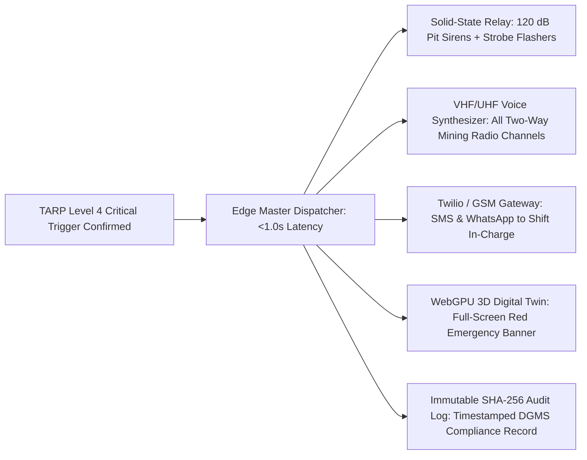

# 14. Early-Warning & Trigger Action Response Plan (TARP) Engine

> **Document Type:** Master Research & Architecture Report  
> **Problem Statement ID:** SIH25071  
> **Problem Statement Title:** AI-Based Rockfall Prediction and Alert System for Open-Pit Mines  
> **Organization:** Ministry of Mines | **Category:** Software | **Theme:** Disaster Management  
> **Target System:** MINE-SAFE AI Platform  
> **Target File:** `docs/14_EARLY_WARNING_TARP.md`

---

## 1. Statutory TARP Concept & Regulatory Mandate

Under the **Directorate General of Mines Safety (DGMS)** regulations and international open-pit standards (ICMM), a **Trigger Action Response Plan (TARP)** is a formal, legally mandated operational risk matrix that links specific measured geotechnical thresholds directly to mandatory management and safety actions.

```
+---------------------------------------------------------------------------------------------------+
|                        THE MINE-SAFE AI DYNAMIC TARP DECISION PIPELINE                            |
+---------------------------------------------------------------------------------------------------+
|  Sensor Telemetry (Displacement, Pore Pressure, Rain, Tilt)                                       |
|  + AI Composite Risk Score (R_z in 0.0 - 1.0)                                                     |
|  + Geotechnical Engineering Rules (DGMS Static Thresholds)                                        |
|  + Kinematic Trend Analysis (Risk Velocity dR/dt & Saito Inverse Velocity 1/v -> 0)               |
|  + Sensor Health & Data Quality Confidence (C_pred)                                               |
|                                  │                                                                |
|                                  ▼                                                                |
|                        DYNAMIC TARP ENGINE                                                        |
|                                  │                                                                |
|                                  ▼                                                                |
|                  4-TIER OPERATIONAL WARNING LEVEL                                                 |
|                                  │                                                                |
|                                  ▼                                                                |
|                    RECOMMENDED STATUTORY ACTION                                                   |
|                                  │                                                                |
|                                  ▼                                                                |
|          HUMAN-IN-THE-LOOP VERIFICATION (Mine Manager / Geotechnical Officer)                     |
|                                  │                                                                |
|                                  ▼                                                                |
|          SUB-SECOND MULTI-CHANNEL DISPATCH (<1.0s Sirens, VHF Radio, SMS)                         |
+---------------------------------------------------------------------------------------------------+
```

> **Statutory Compliance Disclosure:**  
> *"The TARP trigger thresholds and operational action tiers described in this document are **illustrative prototype benchmarks**. Actual operational trigger values and mandatory actions must be established by certified Geotechnical Engineers and approved by the statutory Mine Manager in accordance with site-specific DGMS regulations."*

---

## 2. The 4-Tier Operational TARP Matrix

| TARP Level | Operational Status | Illustrative Physical Triggers | AI Risk Score ($\mathcal{R}_z$) | Automated System Action | Mandatory Human / Site Action |
| :--- | :--- | :--- | :--- | :--- | :--- |
| **Level 1** | **[NORMAL / GREEN]** | $v < 2\text{ mm/day}$, $u < 50\text{ kPa}$, Rain $< 10\text{ mm/hr}$ | $\mathcal{R}_z < 0.25$ | Continuous background data logging (1-min cadence). | Normal mining excavation and haulage. |
| **Level 2** | **[WATCH / YELLOW]** | $2 \le v < 10\text{ mm/day}$, $\dot{w}_{\text{crack}} > 1\text{ mm/day}$ | $0.25 \le \mathcal{R}_z < 0.60$ | Push advisory notification to Geotechnical Officer app. | Visual walkover inspection by geotechnical staff within 4 hours. |
| **Level 3** | **[WARNING / ORANGE]** | $10 \le v < 30\text{ mm/day}$, $u > 150\text{ kPa}$, $\ddot{d} > 0$ | $0.60 \le \mathcal{R}_z < 0.85$ | Flash warning on 3D Digital Twin + SMS to Shift In-Charge. | Relocate heavy shovels/dumpers from bench toe; restrict haul road speed. |
| **Level 4** | **[CRITICAL / RED]** | $v \ge 30\text{ mm/day}$, $\text{IV} \to 0$, $t_f < 2\text{ hrs}$ | $\mathcal{R}_z \ge 0.85$ | **SUB-SECOND DISPATCH (<1.0s):** Sirens ($>120\text{ dB}$) + VHF Radio + SMS. | **IMMEDIATE FULL PIT BENCH EVACUATION**; erect physical barricades. |

---

## 3. Sub-Second Multi-Channel Alert Actuation

To eliminate the lethal 15–45 minute administrative delays typical of manual evacuation chains, MINE-SAFE AI includes an autonomous edge actuation dispatcher:


*Figure 14.1: Sub-second multi-channel TARP early-warning actuation pipeline.*

---

## 4. Human-in-the-Loop Safety Assurance

> **Core Safety Principle:**  
> *"Artificial Intelligence in MINE-SAFE AI functions strictly as an advanced **decision-support and early-warning sentinel**. Statutory authority and final operational decisions for reopening mine benches remain strictly under the command of certified mining engineers."*

1. **Autonomous Emergency Warning:** The system has the authority to immediately sound sirens and radio evacuation warnings when Level 4 critical collapse conditions are detected to protect human lives in real time.
2. **Authorized Reset & Re-entry:** The pit alarm CANNOT be cleared automatically by the software. Re-entry into evacuated zones requires formal physical inspection and digital cryptographic authorization by the statutory Mine Manager.
