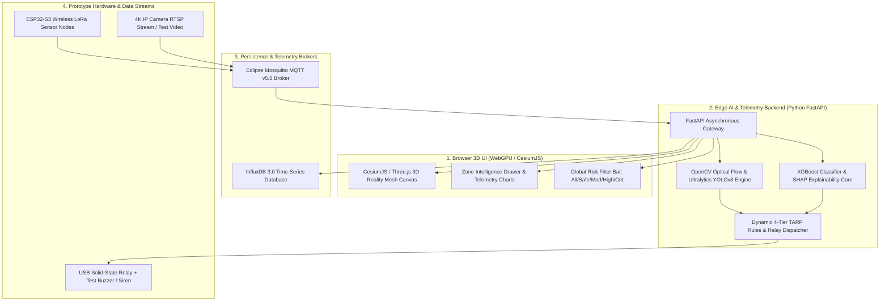

# 15. Student MVP Prototype Implementation Scope

> **Document Type:** Master Research & Architecture Report  
> **Problem Statement ID:** SIH25071  
> **Problem Statement Title:** AI-Based Rockfall Prediction and Alert System for Open-Pit Mines  
> **Organization:** Ministry of Mines | **Category:** Software | **Theme:** Disaster Management  
> **Target System:** MINE-SAFE AI Platform  
> **Target File:** `docs/15_PROTOTYPE_IMPLEMENTATION.md`

---

## 1. Defining the Realistic Student MVP Scope

> **Engineering Principle:**  
> *"A successful Smart India Hackathon project must deliver a working, functional, and testable Minimum Viable Product (MVP) built within student resource boundaries, rather than claiming an unverified multi-million dollar industrial deployment."*

```
+---------------------------------------------------------------------------------------------------+
|                        STUDENT MVP PROTOTYPE vs. INDUSTRIAL EXTENSION                             |
+---------------------------------------------------------------------------------------------------+
|  [ FEATURE COMPONENT ]             │  [ STUDENT MVP PROTOTYPE ]     │  [ FUTURE INDUSTRIAL EXT ]  |
|  ----------------------------------│--------------------------------│---------------------------- |
|  3D Mine Visualization             │  WebGL / CesiumJS 3D Tiles     │  Full-pit 4D Digital Twin   |
|  Geocoded Zone Intelligence        │  Yes (Zone A1 to B5 IDs)       │  Automated Dynamic Zoning   |
|  Edge Computer Vision              │  YOLOv8 + 4K Optical Flow      │  Thermal + Multispectral CV |
|  In-Situ Geotechnical Telemetry    │  ESP32 LoRa Tilt & Crack Node  │  Certified ATEX Mining Mesh |
|  Multi-Modal AI Risk Engine        │  XGBoost + LSTM Forecaster     │  Distributed PINN Cluster   |
|  Explainable AI Diagnostic Cards   │  SHAP TreeExplainer Local Cards│  Causal Graph Reasoning     |
|  Dynamic TARP Early-Warning        │  Sub-second Siren & SMS Relay  │  VHF Digital Radio Trunking |
|  Satellite InSAR Integration       │  Sentinel-1 SBAS Open API Data │  Commercial Daily Tasking   |
|  Slope Stability Radar (SSR)       │  Theoretical Kinematics & Math │  Direct SSR Serial Hookup   |
+---------------------------------------------------------------------------------------------------+
```

---

## 2. Software Architecture & Technology Stack


*Figure 15.1: Software components and dataflow of the working student MVP.*

---

## 3. Verified Open-Source Software Dependencies

The prototype is built using genuine, verified open-source libraries and frameworks:

* **Computer Vision & Object Tracking:** `opencv-python` (4.9.0), `ultralytics` (YOLOv8n/s), `scikit-image`
* **Machine Learning & Explainability:** `xgboost` (2.0.3), `scikit-learn` (1.4.0), `shap` (0.44.1), `torch` (2.2.0)
* **Time-Series Persistence & Telemetry:** `paho-mqtt` (2.0.0), `influxdb-client` (1.40.0), `pandas` (2.2.1)
* **Backend API & WebSockets:** `fastapi` (0.110.0), `uvicorn` (0.28.0), `pydantic` (2.6.4)
* **3D Geospatial Frontend:** `cesium` (1.115), `three` (0.162.0), `chart.js` (4.4.2)
