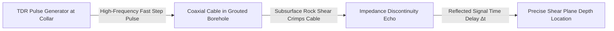

# Existing Technology 15: Time-Domain Reflectometry (TDR)

> **Document Type:** Research & Benchmark Analysis  
> **Problem Statement ID:** SIH25071 | **Ministry of Mines** | **Category:** Software  
> **Prepared For:** Smart India Hackathon (SIH 2025)

---

## 1. Background & Working Principle

Time-Domain Reflectometry (TDR) uses coaxial metallic cables grouted into boreholes crossing potential highwall shear zones to detect subsurface rock shearing.
* **Electrical Pulse Physics:** An ultra-fast electrical step pulse travels down the cable. Rock displacement crimps, bends, or shears the cable, altering its characteristic impedance ($Z_0$) and reflecting an echo pulse back to the instrument:
  $$d_{\text{shear}} = \frac{v_p \cdot \Delta t}{2}$$
  where $v_p$ is signal velocity in the cable and $\Delta t$ is round-trip echo time.

---

## 2. Strengths & Limitations

### Advantages:
* **Cost-Effective Subsurface Shear Mapping:** Vastly cheaper than borehole inclinometer strings.
* **Deep Penetration:** A single coaxial cable can monitor depths up to 300+ meters.

### Limitations:
* **Single-Use Destruction:** Once the rock shears and severs the cable, the instrument is permanently dead.
* **Non-Kinematic:** Pinpoints *where* shearing occurred, but cannot output continuous mm/day velocity curves.

---

## 3. What is Doable & How We Adopt It for SIH25071

| TDR Feature | Traditional Usage | Proposed SIH25071 Implementation |
| :--- | :--- | :--- |
| **Shear Plane Depth** | Manual oscilloscope graph | Automated cable crimp detection instantly fixes the **exact 3D failure slip surface** in our PINN geomechanical model. |

---

## 4. References
1. **Dowding, C. H., & O’Connor, K. M.** (2000). *Geotechnical Applications of Time Domain Reflectometry*. Geotechnical Special Publication.
