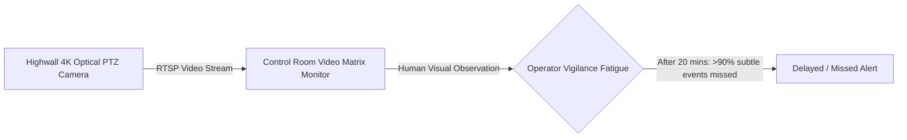

# Existing Technology 19: CCTV & Fixed Optical Cameras

> **Document Type:** Research & Benchmark Analysis  
> **Problem Statement ID:** SIH25071 | **Ministry of Mines** | **Category:** Software  
> **Prepared For:** Smart India Hackathon (SIH 2025)

---

## 1. Background & Working Principle

Industrial PTZ and fixed high-zoom security cameras (e.g., 4K, 40x optical zoom) stream live RTSP/H.264 video of highwalls and benches to mine control rooms.
* **Current Operational Paradigm:** Relies on human security and safety personnel observing multiple video feeds across wall monitors.

---

## 2. Strengths & Critical Human Limitations

### Advantages:
* **Ubiquitous & Inexpensive:** Already installed in >90% of Indian mines for security and vehicle tracking (₹15,000 – ₹60,000/camera).

### Critical Limitations:
* **Human Operator Failure:** Studies prove human operators miss **over 90% of subtle visual anomalies after 20 minutes** of continuous monitoring.
* **Passive Only:** Standard CCTV feeds do not calculate numerical displacement, velocity, or crack opening rates.
* **Environmental Blindness:** Blind in heavy dust, dense fog, and unlit nights without AI enhancement.

---

## 3. What is Doable & How We Adopt It for SIH25071

| CCTV Aspect | Traditional CCTV Setup | Proposed SIH25071 AI Transformation |
| :--- | :--- | :--- |
| **Video Utility** | Passive human viewing | **Active Edge Geotechnical Sensor:** Taps into RTSP feeds directly to run real-time sub-pixel optical flow, virtual keypoint tracking, and automated rockfall detection at 30 FPS. |

---

## 4. References
1. **Green, M.** (2000). *The 20-minute visual vigilance decrement in surveillance monitoring*. Human Factors.
