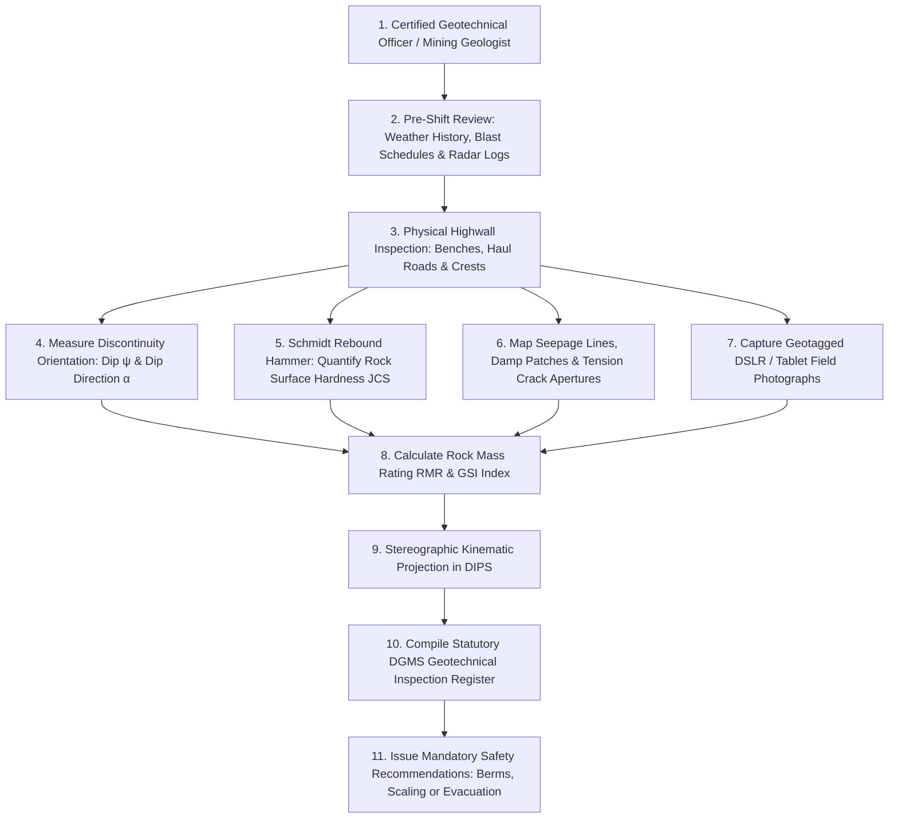
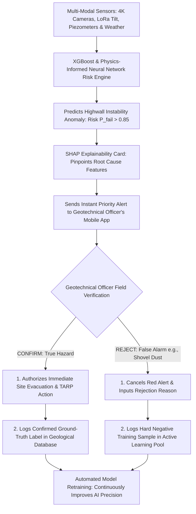
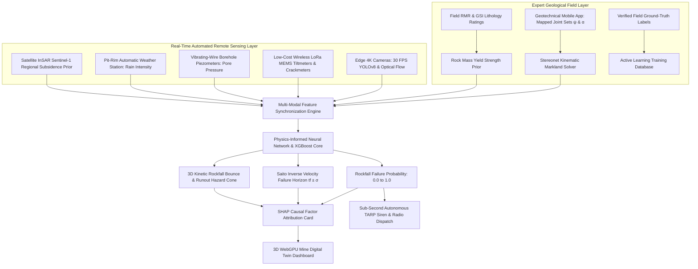
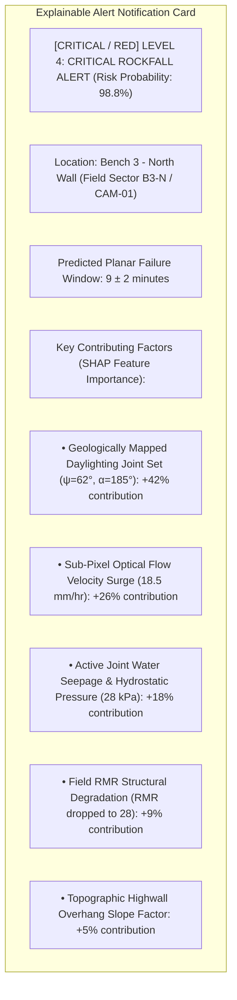
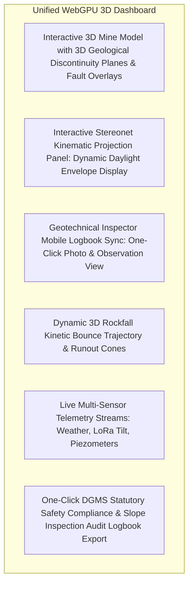
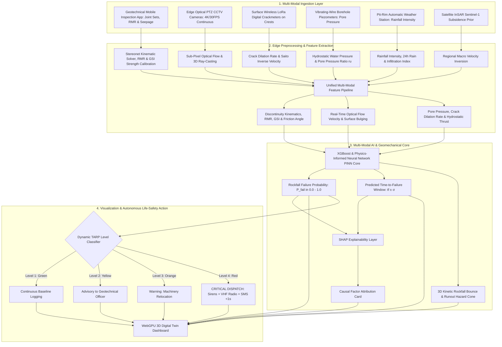

# Existing Technology 21: Manual Geological Inspection & Field Mapping

> **Document Type:** Research & Benchmark Analysis 
> **Problem Statement ID:** SIH25071 
> **Problem Statement Title:** AI-Based Rockfall Prediction and Alert System for Open-Pit Mines 
> **Organization:** Ministry of Mines | **Category:** Software | **Theme:** Disaster Management 
> **Prepared For:** Smart India Hackathon (SIH 2025) Research & Development Documentation 
> **Target File:** `docs/21_Manual_Geological_Inspection.md`

---

## Executive Summary

**Manual Geological Inspection and Geotechnical Field Mapping** represents the foundational, statutory baseline practice mandated by global mining regulators (including the **Directorate General of Mines Safety — DGMS, Government of India**) for identifying and mitigating rock slope instability. Conducted by certified Geotechnical Engineers and Mining Geologists using geological compasses, Schmidt rebound hammers, and field notebooks, manual inspections systematically characterize **geological structural discontinuities (joints, faults, bedding planes, foliation), rock weathering grades, groundwater seepage lines, and macroscopic tension cracks**.

Far from being obsolete in the era of artificial intelligence, **expert human geological judgment provides the irreplaceable contextual ground-truth** required to interpret raw sensor data. A $20\text{ mm}$ displacement on a competent sandstone bench possesses vastly different stability implications than the same displacement across a water-saturated, slickensided clay fault gouge. 

This report evaluates Manual Geological Inspection as an **established geotechnical baseline methodology**. It details standard structural discontinuity mapping and rock mass classification frameworks (**Bieniawski RMR**, **Hoek-Brown GSI**); formulates kinematics of planar, wedge, and toppling failures; examines physical limitations (such as intermittent inspection frequency and hazardous access); and defines a modern **Human-in-the-Loop (HITL) AI framework** where our proposed **SIH25071 system** fuses mobile digital field logging with automated sensor feeds to achieve hybrid, explainable geotechnical risk management.

---

## 1. Introduction to Geological Inspection in Open-Pit Mining

### What is Manual Geological Inspection?
**Manual geological inspection** is the systematic, in-situ physical and visual examination of open-pit highwalls, benches, waste rock dumps, and haul roads conducted on foot or via inspection vehicles by qualified geotechnical personnel to identify kinematic failure indicators, monitor structural defects, and verify statutory compliance.

```
+---------------------------------------------------------------------------------------------------+
| EXPERT HUMAN INSPECTION vs. SENSOR-ONLY AUTOMATION |
+---------------------------------------------------------------------------------------------------+
| [ EXPERT HUMAN GEOLOGICAL INSPECTION ] [ SENSOR-ONLY AUTOMATED MONITORING ] |
| - High contextual & mechanical insight - High-frequency numerical streams (mm, kPa, °) |
| - Identifies rock types, gouge, joints - Blind to lithology, weathering & clay infill |
| - Intermittent cadence (Daily / Weekly) - Continuous 24/7 real-time monitoring |
| - Subjective & labor-intensive - Objective & automated quantitative data |
| - Hazardous physical access near toes - Safe stand-off remote telemetry |
| |
| PROPOSED SIH SOLUTION: HYBRID FUSION (Human Expert Domain Knowledge + 24/7 AI Sensor Streams) |
+---------------------------------------------------------------------------------------------------+
```

---

## 2. Geological Discontinuities & Structural Failure Modes

In hard rock open-pit mines, slope instability is almost entirely controlled by **geological structural discontinuities**—planes of mechanical weakness separating intact rock blocks:

```
Planar Shear Slide Wedge Failure (Intersecting Joints) Flexural / Block Toppling
 
 Highwall Bench Face Joint Plane A \ / B Columnar Rock Blocks 
 
 Bedding Plane (ψp) 3D Intersecting 
 Daylighting (ψf) Sliding Wedge Line 
 Steeply Dipping Joints 
 (Single Planar Joint) (Tetrahedral Block) (Forward Leaning Slabs)
 
```
*Figure 2.1: Structural comparison of the three primary discontinuity-controlled rock slope failure mechanisms.*

### Field Identification Matrix for Inspectors

| Visual Field Observation | Geological & Mechanical Significance | Primary Hazard & Failure Mechanism |
| :--- | :--- | :--- |
| **En-Echelon Tension Cracks** | Tensile stress release behind bench crest; indicates active un-clamping of rock mass. | **Imminent Macro-Scale Slope Slump / Planar Slide**. |
| **Intersecting Joint Sets** | Two or more discontinuity planes dipping out of the slope face. | **Wedge Failure (Tetrahedral rock block sliding along intersection line)**. |
| **Steeply Dipping Joints ($\psi > 70^\circ$)**| Columnar rock slabs striking parallel to highwall face. | **Flexural / Columnar Toppling Failure**. |
| **Water Seepage from Joint**| Perched water table / active joint pressurization. | **Hydrostatic Cleft Thrust & Effective Stress Reduction**. |
| **Slickensided Clay Gouge** | Polished, grooved fault infill with zero effective cohesion ($c' \approx 0$). | **Rapid, Low-Friction Sliding on Ancient Fault Planes**. |
| **Fresh Unweathered Spalls** | Small rock chips accumulating at bench toe. | **Stress Concentration & Micro-Fracturing Prior to Major Collapse**. |
| **Overhanging Cantilever Ledges**| Toe undercut by production blasting or mechanical shovels. | **Direct Gravitational Tensile Overhang Snapping / Rockfall**. |

---

## 3. Standard Field Inspection Workflow


*Figure 3.1: Step-by-step statutory workflow for manual geological slope inspection.*

---

## 4. Traditional Field Tools vs. Modern Digital Mapping

```
Traditional Geological Kit Modern Digital Rugged Tablet UAV Drone Photogrammetry Rig
 
 • Brunton / Clar Compass • Rugged IP68 Tablet • RTK Drone System 
 • Schmidt Rebound Hammer • Digital Clino App • 4K Optical Camera 
 • Geological Pick Upgrade • GPS Sub-Meter Sync Upgrade • WebODM / COLMAP 
 • Steel Tape Measure • Direct Database Sync • 3D Point Cloud Mesh 
 • Paper Field Notebook • Cloud Photo Archive • Automated Joints DSE 
 
```
*Figure 4.1: Technological evolution from manual analog mapping to digital 3D twin inspection.*

### Benchmark: Manual Inspection vs. Automated Sensor Monitoring

| Evaluation Dimension | Traditional Manual Geological Inspection | Automated Multi-Sensor System (SIH25071) |
| :--- | :--- | :--- |
| **Temporal Frequency** | Intermittent (Once daily, weekly, or after heavy rain). | **Continuous 24/7 Real-Time ($30\text{ FPS}$ Vision, $100\text{ Hz}$ LoRa).** |
| **Spatial Coverage** | Limited to accessible benches and safe vantage points. | **Slope-Wide Coverage (Cameras, InSAR, IoT Mesh Arrays).** |
| **Personnel Life Safety**| **High Risk:** Inspectors physically walk near dangerous rockfall toes. | **Zero Risk:** Remote stand-off optical and wireless telemetry. |
| **Geological Understanding**| **Superior:** Understands rock lithology, weathering, and gouge. | Requires geologically informed AI models (PINNs). |
| **Alert Response Time** | Hours to days (Manual report compilation and sign-off). | **Sub-Second ($<1.0\text{ s}$) Autonomous Siren & Radio Dispatch.** |
| **Ground-Truth Value** | **Gold Standard:** Provides validated labels for model training. | Continuously validated against expert human ground-truth. |

---

## 5. Geological Discontinuity Kinematics (Stereonet Analysis)

To evaluate whether a mapped joint set $(J_1)$ can physically slide out of a highwall face with slope dip ($\psi_f$) and dip direction ($\alpha_f$), the **Markland Kinematic Test** is applied:

```
 Kinematic Sliding Envelope (Stereonet Projection)
 N
 
 
 W [HIGHLIGHT] E [HIGHLIGHT] Pole of Critical Sliding Joint
 (Falls inside Daylighting Daylight Envelope)
 
 S
```

### Planar Failure Kinematic Criteria:
1. **Daylighting Condition:** The dip of the joint plane ($\psi_p$) must be shallower than the slope face dip ($\psi_f$), but steeper than the joint friction angle ($\phi'$):
 $$\psi_f > \psi_p > \phi'$$
2. **Strike Parallelism:** The strike of the joint plane must be within $\pm 20^\circ$ of the highwall face strike:
 $$|\alpha_f - \alpha_p| \le 20^\circ$$

---

## 6. Geological Knowledge as Machine Learning Features

| Geological Feature | Engineering Symbol | Measurement Method | Unit | SIH25071 Geotechnical Role |
| :--- | :--- | :--- | :--- | :--- |
| **Rock Mass Rating (RMR)**| $\text{RMR}_{89}$ | Bieniawski 6-parameter field sum | Scale $0 - 100$ | Baseline rock mass structural competency prior. |
| **Geological Strength Index**| $\text{GSI}$ | Hoek-Marinos structural chart | Scale $10 - 100$| Sets non-linear rock mass yield envelope in PINN. |
| **Joint Dip & Dip Direction**| $(\psi, \alpha)$ | Geological Brunton / Tablet clino| $\text{degrees}$ | Defines kinematic failure vector in 3D physics engine. |
| **Joint Friction Angle** | $\phi'$ | Tilt test / Schmidt rebound hammer | $\text{degrees}$ | Frictional resistance against gravitational sliding. |
| **Joint Infill Material** | $I_{\text{gouge}}$ | Field visual / laboratory index | Categorical | Identifies slickensided clay vs. rough mineral contact. |
| **Weathering Grade** | $W_g$ | ISRM scale (Grade I fresh to VI soil) | Scale $1 - 6$ | Quantifies rock degradation and cohesion loss. |
| **Sub-Pixel Vision Velocity** | $v_{\text{vision}}$ | Edge camera optical flow | $\text{mm/hr}$ | Real-time continuous kinematic surface velocity. |
| **Pore-Water Pressure** | $u$ | Vibrating-wire piezometer | $\text{kPa}$ | Destabilizing hydrostatic thrust. |

---

## 7. Human-in-the-Loop (HITL) AI System Architecture

In high-consequence mining environments, an AI system must never operate as an unexplainable "black box." Our proposed **SIH25071 platform** implements a strict **Human-in-the-Loop Active Learning Workflow**:


*Figure 7.1: Human-in-the-Loop Active Learning architecture ensuring continuous model improvement.*

---

## 8. SIH25071 Mobile Geological Inspection App

To eliminate paper notebooks and digitize field data instantly, our proposed architecture includes a dedicated **Offline-First Geotechnical Field App** for mine geologists:

```

 SIH25071 GEOTECHNICAL FIELD INSPECTOR v2.4 (OFFLINE SYNC) 

 Location: Bench 3 - North Highwall [GPS: 23.795°N, 86.432°E]
 Lithology: Sandstone / Carbonaceous Shale Seam Contact 
 Joint Set 1: Dip 62° | Dip Direction 185° [Daylighting! [ALERT]] 
 Seepage: Active Damp Patch (Estimated Pore Pressure: 15 kPa)
 Measured Tension Crack: Length 4.5 m | Aperture 22 mm 
 Geotagged Photo: [IMG_20260817_1422.jpg - Attached] 
 ------------------------------------------------------------- 
 AI ASSISTANT SUGGESTION: 
 "Camera CAM-01 Optical Flow detected 8.2 mm/hr creep here. 
 Calculated Kinematic Wedge Risk: 88.4% (TARP Level 3)" 
 ------------------------------------------------------------- 
 [ [CONFIRMED] CONFIRM & SYNC TO 3D TWIN ] [ [ALERT] OVERRIDE AI SCORE ] 

```
*Figure 8.1: UI mockup of the proposed SIH mobile field inspection and ground-truth logging application.*

---

## 9. Illustrative Synthetic Geological Inspection Dataset

> **Important Data Disclaimer:** 
> *The following dataset and graphs represent **Synthetic / Illustrative Data** designed solely to explain how field inspection logs correlate with automated sensor metrics. They do not represent real measurements from any specific mine.*

### Illustrative Synthetic Multi-Temporal Inspection Dataset

| Inspection Date | Slope Sector | RMR Score (0–100) | GSI Index | Mapped Crack Length ($L$, m) | Observed Seepage State | AI Vision Creep ($v$, mm/hr) | Expert Validated Status |
| :---: | :---: | :---: | :---: | :---: | :---: | :---: | :--- |
| **Day 1** | Bench 3 North | 68 (Good) | 65 | 0.2 | Dry | 0.1 | Normal Stable Face |
| **Day 5** | Bench 3 North | 64 (Good) | 60 | 0.8 | Dry | 0.4 | Minor Joint Opening |
| **Day 10**| Bench 3 North | 55 (Fair) | 52 | 2.1 | Moist Joint | 1.2 | Active Tension Propagation |
| **Day 15**| Bench 3 North | 42 (Fair) | 40 | 4.5 | Dripping Seepage | 5.8 | Secondary Creep Confirmed |
| **Day 18**| Bench 3 North | **28 (Poor)** | **30** | **8.2** | **Continuous Flow**| **18.5** | [CRITICAL / RED] **CRITICAL COLLAPSE THREAT** |

```mermaid
---
config:
 xyChart:
 width: 700
 height: 350
 themeVariables:
 xyChart:
 plotColorPalette: "#d9534f"
---
xychart-beta
 title "Illustrative Example: Rock Mass Rating (RMR) Degradation vs Time (Synthetic Data)"
 x-axis "Elapsed Time (days)" [1, 5, 10, 15, 18]
 y-axis "Rock Mass Rating (RMR Score)" 0 --> 80
 line [68, 64, 55, 42, 28]
```
*Figure 9.1: Illustrative degradation of RMR score as joint weathering and water inflow accelerate.*

---

## 10. Complete Multi-Sensor Data Fusion Pipeline


*Figure 10.1: Master multi-sensor data fusion architecture incorporating geological field mapping.*

---

## 11. Explainable AI (XAI) Diagnostic Breakdown


*Figure 11.1: Conceptual SHAP explainable alert diagnostic card for geologically informed alerts.*

---

## 12. Proposed SIH Decision-Support Dashboard Integration


*Figure 12.1: Functional architecture of the unified 3D decision-support dashboard.*

---

## 13. Research Gap Analysis

```
+---------------------------------------------------------------------------------------------------+
| BRIDGING THE RESEARCH GAP |
+---------------------------------------------------------------------------------------------------+
| [ MANUAL INSPECTION LIMITATION ] High geological expertise, but severely constrained by |
| intermittent frequency (weekly) & hazardous toe access.|
| [ SENSOR-ONLY AUTOMATION GAP ] High-frequency numbers, but blind to lithology, |
| weathering grade, and structural joint kinematics. |
| [ PROPOSED SIH25071 INNOVATION ] Fuses mobile digital geological field mapping with |
| 24/7 Edge Computer Vision, InSAR, & IoT sensors into a |
| Human-in-the-Loop Physics-Informed AI engine that |
| combines human geological wisdom with AI speed! |
+---------------------------------------------------------------------------------------------------+
```

---

## 14. Concepts Adopted from Geological Inspection for SIH25071

| Geological Concept | Technical Mechanism | Proposed SIH25071 Implementation |
| :--- | :--- | :--- |
| **Markland Kinematic Test**| Stereographic projection of discontinuity poles vs. slope face.| Embeds stereonet kinematic math into the 3D physics engine to evaluate sliding modes. |
| **Rock Mass Rating (RMR)** | Bieniawski 6-parameter rock mass competency index.| Sets baseline structural strength priors in XGBoost and PINN predictive models. |
| **Human-in-the-Loop (HITL)**| Geotechnical officer confirms or rejects AI anomaly predictions.| Feeds verified ground-truth labels back into the continuous active learning training loop. |
| **Digital Field Logging App** | Mobile GPS-synced geological observation checklist.| Deploys custom offline-first Android/iOS mobile app for mine geologists. |

---

## 15. Final Proposed System Architecture


*Figure 15.1: Complete end-to-end system architecture incorporating geological field mapping into the real-time AI rockfall prediction pipeline.*

---

## 16. Summary of Visualizations Included

1. **Section 1:** Expert human inspection vs. sensor-only automation operational comparison (ASCII).
2. **Figure 2.1:** Structural comparison of planar, wedge, and toppling rock failure modes (ASCII).
3. **Figure 3.1:** Statutory workflow for manual geological slope inspection (Mermaid).
4. **Figure 4.1:** Technological evolution from manual analog mapping to digital 3D twin inspection (ASCII).
5. **Section 5:** Stereonet projection daylight envelope diagram (ASCII).
6. **Figure 7.1:** Human-in-the-Loop active learning architecture (Mermaid).
7. **Figure 8.1:** UI mockup of the SIH mobile field inspection app (ASCII).
8. **Figure 9.1:** Rock Mass Rating (RMR) degradation vs. time graph (Mermaid xychart — synthetic data).
9. **Figure 10.1:** Master multi-sensor data fusion architecture (Mermaid).
10. **Figure 11.1:** SHAP explainable alert diagnostic card (Mermaid).
11. **Figure 12.1:** Unified 3D decision-support dashboard architecture (Mermaid).
12. **Figure 15.1:** Master end-to-end system architecture flowchart (Mermaid).

---

## 17. Important Scientific & Statutory Cautions

* **AI is a Decision Support Tool:** Under Indian mining law (Mines Act, 1952 and DGMS Circulars), the statutory responsibility for slope safety remains with the certified Mine Manager and Geotechnical Officer. AI alerts assist, but do not replace, human engineering sign-off.
* **Rock Mass Heterogeneity:** Rock is not an isotropic industrial material; geological structures vary across individual blast rounds and require ongoing field re-mapping.
* **Safety in Field Inspection:** Field inspectors must adhere strictly to stand-off safety rules, wearing certified PPE and avoiding highwall toes under active tertiary creep.

---

## 18. Conclusion

Manual geological inspection and field mapping provide the **irreplaceable structural and lithological ground-truth** that governs rock slope failure mechanics in open-pit mines.

Rather than replacing human geologists, our **SIH25071 platform** empowers them by digitizing field mapping through an offline-first mobile app, providing continuous **24/7 Edge Computer Vision, wireless LoRa IoT sensors, and satellite InSAR telemetry**, and implementing a **Human-in-the-Loop AI architecture** that combines human geological wisdom with sub-second automated life-safety protection for the Ministry of Mines.

---

## 19. References & Verified Repositories

### Research Papers & Official Publications:
1. **Bieniawski, Z. T.** (1989). *Engineering Rock Mass Classifications: A Complete Manual for Engineers and Geologists in Mining, Civil, and Petroleum Engineering*. John Wiley & Sons. — *The foundational textbook defining the Rock Mass Rating (RMR89) classification system.*
2. **Hoek, E., & Bray, J. W.** (1981). *Rock Slope Engineering* (3rd ed.). The Institution of Mining and Metallurgy, London. — *The definitive standard on stereographic projection, kinematic Markland tests, and rock slope stability analysis.*
3. **Hoek, E., Carranza-Torres, C., & Corkum, B.** (2002). *Hoek-Brown failure criterion – 2002 edition*. Proceedings of the North American Rock Mechanics Society (NARMS-TAC 2002), 1, pp. 267–273. — *Foundational formulation of the Geological Strength Index (GSI) and non-linear rock mass strength.*
4. **Directorate General of Mines Safety (DGMS).** (2020). *DGMS (Tech) Circular No. 02 of 2020: Standard Operating Procedures for scientific slope stability monitoring in open-cast mines*. Ministry of Labour & Employment, Government of India.
5. **Lundberg, S. M., & Lee, S.-I.** (2017). *A unified approach to interpreting model predictions*. Advances in Neural Information Processing Systems (NeurIPS 2017), 30, pp. 4765–4774.

### Verified Open-Source Frameworks & Toolkits:
1. **DSE (Discontinuity Set Extractor):** [https://github.com/RiquelmeA/DSE](https://github.com/RiquelmeA/DSE) — *Open-source MATLAB/Python software for semi-automatic extraction of rock mass discontinuity sets from 3D point clouds.*
2. **mplstereonet (Python Stereonet Analysis):** [https://github.com/joferkington/mplstereonet](https://github.com/joferkington/mplstereonet) — *Open-source Python library for plotting stereonets, kinematic daylight envelopes, and calculating mean joint set orientations.*
3. **pyGDM (Geotechnical Data Management):** [https://github.com/geotech-open/pygdm](https://github.com/geotech-open/pygdm) — *Open-source library for structuring and parsing geological field mapping records, RMR scoring, and borelog strata.*
