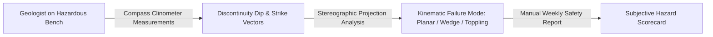

# Existing Technology 21: Manual Geological Inspection & Mapping

> **Document Type:** Research & Benchmark Analysis  
> **Problem Statement ID:** SIH25071 | **Ministry of Mines** | **Category:** Software  
> **Prepared For:** Smart India Hackathon (SIH 2025)

---

## 1. Background & Working Principle

Mining geologists and rock mechanics engineers physically walk active pit benches and highwalls equipped with geological compass-clinometers, Schmidt rebound hammers, and field notebooks.
* **Parameters Logged:** Joint dip/dip direction, strike, fracture spacing, joint persistence, infilling gouge, Rock Quality Designation (RQD), and Geological Strength Index (GSI).
* **Output:** Stereonet projection cross-sections and manual weekly slope inspection audit logs for DGMS compliance.

---

## 2. Strengths & Critical Life Hazards

### Advantages:
* **Tactile Ground Truth:** Direct assessment of rock joint roughness and groundwater seepage gouge.

### Critical Hazards:
* **Lethal Safety Liability:** Forces geologists to stand directly beneath fractured highwalls and along unstable crest edges where falling rocks cause fatal accidents.
* **Infrequent & Discontinuous:** Carried out only once a week/month; cannot catch dynamic, sudden tertiary creep or nighttime collapses.
* **Subjective Human Bias:** Different inspectors assess GSI and joint roughness differently.

---

## 3. What is Doable & How We Adopt It for SIH25071

| Feature | Manual Inspection | Proposed SIH25071 AI Innovation |
| :--- | :--- | :--- |
| **Joint Mapping** | Hazardous bench walking | **Virtual AI Discontinuity Extraction:** Drone 3D point clouds + AI RANSAC plane fitting automatically extract dip, strike, and RMR with zero human hazard. |
| **Reporting** | Manual paper logs | **Automated DGMS Digital Logbook:** Real-time digital hazard scoring and compliance report generation. |

---

## 4. References
1. **Bieniawski, Z. T.** (1989). *Engineering Rock Mass Classifications*. John Wiley & Sons.
2. **Hoek, E., & Brown, E. T.** (1997). *Practical estimates of rock mass strength*. International Journal of Rock Mechanics and Mining Sciences.
