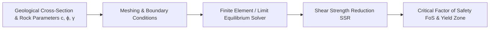

# Existing Technology 22: Numerical Slope Stability Analysis (LEM, FEM, DEM)

> **Document Type:** Research & Benchmark Analysis  
> **Problem Statement ID:** SIH25071 | **Ministry of Mines** | **Category:** Software  
> **Prepared For:** Smart India Hackathon (SIH 2025)

---

## 1. Background & Working Principle

Numerical slope stability software packages simulate stresses, deformations, and factors of safety:
1. **Limit Equilibrium Methods (LEM - Slide2, Slope/W):** Calculates the Factor of Safety ($\text{FoS} = \sum \text{Resisting Forces} / \sum \text{Driving Forces}$) along predefined circular or non-circular slip surfaces using Bishop, Janbu, or Spencer formulations.
2. **Finite Element / Finite Difference (FEM/FDM - RS2, FLAC3D):** Solves continuum elastic-plastic constitutive equations (Mohr-Coulomb, Hoek-Brown) via Shear Strength Reduction (SSR) to identify yield zones.
3. **Distinct Element Modeling (DEM - UDEC, 3DEC):** Models jointed rock masses as discrete deformable blocks interacting along contact interfaces to simulate block toppling and wedge detachment.

---

## 2. Strengths & Limitations

### Advantages:
* **Physics-Grounded Rigor:** Rooted in fundamental laws of continuum and discontinuum mechanics.

### Limitations:
* **Static & Offline:** Simulations take hours or days to set up and mesh; cannot run in a real-time closed loop with live sensor streams.
* **Cost & Skill Barrier:** Software licenses cost ₹10 Lakh – ₹40 Lakh and require specialized geotechnical PhDs.

---

## 3. What is Doable & How We Adopt It for SIH25071

| Numerical Analysis Feature | Traditional Geotechnical Software | Proposed SIH25071 Implementation |
| :--- | :--- | :--- |
| **Computation Speed** | Hours per simulation | **Physics-Informed Neural Network (PINN) Surrogate:** Pre-trained on thousands of FEM/LEM runs, computes dynamic 3D FoS in **<50 milliseconds**. |
| **Real-Time Coupling** | Offline manual input | Dynamically ingests live pore pressure ($u$) and crack opening ($\Delta w$) to recompute safety factors instantly. |

---

## 4. References
1. **Bishop, A. W.** (1955). *The use of the slip circle in the stability analysis of slopes*. Géotechnique.
2. **Itasca Consulting Group.** (2020). *FLAC3D – Fast Lagrangian Analysis of Continua in 3-Dimensions*.
