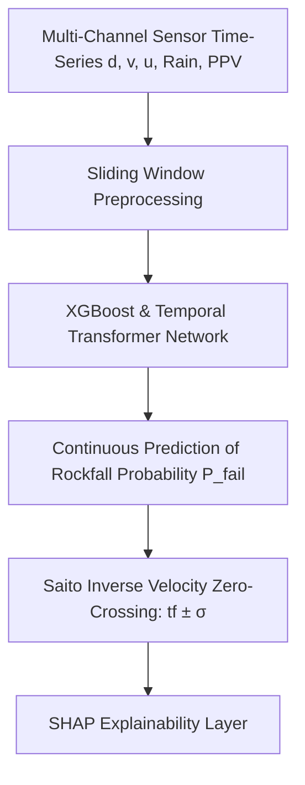

# Existing Technology 23: AI & Machine Learning Failure Prediction

> **Document Type:** Research & Benchmark Analysis  
> **Problem Statement ID:** SIH25071 | **Ministry of Mines** | **Category:** Software  
> **Prepared For:** Smart India Hackathon (SIH 2025)

---

## 1. Background & Working Principle

Machine learning models (LSTM, GRU, Temporal Convolutional Networks, Random Forest, XGBoost) analyze multi-parameter historical time-series data to forecast slope displacement and predict the **Time-to-Failure ($t_f$)**.
* **Saito Inverse Velocity Law Integration:**
  $$\frac{1}{v(t)} = A(t_f - t)$$
  Models perform rolling regression on inverse velocity to estimate the zero-crossing timestamp representing structural collapse.

---

## 2. Strengths & Critical Pitfalls

### Advantages:
* **Multi-Variate Non-Linear Modeling:** Discovers complex interactions between rainfall surges, pore pressure spikes, blast shocks, and bench creep rates.

### Critical Limitations:
* **"Black Box" Lack of Physical Constraints:** Pure data-driven deep networks can hallucinate unphysical predictions during sensor glitches, creating distrust among mine managers.
* **Overfitting on Rare Failure Events:** Slope collapses are rare in mining historical datasets, leading to severe class imbalance.

---

## 3. What is Doable & How We Adopt It for SIH25071

| AI / ML Concept | Academic Research Standard | Proposed SIH25071 Implementation |
| :--- | :--- | :--- |
| **Model Structure** | Unconstrained Black-Box LSTM | **Physics-Informed Hybrid Architecture:** Tree ensembles (XGBoost) + Physics-Informed Neural Network (PINN) constrained by Mohr-Coulomb mechanics. |
| **Explainability** | Raw probability output | **SHAP Diagnostic Breakdown:** Outputs exact percentage contribution of rainfall, velocity, and pore pressure for every alert. |

---

## 4. References
1. **Saito, M.** (1965). *Forecasting the time of occurrence of a slope failure based on strain measurements*. Proceedings of the 6th ICSMFE.
2. **Lundberg, S. M., & Lee, S.-I.** (2017). *A unified approach to interpreting model predictions (SHAP)*. NeurIPS 2017.
