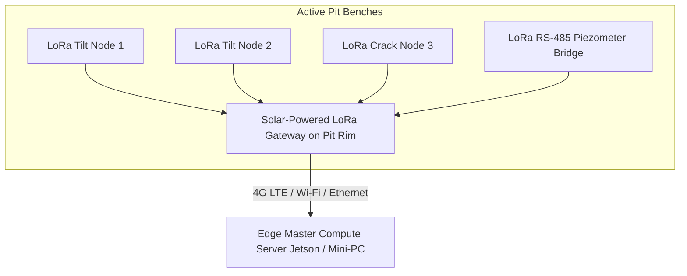

# Existing Technology 24: IoT Wireless Sensor Networks (LoRaWAN / Mesh WSN)

> **Document Type:** Research & Benchmark Analysis  
> **Problem Statement ID:** SIH25071 | **Ministry of Mines** | **Category:** Software  
> **Prepared For:** Smart India Hackathon (SIH 2025)

---

## 1. Background & Working Principle

Wireless Sensor Networks (WSN) deploy ultra-low-power edge nodes (ESP32/STM32 + SX1262 LoRa) across highwalls and benches:
* **LoRaWAN & Mesh Topologies:** Operates on license-free 865–867 MHz frequency bands in India, achieving long-range (up to 10 km) line-of-sight communication with multi-year battery life on deep sleep modes.
* **RS-485 to LoRa Bridges:** Digitizes legacy in-situ geotechnical instruments (piezometers, inclinometers, crack meters) into wireless cloud streams.

---

## 2. Strengths & Limitations

### Advantages:
* **Ultra-Low Cost:** Custom nodes cost only ₹2,500 – ₹5,000 ($30–$60 USD), allowing hundreds of sensors across every bench.
* **Multi-Year Battery Endurance:** Consumes micro-amps in deep sleep, operating 2–5 years on lithium batteries.

### Limitations:
* **RF Attenuation in Deep Pits:** Metallic ore bodies (iron/copper) and steep walls attenuate UHF signals.
* **Low Bandwidth:** LoRa payload size is 51–222 bytes; cannot transmit raw high-speed video or audio streams.

---

## 3. What is Doable & How We Adopt It for SIH25071

| IoT Concept | Standard WSN Implementation | Proposed SIH25071 AI Innovation |
| :--- | :--- | :--- |
| **Data Transmission** | Fixed interval periodic dumps | **Edge-Adaptive Sampling:** Nodes sleep and send 1 packet/hour during normal states. The millisecond an anomaly is detected, they shift to **10 Hz burst mode** instantly. |
| **Mesh Routing** | Star-only LoRaWAN | **Multi-Hop LoRa Mesh:** Packets hop over bench crests to bypass deep pit RF dead zones. |

---

## 4. References
1. **Adelantado, F., et al.** (2017). *Understanding the limits of LoRaWAN for wide-area IoT deployments*. IEEE Communications Magazine.
