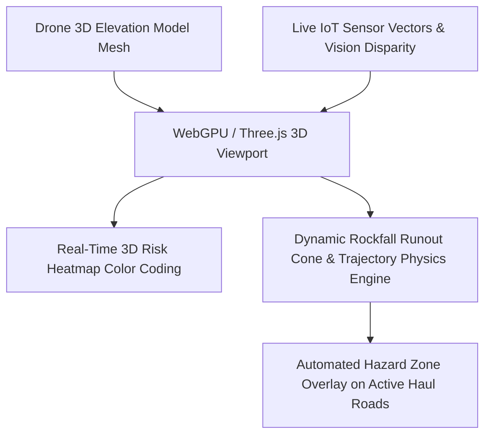

# Existing Technology 25: Digital Twin & 3D Mine Monitoring Platforms

> **Document Type:** Research & Benchmark Analysis  
> **Problem Statement ID:** SIH25071 | **Ministry of Mines** | **Category:** Software  
> **Prepared For:** Smart India Hackathon (SIH 2025)

---

## 1. Background & Working Principle

Web-based 3D geospatial platforms (built on WebGPU, Three.js, CesiumJS) create a real-time virtual replica of the open-pit mine:
* **Geometry Ingestion:** Ingests drone 3D photogrammetry OBJ/GLTF meshes or LiDAR point clouds to render realistic highwall bench surfaces.
* **Dynamic Overlay Layer:** Maps live IoT sensor vectors, piezometric water tables, blast vibration zones, and optical flow deformation heatmaps onto the 3D surface in real-time.
* **Kinetic Boulder Runout Simulation:** Uses 3D rigid-body mechanics to simulate falling rock bounce paths ($v_n^+ = -R_n v_n^-$), impact envelopes, and runout cones across lower haul roads.

---

## 2. Strengths & Commercial Limitations

### Advantages:
* **Intuitive Spatial Decision-Support:** Provides a unified "single-pane-of-glass" operational view for mine managers, shift supervisors, and DGMS auditors.

### Limitations:
* **Heavy Rendering Overhead:** Complex 50M polygon meshes crash standard tablets without WebGPU Level-of-Detail (LOD) optimization.
* **Often Purely Visual:** Many commercial twins are static dashboards lacking predictive AI backplanes.

---

## 3. What is Doable & How We Adopt It for SIH25071

| Digital Twin Feature | Commercial Industrial Software | Proposed SIH25071 Implementation |
| :--- | :--- | :--- |
| **Client-Side Performance** | Heavy desktop software (₹20L+) | **Lightweight WebGPU LOD Engine:** Fluid 60 FPS rendering on standard browser tablets and smartphones. |
| **Physics Simulation** | Static sensor visualization | **Live 3D Kinetic Runout Physics:** Simulates bouncing boulder trajectories to dynamically flag endangered excavators and trucks. |

---

## 4. References
1. **Grieves, M., & Vickers, J.** (2017). *Digital twin: Mitigating unpredictable, undesirable emergent behavior in complex systems*. Transdisciplinary Perspectives on Complex Systems.
2. **Volkwein, A., et al.** (2011). *Rockfall characterisation and structural protection – a review*. Natural Hazards and Earth System Sciences.
