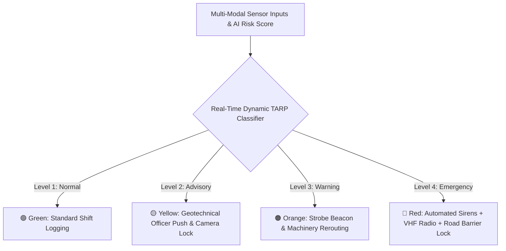

# Existing Technology 26: Early-Warning & TARP Systems (Trigger Action Response Plans)

> **Document Type:** Research & Benchmark Analysis  
> **Problem Statement ID:** SIH25071 | **Ministry of Mines** | **Category:** Software  
> **Prepared For:** Smart India Hackathon (SIH 2025)

---

## 1. Background & Working Principle

A Trigger Action Response Plan (TARP) is a formal risk management protocol mandated by mining safety regulations (such as DGMS guidelines in India) that defines exact operational actions based on escalating sensor thresholds:

```
+---------------------------------------------------------------------------------------------------+
| LEVEL 1: GREEN (Normal Operations)                                                                |
| Criteria: Velocity < 2 mm/day | Pore pressure normal | No active tension crack propagation        |
| Action: Continuous baseline logging; standard production shifts proceed unhindered.               |
+---------------------------------------------------------------------------------------------------+
                                                  │
                                                  ▼
+---------------------------------------------------------------------------------------------------+
| LEVEL 2: YELLOW (Advisory / Heightened Vigilance)                                                 |
| Criteria: Velocity 2 - 10 mm/day | Pore pressure elevated (>20% baseline) | Micro-tilt detected  |
| Action: Automated SMS/email alert to Geotechnical Officer; increase sensor logging to 1 min;      |
|         Edge PTZ camera automatically locks and zooms onto the anomaly bench.                     |
+---------------------------------------------------------------------------------------------------+
                                                  │
                                                  ▼
+---------------------------------------------------------------------------------------------------+
| LEVEL 3: ORANGE (Warning / Tactical Relocation)                                                   |
| Criteria: Velocity 10 - 50 mm/day | Acceleration positive (α ≈ 1) | Crack dilation > 5 mm/hr      |
| Action: Automated amber strobe beacons activate; haul trucks and workers evacuated from bench;    |
|         production shovels relocated outside the simulated 3D rockfall runout hazard cone.        |
+---------------------------------------------------------------------------------------------------+
                                                  │
                                                  ▼
+---------------------------------------------------------------------------------------------------+
| LEVEL 4: RED (Critical Emergency / Complete Pit Evacuation)                                       |
| Criteria: Velocity > 50 mm/day | Saito Inverse Velocity 1/v -> 0 (tf < 30 min)                    |
| Action: AUTOMATED SUB-SECOND DISPATCH (<1.0s): High-decibel solar sirens sound across the pit;   |
|         synthesized VHF walkie-talkie voice alert ("EVACUATE BENCH 3 NOW");                       |
|         automated boom barriers lock haul road access; emergency SMS push to all mine personnel.  |
+---------------------------------------------------------------------------------------------------+
```



---

## 2. Strengths & Critical Life-Safety Pitfalls

### Advantages:
* **Statutory Compliance:** Directly aligns with Directorate General of Mines Safety (DGMS) mandatory guidelines.
* **Structured Action:** Eliminates ambiguity on when to withdraw machinery and personnel.

### Critical Pitfalls in Traditional Mines:
* **Administrative Human Delays:** When a sensor exceeds a threshold, an email is sent to an engineer who must physically verify data, call the mine manager, seek permission, and manually activate sirens. This chain takes **15 to 45 minutes—during which catastrophic slope failure occurs**.
* **Alert Fatigue from False Alarms:** Unfiltered single-parameter thresholds trigger frequent false alarms from rain or blasting, causing supervisors to bypass or disable sirens.

---

## 3. What is Doable & How We Adopt It for SIH25071

| TARP Dimension | Traditional Mining Approach | Proposed SIH25071 Implementation |
| :--- | :--- | :--- |
| **Trigger Execution** | Manual human phone calls (15–45 min delay) | **Autonomous Sub-Second Dispatch (<1.0s):** Sirens, VHF walkie-talkie voice, SMS/WhatsApp, and road barrier locking triggered automatically upon confirmed tertiary creep. |
| **Threshold Reliability** | Rigid single-sensor threshold | **Multi-Modal AI Cross-Validation:** Eliminates false alarms and alert fatigue by requiring multi-sensor convergence before Level 4 trigger. |

---

## 4. References
1. **Directorate General of Mines Safety (DGMS).** (2021). *DGMS Circular No. 06 of 2021: Implementation of Safety Management Plans (SMP) and Trigger Action Response Plans (TARP) in Open-Cast Mines*.
2. **Macciotta, R., et al.** (2015). *Quantitative risk assessment of slope hazards based on TARP systems*. Rock Mechanics and Rock Engineering.
