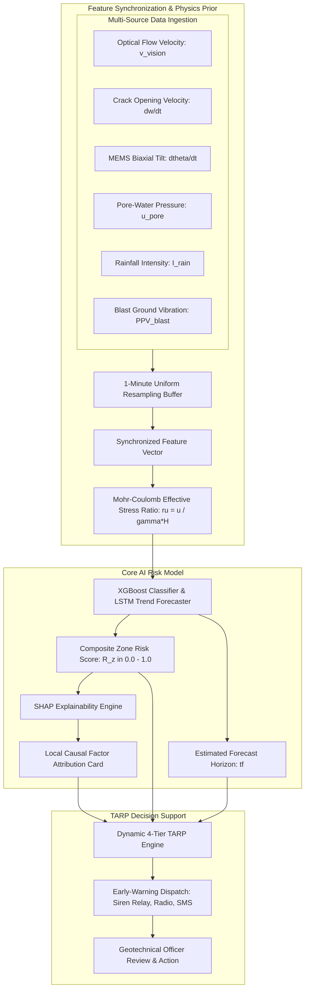

# PROPOSED AI ARCHITECTURE BLUEPRINT: MINE-SAFE AI
## Integrated Multi-Modal Rockfall Risk Prediction & Early-Warning Platform
**Target Problem Statement:** SIH25071 | **Ministry of Mines** | **Disaster Management**  
**Author / Principal System Architect:** Angel Verman & Team  
**Document File:** `docs/PROPOSED_AI_ARCHITECTURE_BLUEPRINT.md`

---

## 1. System Vision & Paradigm Shift

Current industry practices for open-pit slope stability face notable trade-offs:
- **Commercial Ground-Based Radars (SSR / GB-InSAR):** Deliver high precision across wide areas but involve significant capital and maintenance investments.
- **Discrete Point Sensors (Prisms, Extensometers):** Monitor isolated locations and can miss localized shear fractures occurring between instrumented points.
- **Manual Geological Surveys:** Are periodic and cannot provide continuous, real-time alerting during sudden monsoonal destabilization.

**MINE-SAFE AI** bridges these gaps by combining **Edge Computer Vision**, **Low-Power Wireless Sensor Networks (LoRaWAN)**, **Physics-Informed Feature Engineering**, and **Dynamic TARP Decision Support** to deliver a unified, accessible software intelligence layer for open-cast mines.

```
+---------------------------------------------------------------------------------------------------------+
|                                    MINE-SAFE AI SYSTEM WORKFLOW                                         |
+---------------------------------------------------------------------------------------------------------+
  [ 1. EDGE SENSING ]               [ 2. FUSION & AI ENGINE ]              [ 3. DIGITAL TWIN & TARP ]
  - Optical PTZ CCTV Feeds         - Edge Compute / Time-Series Sync     - 3D Terrain Visualization Canvas
  - Wireless Tilt/Crack Nodes      - Sub-Pixel Optical Flow Tracking     - 3D Kinetic Runout Hazard Overlays
  - Micro-Weather Station Inflow   - Saito Inverse Velocity Trend Math   - Multi-Channel Warning Dispatch
  - Blast Vibration Geophones      - Mohr-Coulomb Effective Stress Ratio - Human-in-the-Loop Decision Support
+---------------------------------------------------------------------------------------------------------+
```

### Visual System Blueprint & Project Assets
| 3D Digital Twin Interface | Real-Time Edge Vision Analytics |
| :---: | :---: |
|  |  |
| **Pit-Rim Autonomous Monitoring Station** | **In-Situ Wireless LoRa Sensor Node** |
|  |  |

---

## 2. Hardware Architecture & Prototype Components

The MINE-SAFE AI prototype hardware is designed for robustness under challenging open-cast environmental conditions (dust, precipitation, temperature variations, and vibration).

### Prototype Hardware Specifications (Illustrative Benchmark)

| Component | Technical Specifications | Purpose in MINE-SAFE AI | Status |
| :--- | :--- | :--- | :--- |
| **Edge Compute Gateway** | Embedded Edge AI Module / SBC in IP67 casing with battery backup | Local video stream decoding, optical flow extraction, and feature aggregation | `[PROTOTYPE]` |
| **PTZ Optical Camera** | High-Definition Optical Camera with IR illumination | Surface video monitoring and optical feature tracking | `[PROTOTYPE]` |
| **Wireless LoRa Gateway** | Multi-channel LoRaWAN Gateway (865–867 MHz) | Sensor packet aggregation from in-situ highwall nodes | `[PROTOTYPE]` |
| **Geotechnical Sensor Nodes** | ESP32-S3 microcontroller + MEMS Accelerometer + Crack Transducer | Crest tilt tracking and tension crack opening measurements | `[PROTOTYPE]` |
| **Micro-Weather Sensor** | Tipping-bucket rain gauge, temperature, barometric pressure | Real-time rainfall intensity ($mm/hr$) and Antecedent Moisture Index | `[PROTOTYPE]` |
| **Early-Warning Actuator** | Relay-driven Acoustic Warning Unit + Radio / SMS Synthesizer | Multi-channel early-warning dispatch upon confirmed TARP trigger | `[PROTOTYPE]` |

---

## 3. The Edge Computer Vision Pipeline

```
+---------------------------------------------------------------------------------------------------------+
|                                    EDGE COMPUTER VISION PIPELINE                                        |
+---------------------------------------------------------------------------------------------------------+
  RTSP Video Stream (Optical Camera)
      │
      ▼
  [ 1. Image Preprocessing & Stabilization ]
      - Digital homography correction to cancel camera mast wind vibration
      - Adaptive histogram equalization for dust and contrast enhancement
      │
      ▼
  [ 2. Motion Tracking & Feature Extraction ]
      - Sub-pixel Lucas-Kanade optical flow tracking across highwall keypoints
      - Real-time kinematic velocity calculation: v_vision in mm/hr
      │
      ▼
  [ 3. Dynamic Bounding Box & Segmentation ]
      - YOLO-based real-time bounding box detection for detached falling rock blocks
      - Deep crack instance segmentation on exposed bench crests
      │
      ▼
  [ 4. 2D-to-3D Projection & Zone Association ]
      - Pinhole camera matrix projection onto drone-derived Digital Elevation Model (DEM)
      - Association of optical displacement vectors with specific Zone IDs
```

---

## 4. Multi-Modal Sensor Fusion & AI Risk Engine



---

## 5. 3D Digital Twin Prototype & Zone Intelligence

* **Interactive Reality Mesh:** WebGL / CesiumJS 3D viewer streaming textured open-pit topography.
* **Zone Spatial Partitioning:** Unique Zone IDs assigned to all highwall bench segments.
* **1-Click Drill-Down:** Selecting any Zone ID zooms the 3D camera to display live sensor telemetry, time-series trends, optical camera crops, and SHAP causal attribution cards.
* **Global Risk Filters:** Filter the 3D highwall view by risk tier (**All**, **Safe**, **Moderate**, **High**, **Critical**).

---

## 6. Scientific Scope & Reliability Boundaries

* **Decision-Support Authority:** MINE-SAFE AI functions strictly as an early-warning decision-support system. Evacuation orders and statutory pit management decisions remain under the authority of certified mine managers and geotechnical engineers.
* **Prototype Validation:** AI models and TARP triggers are validated using public geodetic datasets, experimental test-bench telemetry, and physics-based simulations, clearly distinguished from live production mine deployments.
