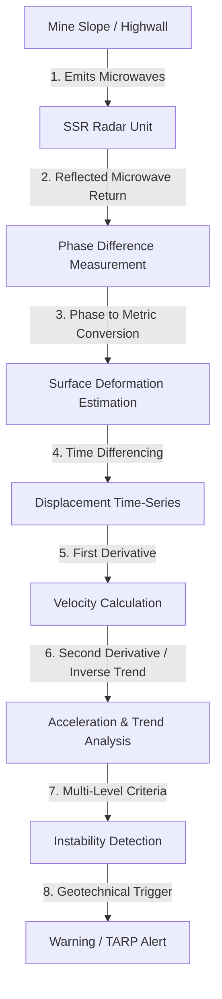
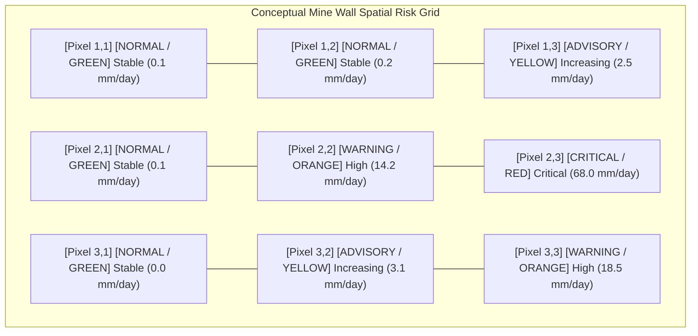
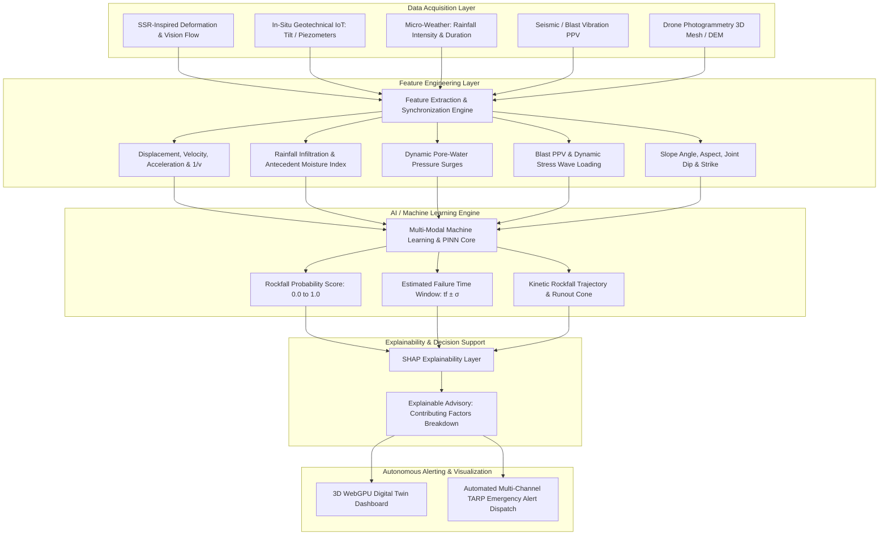
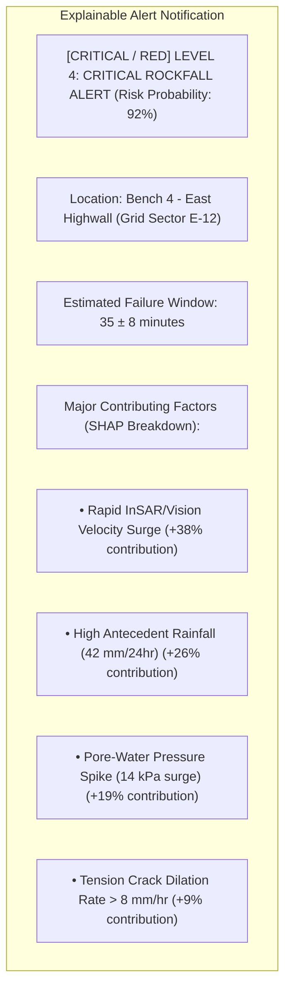
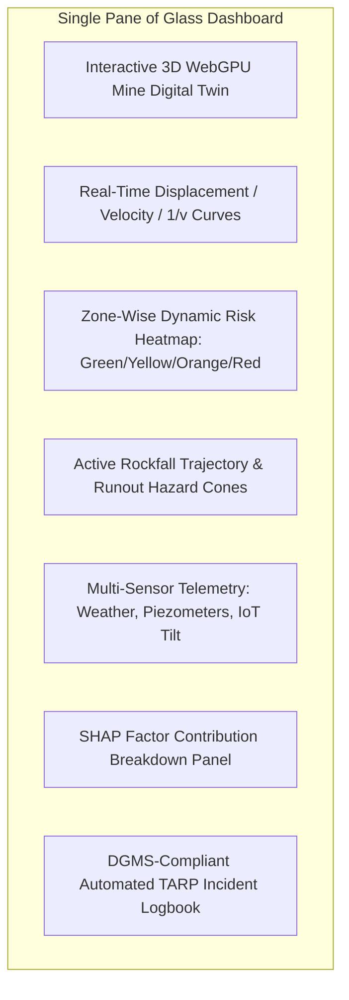
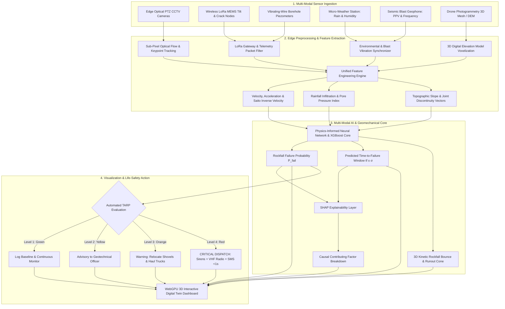

# Existing Technology 1: Slope Stability Radar (SSR)

> **Document Type:** Research & Benchmark Analysis 
> **Problem Statement ID:** SIH25071 
> **Problem Statement Title:** AI-Based Rockfall Prediction and Alert System for Open-Pit Mines 
> **Organization:** Ministry of Mines | **Category:** Software | **Theme:** Disaster Management 
> **Prepared For:** Smart India Hackathon (SIH 2025) Research & Development Documentation
> **Target File:** `docs/technologies/01_Slope_Stability_Radar_SSR.md`
> **Technology Status:** [EXISTING] [RESEARCHED] | Mathematical models & Saito Inverse Velocity adopted; Hardware in Future Scope

---

## Executive Overview

Slope Stability Radar (SSR) represents one of the most significant technological advancements in open-pit geotechnical monitoring over the past two decades. Developed originally through collaborative mining research (such as the Australian Coal Association Research Program - ACARP and commercialized by entities like GroundProbe), SSR systems provide continuous, non-contact, millimeter-level measurements of rock face deformation.

The objective of this report is not only to explain how SSR functions as an **existing commercial technology**, but to critically analyze its operational strengths and practical limitations. By dissecting the underlying physics (differential interferometry, velocity derivation, and inverse-velocity failure forecasting), this document identifies **which core concepts can be adopted, modified, and integrated into our proposed AI-based multi-modal rockfall prediction system for SIH25071**.

---

## 1. Background

### What is Slope Stability Radar?
Slope Stability Radar (SSR) is a terrestrial, ground-based radar system designed specifically to monitor slope movement in open-pit mines. It uses radar waves (typically in the X-band or Ku-band frequency ranges) to scan exposed highwalls and benches remotely from distances ranging from 50 meters up to several kilometers.


### Why is it Used in Open-Pit Mines?
Open-pit mining involves excavating steep rock benches to extract valuable ore and coal. As mining progresses deeper, the natural stress state of the rock mass is disturbed. Geological discontinuities (such as faults, joints, bedding planes, and foliation) combined with heavy monsoon rainfall, groundwater pressure, and blasting vibrations can cause highwalls to collapse without long visual warning. 

Slope failures can cause:
1. **Fatalities and Serious Injuries:** Crushing workers operating shovels, dumpers, and drill rigs on lower benches.
2. **Equipment Destruction:** Burying high-value machinery (excavators costing ₹10–50 Crores).
3. **Pit Sterilization & Economic Loss:** Halting mine production, blocking haul roads, and requiring months of hazardous clearing operations.

### What Problem Does SSR Solve?
Before the introduction of radar, mines relied on manual visual inspections, crack measurement sticks, and discrete optical prisms measured by total stations. These methods had major drawbacks:
* Optical prisms only measure single points (a collapse happening between prisms is missed).
* Total stations struggle during heavy dust, fog, and night.
* Manual inspections place human geologists in immediate danger under unstable rock walls.

SSR solved these challenges by providing **continuous, full-field spatial scanning** without requiring any physical sensors or reflectors to be installed on the hazardous rock face itself.

### Continuous Monitoring and Early Warning
Rock slope failure is rarely instantaneous at the micro-scale; it typically progresses through three distinct geomechanical creep phases:
1. **Primary Creep (Transient):** Initial deceleration after an excavation or blast perturbation.
2. **Secondary Creep (Steady-State):** Constant, slow displacement velocity over time.
3. **Tertiary Creep (Accelerating):** Progressive acceleration of displacement where micro-cracks coalesce into a continuous shear failure surface.

Continuous monitoring allows geotechnical teams to detect the onset of **tertiary creep**, enabling timely evacuations hours or days before catastrophic collapse.

---

## 2. SSR Working Principle

### High-Level Intuitive Explanation
In simple terms, an SSR acts like an ultra-sensitive electronic ruler. It sits safely on the opposite side of the pit and sends out thousands of microwave pulses toward the rock wall. When these pulses hit the rock, they bounce back to the radar dish. 

By comparing the exact time and wave alignment (phase) of the returning wave with previous scans, the computer calculates whether that specific section of the rock wall has moved closer to the radar by even a fraction of a millimeter. If a patch of rock keeps moving faster over time, the system flags it as an unstable zone.



### Detailed Technical Explanation

#### Phase Interferometry Physics
Slope Stability Radar employs **Differential Radar Interferometry (D-InSAR principles applied in a ground-based configuration)**. 

1. The radar antenna transmits a coherent electromagnetic wave packet toward the target slope:
 $$s(t) = A \cos(2\pi f_0 t + \phi_0)$$
 where $f_0$ is the carrier frequency (e.g., $9.5\text{ GHz}$ for X-band, $\lambda \approx 31.5\text{ mm}$, or $17.2\text{ GHz}$ for Ku-band, $\lambda \approx 17.4\text{ mm}$).

2. The wave reflects off the rough rock surface and returns to the receiver with a phase $\phi$:
 $$\phi = \frac{4\pi}{\lambda} R + \phi_{\text{scattering}}$$
 where $R$ is the range (distance) from the radar to the rock target.

3. Between scan epoch $t_1$ and scan epoch $t_2$, if the rock surface deforms along the radar's Line of Sight (LOS) by a distance $\Delta R$, the phase shift $\Delta \phi$ is given by:
 $$\Delta \phi = \phi(t_2) - \phi(t_1) = \frac{4\pi}{\lambda} \Delta R + \Delta \phi_{\text{atm}} + \Delta \phi_{\text{noise}}$$

4. After correcting for the atmospheric phase screen ($\Delta \phi_{\text{atm}}$) caused by ambient air temperature, humidity, and pressure variations, the line-of-sight displacement $\Delta R$ is calculated:
 $$\Delta R = \frac{\lambda}{4\pi} \Delta \phi$$

Because the wavelength $\lambda$ is known to high precision, phase differences as small as a few degrees can be resolved, delivering sub-millimeter displacement detection ($\pm 0.1\text{ mm}$ under optimal conditions).

---

## 3. How SSR Detects Slope Movement

### Spatial Scanning & Grid Mapping
The radar dish mechanically scans horizontally (azimuth) and vertically (elevation) across the slope face. The monitored wall is divided into thousands of spatial pixels (radar resolution cells). 



### Risk Level Color Coding
* [NORMAL / GREEN] **Green (Stable):** Background baseline noise, seasonal thermal expansion/contraction ($\le 1.0\text{ mm/day}$).
* [ADVISORY / YELLOW] **Yellow (Increasing Movement):** Secondary creep initiation, movement above normal baseline ($1.0 - 5.0\text{ mm/day}$).
* [WARNING / ORANGE] **Orange (High Movement):** Accelerated deformation, tension crack dilation ($5.0 - 30.0\text{ mm/day}$).
* [CRITICAL / RED] **Critical Movement:** Exponential tertiary creep, impending slope detachment ($> 30.0\text{ mm/day}$ or rapid $1/v \to 0$ convergence).

---

## 4. Data Produced by SSR

| Data Parameter | Unit / Format | Geotechnical Meaning | Operational Importance |
| :--- | :--- | :--- | :--- |
| **Displacement** ($\Delta R$) | Millimeters ($\text{mm}$) | Cumulative distance the rock surface has moved along the radar line of sight since baseline setup. | Confirms total magnitude of movement; identifies the boundary of the moving rock mass. |
| **Velocity** ($v = \frac{d(\Delta R)}{dt}$) | $\text{mm/hour}$ or $\text{mm/day}$ | Rate of surface movement over a given sliding window. | Essential indicator of kinetic state; distinguishes steady creep from accelerating instability. |
| **Acceleration** ($a = \frac{dv}{dt}$) | $\text{mm/hour}^2$ | Rate of change of velocity over time. | Detects the onset of tertiary creep; positive sustained acceleration indicates progressive failure. |
| **Inverse Velocity** ($1/v$) | $\text{hours/mm}$ or $\text{days/mm}$ | Reciprocal of displacement velocity. | Diagnostic tool for predicting the estimated window of slope collapse ($t_f$). |
| **Spatial Deformation Map** | 2D Georeferenced Heatmap | Pixel-by-pixel displacement projected onto a digital photograph or 3D Digital Elevation Model (DEM). | Pinpoints exact physical boundaries, bench levels, and volume extent of the unstable mass. |
| **Time-Series Curves** | Continuous Historical Plots | Continuous temporal evolution of displacement, velocity, and inverse velocity. | Enables geotechnical engineers to perform trend analysis and filter out non-geological noise. |
| **Risk / Alert Level** | TARP Levels (Green, Yellow, Orange, Red) | Automated classification based on user-configured displacement or velocity thresholds. | Triggers operational actions: alarms, equipment relocation, or pit evacuation. |

---

## 5. Displacement-Time Analysis

The following illustrative dataset demonstrates how a typical open-pit rock slope transitions from steady-state background deformation into accelerating tertiary creep prior to failure.

> **Important Data Disclaimer:** 
> *The table and graphs below represent **Synthetic / Illustrative Data** designed solely to explain geomechanical creep concepts. They do not represent proprietary measurements from any specific mine.*

### Illustrative Example Dataset

| Elapsed Time ($t$, min) | Cumulative Displacement ($d$, mm) | Incremental Movement ($\Delta d$, mm) | Velocity ($v$, mm/min) | Inverse Velocity ($1/v$, min/mm) | Creep Phase Classification |
| :---: | :---: | :---: | :---: | :---: | :--- |
| **0** | 0.00 | — | — | — | Baseline Setup |
| **10** | 0.50 | 0.50 | 0.050 | 20.00 | Primary / Settling |
| **20** | 1.00 | 0.50 | 0.050 | 20.00 | Secondary (Steady-State Creep) |
| **30** | 1.70 | 0.70 | 0.070 | 14.29 | Early Acceleration Initiation |
| **40** | 3.00 | 1.30 | 0.130 | 7.69 | Tertiary Creep Phase |
| **50** | 5.50 | 2.50 | 0.250 | 4.00 | Rapid Acceleration |
| **55** | 8.00 | 2.50 (in 5 min) | 0.500 | 2.00 | Imminent Failure Onset |
| **58** | 11.50 | 3.50 (in 3 min) | 1.167 | 0.86 | Critical Dynamic Detachment |

```mermaid
---
config:
 xyChart:
 width: 700
 height: 350
 themeVariables:
 xyChart:
 plotColorPalette: "#d9534f"
---
xychart-beta
 title "Illustrative Example: Cumulative Displacement vs Time (Synthetic Data)"
 x-axis "Elapsed Time (minutes)" [0, 10, 20, 30, 40, 50, 55, 58]
 y-axis "Cumulative Displacement (mm)" 0 --> 12
 line [0, 0.5, 1.0, 1.7, 3.0, 5.5, 8.0, 11.5]
```

### What This Graph Demonstrates
1. **From $t = 0$ to $t = 20\text{ min}$:** The displacement curve is linear with a constant slope ($0.05\text{ mm/min}$). This represents steady-state secondary creep. The rock mass is deforming, but the shear stress is balanced by the resisting strength.
2. **From $t = 30$ to $t = 58\text{ min}$:** The slope of the curve progressively increases. The curve bends upward in an exponential fashion. This demonstrates **tertiary creep**, where internal micro-fractures connect to form a continuous shear plane, leading to progressive structural breakdown.

---

## 6. Velocity and Acceleration Analysis

Simply monitoring cumulative displacement is insufficient for reliable slope safety management. 

### Why Displacement Alone is Misleading

Consider two scenarios:
* **Scenario A:** A bench displaces by $15\text{ mm}$ over a period of $6\text{ months}$ ($0.08\text{ mm/day}$). This represents slow, stable creep that can be safely managed during routine mining.
* **Scenario B:** A bench displaces by $15\text{ mm}$ within $15\text{ minutes}$ ($1440\text{ mm/day}$). This represents active, dangerous collapse requiring immediate evacuation.

Therefore, **Velocity** and **Acceleration** are the primary diagnostic parameters for early-warning triggers:
$$\text{Velocity: } v(t) = \frac{\Delta d}{\Delta t} = \frac{d(t_2) - d(t_1)}{t_2 - t_1}$$
$$\text{Acceleration: } a(t) = \frac{\Delta v}{\Delta t} = \frac{v(t_2) - v(t_1)}{t_2 - t_1}$$

```mermaid
---
config:
 xyChart:
 width: 700
 height: 350
 themeVariables:
 xyChart:
 plotColorPalette: "#f0ad4e"
---
xychart-beta
 title "Illustrative Example: Deformation Velocity vs Time (Synthetic Data)"
 x-axis "Elapsed Time (minutes)" [10, 20, 30, 40, 50, 55, 58]
 y-axis "Velocity (mm/min)" 0.0 --> 1.2
 line [0.05, 0.05, 0.07, 0.13, 0.25, 0.50, 1.17]
```

### Explanation of the Velocity Curve
As shown in the illustrative graph above:
* Velocity remains flat at $0.05\text{ mm/min}$ during secondary creep ($t = 10\text{ to }20\text{ min}$).
* Between $t = 30$ and $t = 58\text{ min}$, velocity exhibits an exponential surge from $0.07\text{ mm/min}$ to over $1.16\text{ mm/min}$ (a 16-fold increase), providing an unambiguous early warning of catastrophic failure.

---

## 7. Inverse Velocity Method

### Mathematical Foundation
The Inverse Velocity Method (first formulated by **Saito in 1965** and expanded by **Fukuzono in 1985**) is one of the most widely applied analytical techniques in geotechnical radar monitoring.

Fukuzono demonstrated that during the tertiary creep stage prior to catastrophic brittle or ductile rock mass failure, the acceleration of displacement obeys the power law:
$$\frac{d^2 x}{dt^2} = A \left(\frac{dx}{dt}\right)^\alpha$$
where $x$ is displacement, $t$ is time, and $A, \alpha$ are constants.

When $\alpha \approx 2.0$ (typical for progressive open-pit rock slope failures), integrating the differential equation yields a linear relationship for inverse velocity:
$$\frac{1}{v(t)} = \left(\frac{1}{v_0}\right) - A(t - t_0) = A(t_f - t)$$
where:
* $v(t) = \frac{dx}{dt}$ is the instantaneous velocity.
* $t_f$ is the theoretical **Time of Failure**.

As the time $t$ approaches the failure time $t_f$, the velocity $v(t) \to \infty$, causing the **inverse velocity to trend toward zero ($\frac{1}{v(t)} \to 0$)**.

```mermaid
---
config:
 xyChart:
 width: 700
 height: 350
 themeVariables:
 xyChart:
 plotColorPalette: "#0275d8"
---
xychart-beta
 title "Conceptual Illustration: Inverse Velocity (1/v) vs Time Trending Towards Failure"
 x-axis "Elapsed Time (minutes)" [10, 20, 30, 40, 50, 55, 58]
 y-axis "Inverse Velocity (min/mm)" 0 --> 25
 line [20.0, 20.0, 14.3, 7.7, 4.0, 2.0, 0.86]
```

### Operational Utility and Limitations of the Inverse Velocity Method
* **Practical Utility:** By plotting $1/v$ against time in real-time, geotechnical engineers can fit a linear regression line through the data points. The X-intercept of this line ($\frac{1}{v} = 0$) provides an estimated failure time window ($t_f$), allowing mine personnel to establish safe evacuation deadlines.
* **Important Operational Caveat:** The inverse velocity method provides an **estimate of trend progression**, not an absolute guarantee of exact failure timing. Complex factors such as sudden rainfall events, blast vibrations, structural joint stepping, or progressive load shedding can cause the slope to fail earlier or stabilize temporarily (regressive behavior).

---

## 8. Advantages of Slope Stability Radar (SSR)

| Advantage | Technical Explanation | Operational Benefit in Mining |
| :--- | :--- | :--- |
| **Non-Contact Remote Sensing** | Operates from safe stand-off distances (50m to 4km) across the pit without requiring physical access. | Eliminates the safety hazard of sending survey personnel to install instruments on unstable rock faces. |
| **Continuous Monitoring** | Scans the slope continuously (e.g., full scan completed every 2 to 5 minutes). | Detects rapid acceleration trends and sudden onset of tertiary creep around the clock. |
| **Sub-Millimeter Sensitivity** | Uses microwave phase interferometry ($\pm 0.1\text{ mm}$ displacement resolution). | Identifies microscopic movement long before visible cracks or loose rocks appear to the naked eye. |
| **Full-Field Spatial Coverage** | Monitors tens of thousands of spatial resolution cells simultaneously across the highwall. | Overcomes the blind spots of discrete point sensors (e.g., prisms or crack meters). |
| **All-Weather & Day/Night Capability** | Microwaves penetrate darkness, moderate dust, light rain, and ambient smoke. | Delivers continuous 24/7 life safety protection unaffected by solar lighting conditions. |
| **Direct Velocity & Acceleration Output** | Software computes spatial velocity and inverse velocity trends automatically in real-time. | Enables quantitative Trigger Action Response Plan (TARP) threshold alerting. |

---

## 9. Critical Limitations of Existing SSR Systems

While SSR is an exceptional engineering tool, a critical analysis reveals several major technical, operational, and commercial limitations:

```mermaid
mindmap
 root((Limitations of Existing SSR))
 Cost & Commercial Access
 High Initial Capex ₹3.5Cr - ₹8Cr
 High Annual Opex Maintenance
 Proprietary Ecosystem Lock-in
 Physical & Environmental Limits
 Line of Sight LOS Blindness
 Atmospheric Phase Screen APS Noise
 Shadowing Behind Crests and Benches
 Geotechnical Blindness
 Deformation Only - No Causal Insight
 Blind to Pore-Water Pressure
 Blind to Blast Shockwaves
 Operational Vulnerabilities
 Alert Fatigue from False Alarms
 Requires Expert Geotechnical Interpretation
 Not a Complete Predictive AI System
```

### 1. High Capital and Maintenance Cost
Commercial SSR systems typically require a capital expenditure of **₹3.5 Crores to ₹8.0 Crores ($450,000 to $1,000,000+ USD)** per mobile unit, plus annual maintenance, software licensing, and specialized calibration contracts of ₹30–50 Lakhs. Consequently, **fewer than 5% of open-pit mines in India (primarily mega-scale coal and top-tier iron ore mines) can afford dedicated radar systems**.

### 2. Line-of-Sight (LOS) Measurement Restriction
Radar interferometry measures displacement **only along the radial line-of-sight vector** connecting the radar antenna to the rock target. If a rock block slides vertically downward or shears horizontally perpendicular to the radar beam, the true 3D vector displacement is severely underestimated or entirely missed.

### 3. Atmospheric Phase Screen (APS) Distortion
Changes in atmospheric temperature, relative humidity, and barometric pressure between scans alter the dielectric permittivity of air. This causes phase delays that look identical to real slope displacement. During heavy monsoon storms or severe temperature inversions, atmospheric noise can create false movement readings of several millimeters, leading to **false alarms and operator alert fatigue**.

### 4. Lack of Direct Causal and Subsurface Awareness
SSR measures the **symptom (surface deformation)** rather than the **underlying root causes (pore-water pressure, rainfall infiltration, blast vibration shockwaves, and joint water pressures)**. Radar cannot see through rock to measure subsurface shear planes, nor does it measure groundwater table surges.

### 5. Absence of Autonomous AI & Physics-Informed Synthesis
Most commercial SSR installations rely on basic statistical threshold alerts (e.g., "sound alarm if velocity $> 5\text{ mm/hr}$"). They lack machine learning models that fuse geological structures, weather forecasts, and dynamic runout simulations into an automated, explainable decision-support engine.

---

## 10. What We Can Adopt From SSR for SIH25071

Rather than attempting to reinvent mechanical radar hardware, our proposed SIH25071 solution adopts the **core physical principles, mathematical formulations, and spatial monitoring workflows** established by SSR and translates them into a modern, multi-modal software-driven platform:

| Core SSR Concept | Underlying Engineering Mechanism | How We Adopt & Implement It in SIH25071 |
| :--- | :--- | :--- |
| **Continuous Deformation Tracking** | High-frequency time-series measurement of surface movement. | Ingest real-time displacement data from low-cost edge vision cameras, virtual keypoints, and wireless IoT sensor nodes. |
| **Time-Series Velocity Derivation** | First derivative of displacement over moving time windows ($v = \Delta d / \Delta t$). | Compute rolling velocity vectors across all spatial monitoring points to serve as core inputs for machine learning models. |
| **Acceleration & Creep Classification** | Second derivative ($a = \Delta v / \Delta t$) identifying secondary vs. tertiary creep. | Implement automated creep-phase classification algorithms to detect transitioning failure regimes. |
| **Inverse Velocity Failure Forecasting** | Saito/Fukuzono model ($\frac{1}{v} \to 0$) for estimating time to failure ($t_f$). | Integrate automated linear and polynomial inverse velocity regression as an engineered feature in the AI risk prediction pipeline. |
| **Spatial Grid Risk Heatmapping** | Dividing slope into discrete cells with color-coded risk levels (Green/Yellow/Orange/Red). | Generate dynamic 3D web-based spatial risk heatmaps mapped directly onto mine Digital Elevation Models (DEM). |
| **Multi-Tiered TARP Trigger Logic** | Staged warning levels based on increasing physical movement thresholds. | Develop an automated Trigger Action Response Plan (TARP) engine that links AI risk probability directly to emergency sirens and notifications. |
| **Non-Contact Virtual Monitoring** | Remotely measuring points across the rock face without climbing hazardous benches. | Use Computer Vision (optical flow and sub-pixel Digital Image Correlation) to track 10,000+ natural rock texture points prismlessly. |

---

## 11. How SSR Can Be Combined With Multi-Modal AI

The fundamental breakthrough of our proposed SIH25071 system is moving beyond single-sensor deformation monitoring to create an integrated **Multi-Modal Geo-Intelligence Platform**:



---

## 12. Proposed AI Data Inputs

To achieve high predictive accuracy, our proposed system clearly demarcates traditional SSR data from the expanded multi-source inputs integrated into the AI pipeline:

### Category A: Traditional SSR Input (Adopted / Simulated)
* **Surface Line-of-Sight Displacement ($\text{mm}$):** Continuous distance changes over time.
* **Deformation Velocity ($\text{mm/hr}$):** Rate of surface displacement.
* **Inverse Velocity ($1/v$):** Failure trend indicator.

### Category B: Additional Proposed SIH25071 Inputs (Multi-Source Fusion)

#### 1. Geotechnical & In-Situ Subsurface Data
* **Subsurface Tilt & Incline ($\Delta \theta$):** Triaxial MEMS tilt angle changes from wireless LoRa nodes.
* **Pore-Water Pressure ($u$, $\text{kPa}$):** Vibrating-wire piezometric pressure showing groundwater buildup behind slopes.
* **Tension Crack Dilation ($\text{mm}$):** Opening rate of crest tension cracks.
* **Rock Mass Rating (RMR) & Geological Strength Index (GSI):** Structural joint spacing, persistence, and friction angles.

#### 2. Environmental & Dynamic Trigger Data
* **Rainfall Rate & Duration ($\text{mm/hr}$, cumulative $\text{mm}$):** Real-time precipitation data from micro-weather stations.
* **Antecedent Moisture Index (AMI):** 7-day cumulative rainfall estimating rock mass saturation.
* **Blast Vibration Peak Particle Velocity ($\text{PPV}$, $\text{mm/s}$):** Dynamic seismic loading from production blasting.

#### 3. Spatial, Topographic & Visual Data
* **High-Resolution 3D Digital Elevation Models (DEM):** Topographic slope angle ($\beta$), bench height, and aspect.
* **Drone / CCTV Optical Feature Flow:** Sub-pixel visual displacement tracking across natural rock textures.
* **Automated Crack Segmentation:** Computer vision edge-detection tracing surface fracture propagation.

---

## 13. Proposed Machine Learning Layer

### Model Architectures Under Evaluation
For structured geotechnical, environmental, and time-series sensor streams, tree-based ensemble models and physics-informed architectures provide optimal performance, robustness against outliers, and high computational efficiency on edge hardware:

1. **Gradient Boosted Decision Trees (XGBoost / LightGBM):** 
 * *Strengths:* Exceptional performance on tabular sensor streams; natively handles missing sensor packets; computationally lightweight for real-time edge execution.
2. **Random Forest Classifier & Regressor:** 
 * *Strengths:* Robust against noise and overfitting; provides direct Gini-impurity feature importance metrics.
3. **Temporal Convolutional Networks (TCN) / LSTM Networks:** 
 * *Strengths:* Captures multi-scale temporal dependencies across time-series displacement and rainfall histories.
4. **Physics-Informed Neural Networks (PINN):** 
 * *Strengths:* Constrains neural predictions with fundamental geomechanical equilibrium equations (Mohr-Coulomb limit equilibrium and Saito inverse velocity laws).

```mermaid
flowchart LR
 A[Synchronized Sensor Vector] --> B[ML Prediction Pipeline]
 B --> C[Probability Estimation: P_failure in 0.0 - 1.0]
 C --> D{TARP Risk Classification}
 D -->|P < 0.30| E[[NORMAL / GREEN] LOW RISK / Green]
 D -->|0.30 <= P < 0.65| F[[ADVISORY / YELLOW] MEDIUM RISK / Yellow]
 D -->|0.65 <= P < 0.85| G[[WARNING / ORANGE] HIGH RISK / Orange]
 D -->|P >= 0.85| H[[CRITICAL / RED] CRITICAL RISK / Red]
 H --> I[Automated Multi-Channel Alert]
```

---

## 14. Explainable AI (XAI) for Mine Safety Decisions

A critical flaw in standard deep learning systems is the "black-box" dilemma. A mine safety officer will not order a costly pit evacuation or halt high-value production shovels simply because an AI outputs an unverified "HIGH RISK" alert.

### SHAP (SHapley Additive exPlanations) Integration
Our system incorporates a **SHAP Explainability Layer** that mathematically decomposes the exact contribution of each input variable to the final risk score:

$$\text{Risk Score} = \phi_0 + \sum_{i=1}^{M} \phi_i$$
where $\phi_0$ is the base expected risk and $\phi_i$ is the Shapley value for feature $i$.



By providing transparent, geotechnically grounded explanations, the system builds operator trust and eliminates uncertainty during critical emergency decisions.

---

## 15. Proposed SIH Decision-Support Dashboard

The proposed GeoShield AI dashboard delivers a unified operational interface:



### Key Dashboard Modules
1. **Interactive 3D Pit Mesh:** Georeferenced digital elevation model color-coded by real-time risk probability.
2. **Time-Series Analytics Panel:** Synchronized plots showing displacement, velocity surge, and inverse velocity linear regression.
3. **Dynamic Rockfall Runout Simulator:** Visualizes simulated bouncing boulder paths and impact envelopes across lower haul roads.
4. **Autonomous TARP Dispatch Center:** Single-click or automated emergency broadcast triggers.

---

## 16. Comparison: Existing SSR Approach vs. Proposed SIH System

| Feature / Dimension | Typical Existing SSR Approach | Proposed SIH25071 Multi-Modal System |
| :--- | :--- | :--- |
| **Primary Physical Sensor** | High-power microwave dish radar (Real-aperture or GB-InSAR). | Multi-camera edge computer vision + low-cost wireless LoRa IoT sensor mesh. |
| **Capital Expenditure (Capex)** | **₹3.5 Crore – ₹8.0 Crore** (Extremely expensive). | **₹2.0 Lakh – ₹5.0 Lakh** (>95% cost reduction). |
| **Deformation Monitoring** | Line-of-sight displacement ($\pm 0.1\text{ mm}$). | Multi-point sub-pixel optical flow + IoT tilt disparity. |
| **Kinematic Feature Extraction** | Velocity, acceleration, and inverse velocity. | Velocity, acceleration, inverse velocity + geomechanical strain. |
| **Environmental Coupling** | External standalone weather stations (not integrated). | Fully synchronized real-time rainfall, temperature, and moisture fusion. |
| **Subsurface Awareness** | Blind to subsurface conditions. | Ingests real-time vibrating-wire piezometer pore pressure and tilt. |
| **Machine Learning Core** | Basic numerical threshold filtering. | Multi-modal tree ensembles (XGBoost) + Physics-Informed Neural Networks. |
| **Explainability** | Threshold exceedance indicators only. | SHAP-based feature importance breakdown explaining risk drivers. |
| **3D Trajectory & Runout Simulation** | None (measures wall movement only). | Integrated 3D kinetic bounce physics simulating hazard runout paths. |
| **Alert Dispatch Mechanism** | Visual display alarm; manual siren activation. | Autonomous sub-second multi-channel dispatch (Sirens, VHF Radio, SMS/WhatsApp). |
| **Accessibility for Indian Mines** | Limited to <5% large mega-mines. | Universally deployable across all 800+ open-cast mines in India. |

---

## 17. Research Gap Analysis

### Identified Industry Gap
While existing Slope Stability Radar (SSR) technology has revolutionized the detection of surface deformation, **it operates in isolation**. In the real world, slope failure is a complex multi-physics phenomenon driven by rainfall infiltration, pore-water pressure surges, joint orientation, dynamic blast shockwaves, and structural rock degradation.

Existing radar systems provide high-precision monitoring of **symptoms (displacement)**, but they lack:
1. Multi-sensor data fusion linking triggers to physical response.
2. Machine learning models that generalize across varying geological formations.
3. Real-time rockfall kinetic trajectory and hazard runout prediction.
4. Affordable implementation architectures accessible to small and medium-scale open-cast mines.

```
+---------------------------------------------------------------------------------------------------+
| BRIDGING THE RESEARCH GAP |
+---------------------------------------------------------------------------------------------------+
| [ Traditional SSR Approach ] [ Proposed SIH25071 Innovation ] |
| - Expensive Radar Hardware - Affordable Edge Vision + Wireless LoRa IoT Mesh |
| - Single-Sensor Displacement Only - Multi-Source Fusion (Deformation + Weather + Geotech) |
| - Manual Geotechnical Analysis - Physics-Informed Machine Learning & Inverse Velocity |
| - Rigid Threshold Alarms - Explainable AI (SHAP) + Dynamic 3D Runout Cones |
| - Manual Alert Notification - Automated Sub-Second Multi-Channel TARP Dispatch |
+---------------------------------------------------------------------------------------------------+
```

---

## 18. Proposed Innovations for SIH25071

For the Smart India Hackathon 2025, our team proposes the following concrete engineering innovations:

1. **Prismless Virtual Vision Tracking:** Using high-zoom PTZ cameras and edge sub-pixel optical flow to track 10,000+ virtual rock texture points, replicating radar-like full-field deformation tracking at a fraction of the cost.
2. **Multi-Source IoT & Environmental Fusion:** Unifying wireless LoRa tilt/vibration nodes, micro-weather precipitation rates, and piezometric pore pressure into a synchronized time-series pipeline.
3. **Physics-Informed ML Failure Estimator:** Combining empirical geomechanical laws (Saito Inverse Velocity and Mohr-Coulomb Limit Equilibrium) with modern XGBoost and Transformer models.
4. **SHAP-Powered Explainable Alerts:** Generating instant, plain-language diagnostic reports explaining the exact causal triggers behind every high-risk alert.
5. **Real-Time 3D Kinetic Runout Simulator:** Simulating rigid-body boulder bouncing and runout cones over 3D Digital Elevation Models to dynamically protect haulage routes.
6. **Autonomous Sub-Second TARP Dispatcher:** Instantaneously broadcasting sirens, synthesized VHF walkie-talkie voice alerts, and automated SMS/WhatsApp warnings to workers in danger zones.

---

## 19. Final System Architecture



---

## 20. Conclusion

Slope Stability Radar (SSR) has established the global benchmark for understanding slope deformation dynamics, proving that continuous millimeter-scale displacement tracking and inverse-velocity analysis can successfully provide early warning of catastrophic slope failures.

However, existing commercial SSR systems remain expensive, proprietary, and constrained to surface line-of-sight kinematics without integrating environmental triggers or subsurface geomechanics.

Our proposed **SIH25071 system** builds directly upon the proven physics of SSR while advancing the state of the art through modern multi-modal sensor fusion, edge computer vision, and explainable machine learning. The ultimate mission of our project is to transition mine safety from:

> **"Detecting that a slope is deforming"**

towards:

> **"Accurately predicting the probability of rockfall, mapping the endangered 3D runout zone, explaining the underlying geotechnical causes, and triggering autonomous, life-saving evacuations in sub-second time."**

---

## 21. References

1. **Saito, M.** (1965). *Forecasting the time of occurrence of a slope failure based on strain measurements*. Proceedings of the 6th International Conference on Soil Mechanics and Foundation Engineering, Montreal, Vol. 2, pp. 537–541.
2. **Fukuzono, T.** (1985). *A new method for predicting the failure time of a slope*. Proceedings of the 4th International Conference and Field Workshop on Landslides, Tokyo, pp. 145–150.
3. **Harries, N., Noon, D., & Rowley, K.** (2006). *Slope Stability Radar (SSR) - A proven technology for real-time slope monitoring and early warning of slope failures*. Proceedings of the International Symposium on Stability of Rock Slopes in Open Pit Mining and Civil Engineering (Slope Stability 2006), Cape Town, South African Institute of Mining and Metallurgy, pp. 283–294.
4. **Rose, N. D., & Hungr, O.** (2007). *Forecasting potential rock slope failure in open pit mines using the inverse-velocity method*. International Journal of Rock Mechanics and Mining Sciences, 44(2), pp. 308–320. [DOI: 10.1016/j.ijrmms.2006.07.014](https://doi.org/10.1016/j.ijrmms.2006.07.014)
5. **Noon, D.** (2003). *Slope Stability Radar (SSR) for monitoring open-cut mine walls*. ACARP Project C9024 Final Report, Australian Coal Association Research Program.
6. **Eberhardt, E.** (2008). *Twenty-Seventh Canadian Geotechnical Colloquium: The role of advanced numerical modeling and open pit slope stability*. Canadian Geotechnical Journal, 45(4), pp. 481–510. [DOI: 10.1139/T08-005](https://doi.org/10.1139/T08-005)
7. **Lundmark, D. A., & Severin, J.** (2021). *Slope monitoring and performance analysis using ground-based interferometric radar in surface mines*. Rock Mechanics and Rock Engineering, 54(8), pp. 4101–4122. [DOI: 10.1007/s00603-021-02489-3](https://doi.org/10.1007/s00603-021-02489-3)
8. **Directorate General of Mines Safety (DGMS).** (2020). *DGMS (Tech) Circular No. 02 of 2020: Standard Operating Procedures for scientific slope monitoring in open-cast mines*. Ministry of Labour & Employment, Government of India.
9. **Lundberg, S. M., & Lee, S.-I.** (2017). *A unified approach to interpreting model predictions*. Advances in Neural Information Processing Systems (NeurIPS 2017), 30, pp. 4765–4774.
10. **National Institute for Occupational Safety and Health (NIOSH).** (2019). *Ground Control in Open-Pit Mining: Safety Guidelines for Highwall Hazard Assessment*. CDC/NIOSH Information Circular IC 9532.
