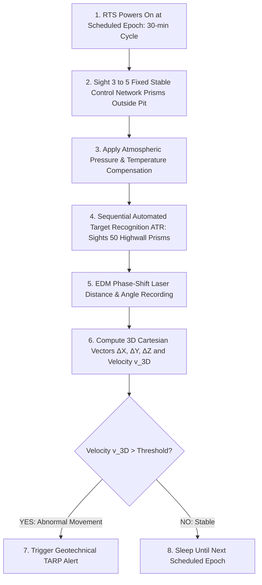
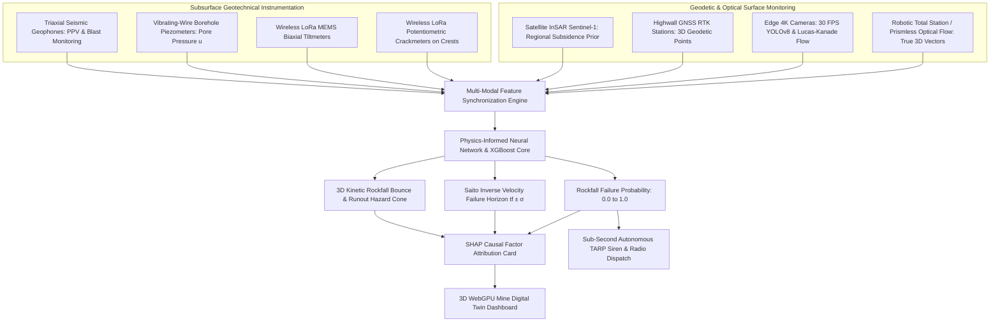
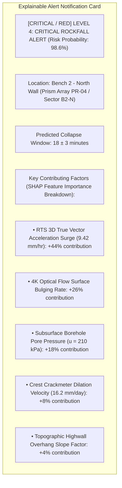
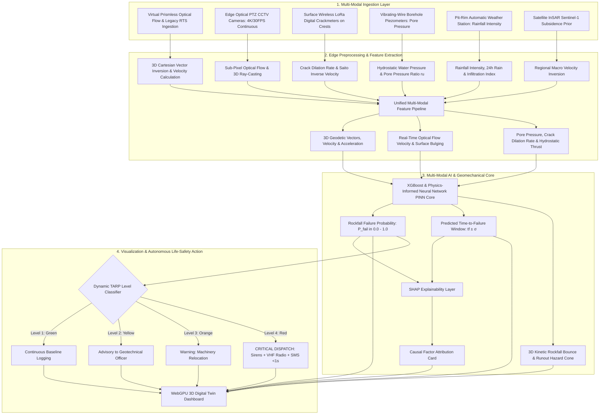

# Existing Technology 04: Robotic Total Station & Prism Monitoring (RTS / AMTS)

> **Document Type:** Research & Benchmark Analysis 
> **Problem Statement ID:** SIH25071 
> **Problem Statement Title:** AI-Based Rockfall Prediction and Alert System for Open-Pit Mines 
> **Organization:** Ministry of Mines | **Category:** Software | **Theme:** Disaster Management 
> **Prepared For:** Smart India Hackathon (SIH 2025) Research & Development Documentation 
> **Target File:** `docs/technologies/04_Total_Station_Prism_Monitoring.md`
> **Technology Status:** [EXISTING] [PROTOTYPE] | 3D Geodetic Vector Math adopted into Virtual Prismless Optical Flow

---

## Executive Summary

**Robotic Total Station and Prism Monitoring Systems**—also designated as **Automated Motorized Total Stations (AMTS)**—represent the traditional, statutory gold-standard in geodetic deformation monitoring across global open-cast mines and civil infrastructure. Permanently mounted on stable concrete control pillars situated on stable ground outside the pit limit, an RTS combines an **electronic theodolite (measuring horizontal angle $\theta$ and vertical zenith angle $\alpha$)** with an **infrared Electronic Distance Measurement (EDM) laser** to sequentially sight an array of glass corner-cube retroreflective prisms bolted into the rock benches.

While RTS systems deliver sub-millimeter Cartesian coordinate accuracy ($\pm 1.0\text{ mm} \pm 1\text{ ppm}$) and direct 3D vector displacements $(\Delta X, \Delta Y, \Delta Z)$, they suffer from fundamental physical limitations: (1) **discrete point blindness** (collapses between prisms remain undetected), (2) **high hardware vulnerability to blast flyrock**, (3) **atmospheric beam attenuation in heavy coal/ore dust and fog**, and (4) **high measurement cycle latency ($30\text{ to } 60\text{ minutes}$)**.

This report evaluates Robotic Total Stations as an **established geodetic monitoring methodology**. It formulates EDM phase-shift physics and 3D polar-to-Cartesian coordinate transformations; evaluates atmospheric refraction corrections; benchmarks commercial instruments (**Leica TM50/TM60**, **Trimble S9**); and presents our proposed **Virtual Prismless Optical Flow AI strategy for SIH25071**, which replaces fragile physical glass prisms with 100,000+ natural rock texture keypoints projected onto a 3D drone mesh.

---

## 1. Introduction to Robotic Total Station Monitoring

### What is a Robotic Total Station (RTS / AMTS)?
A **Robotic Total Station** is an automated, electro-optical geodetic surveying instrument equipped with motorized servo drives, automatic target recognition (ATR) image sensors, and high-precision coaxial EDM lasers capable of operating autonomously without a human surveyor.

```
+---------------------------------------------------------------------------------------------------+
| PHYSICAL PRISM RTS vs. PROPOSED VIRTUAL OPTICAL AI |
+---------------------------------------------------------------------------------------------------+
| [ PHYSICAL ROBOTIC TOTAL STATION ] [ PROPOSED SIH25071 VIRTUAL OPTICAL AI ] |
| - Discrete physical glass prisms (50 pts) - Full-field dense virtual tracking (100,000+ keypoints)|
| - High unit cost (₹35L instrument + ₹10k/pt)- Low-cost 4K optical edge cameras (₹25k/node) |
| - Prisms shattered by blasting flyrock - Non-contact stand-off cameras outside danger zone |
| - 30 to 60 minute sequential cycle time - Real-time 30 FPS continuous optical flow (<33 ms) |
| - Beam blocked by pit dust & fog - Bi-spectrum thermal + multi-modal sensor fusion |
+---------------------------------------------------------------------------------------------------+
```

---

## 2. Geodetic Operating Principle & Coordinate Mathematics

```
 Stable Reference Pillar (RTS Location)
 
 [RTS] 
 
 
 Pulsed Infrared Laser Distance d
 Zenith Angle α, Az θ 
 
 
 Glass Cube Prism 1 (Bench 2 Crest)
 
```
*Figure 2.1: Optical line-of-sight measurement geometry between RTS reference pillar and bench target prism.*

### 3D Polar to Cartesian Coordinate Transformation
An RTS calculates 3D Cartesian coordinates $(X_t, Y_t, Z_t)$ from instrument center $(X_0, Y_0, Z_0)$ using slope distance ($d$), horizontal azimuth ($\theta$), and zenith angle ($\alpha$):

$$X_t = X_0 + d \cdot \sin(\alpha) \cdot \cos(\theta)$$
$$Y_t = Y_0 + d \cdot \sin(\alpha) \cdot \sin(\theta)$$
$$Z_t = Z_0 + d \cdot \cos(\alpha) + \frac{1 - k_r}{2 R_E} \cdot (d \cdot \sin\alpha)^2$$

Where:
* $k_r \approx 0.14$ is the atmospheric refraction coefficient.
* $R_E \approx 6,371,000\text{ m}$ is the mean radius of the Earth.

### 3D True Vector Displacement & Velocity
$$\Delta X = X_t - X_0, \quad \Delta Y = Y_t - Y_0, \quad \Delta Z = Z_t - Z_0$$
$$D_{3D} = \sqrt{(\Delta X)^2 + (\Delta Y)^2 + (\Delta Z)^2}$$
$$v_{3D}(t) = \frac{\Delta D_{3D}}{\Delta t}$$

---

## 3. Atmospheric Refraction & Velocity Corrections

Infrared EDM signals travel through ambient air whose refractive index ($n$) varies with temperature ($T$), barometric pressure ($P$), and partial water vapor pressure ($e$):

$$n = 1 + \left( \frac{273.15}{1013.25} \cdot \frac{P}{T} \cdot (n_0 - 1) \right) - \frac{11.27 \cdot e}{T} \cdot 10^{-6}$$

* In deep open-cast mines, extreme temperature inversions ($15^\circ\text{C}\text{ at crest to } 42^\circ\text{C}\text{ at pit bottom}$) introduce up to $\pm 15\text{ mm}$ of false apparent displacement unless calibrated against fixed reference stable control prisms outside the pit.

---

## 4. Operational Monitoring Cycle & Workflow


*Figure 4.1: Automated measurement and calibration cycle of an AMTS monitoring network.*

---

## 5. Critical Engineering Limitations in Open-Cast Mining

```
+---------------------------------------------------------------------------------------------------+
| CORE LIMITATIONS OF PRISM MONITORING |
+---------------------------------------------------------------------------------------------------+
| 1. DISCRETE SPATIAL BLINDNESS: An RTS only measures the exact spot where a prism is bolted. |
| A 50,000-ton bench collapse between prisms occurs with ZERO prior warning. |
| 2. FLYROCK DESTRUCTION & SAFETY HAZARD: Blasting flyrock regularly destroys prisms. Surveyors |
| must manually climb active, hazardous highwalls to install replacements. |
| 3. ATMOSPHERIC ATTENUATION: Heavy mineral dust, shovel exhaust, and fog scatter infrared laser |
| beams, causing up to 40% data loss during critical winter mornings. |
| 4. CYCLE TIME LATENCY (30–60 MIN): Sequential mechanical slewing across 50+ prisms is too slow |
| to capture rapid brittle rockfall detachments occurring within seconds. |
| 5. PROHIBITIVE COST: Automated RTS units cost ₹35–50 Lakhs each, limiting deployment to 1 unit. |
+---------------------------------------------------------------------------------------------------+
```

---

## 6. Commercial Robotic Total Station Systems Benchmark

| System Name | Manufacturer / Country | Angular Accuracy | EDM Distance Accuracy | ATR Search Range | Key Features | Approximate Cost Profile |
| :--- | :--- | :--- | :--- | :--- | :--- | :--- |
| **Leica Nova TM50 / TM60**| Leica Geosystems (Switzerland)| $0.5''\text{ (0.15 mgon)}$ | $\pm 0.6\text{ mm} + 1\text{ ppm}$| Up to $3,000\text{ m}$ | Coaxial overview camera, piezo direct drives, GeoMoS software integration. | **₹40 – ₹55 Lakhs** |
| **Trimble S9 / SX12** | Trimble Navigation (USA) | $0.5''\text{ to } 1.0''$ | $\pm 0.8\text{ mm} + 1\text{ ppm}$| Up to $2,500\text{ m}$ | Trimble 4D Control software, integrated 3D laser scanning on SX12. | **₹38 – ₹50 Lakhs** |
| **Topcon MS05AXII** | Topcon Corporation (Japan) | $0.5''$ | $\pm 0.5\text{ mm} + 1\text{ ppm}$| Up to $2,000\text{ m}$ | Ultra-high precision distance measurement, automated target acquisition. | **₹35 – ₹45 Lakhs** |

---

## 7. Proposed SIH25071 Innovation: Virtual Prismless Optical Flow

To eliminate the extreme cost and point-blindness of physical prisms, our proposed platform develops a **Virtual Prismless Geodetic System** using edge computer vision:

```mermaid
flowchart LR
 CAM[Fixed 4K Optical PTZ Camera: Non-Contact Stand-Off] --> CORNERS[Shi-Tomasi & SIFT: Extracts 100,000+ Natural Rock Texture Keypoints]
 CORNERS --> FLOW[Sub-Pixel Lucas-Kanade Optical Flow: Tracks 2D Sub-Pixel Pixel Shifts]
 FLOW --> RAYCAST[2D-to-3D Ray Casting onto Drone DEM Mesh P = K R|t]
 RAYCAST --> VIRTUAL_VEC[Generates Continuous 3D True Displacement Vectors ΔX, ΔY, ΔZ at 30 FPS]
```
*Figure 7.1: Transformation of raw 2D video into 100,000+ virtual 3D geodetic monitoring points.*

### Technical Comparison: Physical Prisms vs. Virtual Optical Flow

| Parameter | Traditional Physical RTS Prisms | Proposed SIH25071 Virtual Optical Flow |
| :--- | :--- | :--- |
| **Target Requirement** | Physical glass retroreflectors bolted to bench face. | **Zero physical targets (Uses natural rock texture).** |
| **Monitored Points Count**| $30\text{ to } 80\text{ discrete points per pit}$. | **$>100,000\text{ continuous surface keypoints}$.** |
| **Sampling Frequency** | Once every $30\text{ to } 60\text{ minutes}$. | **Continuous 30 FPS real-time ($33\text{ ms}$).** |
| **Blast Vulnerability**| High (Prisms shatter from flyrock). | **Zero (Cameras installed safely at pit rim).** |
| **Spatial Coverage** | Point-only sampling. | **Full highwall coverage with zero blind spots.** |
| **Capital Cost** | ₹40,000,000+ (Instrument + prisms). | **<₹25,000 per Edge AI camera node.** |

---

## 8. Illustrative Synthetic RTS Benchmark Dataset

> **Important Data Disclaimer:** 
> *The following dataset and graphs represent **Synthetic / Illustrative Data** designed solely to explain RTS 3D coordinate vector calculations. They do not represent real measurements from any specific mine.*

### Illustrative Synthetic RTS 3D Coordinate Displacement Log

| Measurement Epoch | Elapsed Time ($t$, hr) | $\Delta X$ Easting (mm) | $\Delta Y$ Northing (mm) | $\Delta Z$ Elevation (mm) | True 3D Vector $D_{3D}$ (mm) | Velocity $v_{3D}$ (mm/hr) | TARP Status |
| :---: | :---: | :---: | :---: | :---: | :---: | :---: | :--- |
| **$E_0$** | 0 | 0.0 | 0.0 | 0.0 | 0.0 | 0.00 | Baseline Setup |
| **$E_1$** | 12 | +0.4 | -0.2 | -0.1 | 0.46 | 0.04 | Stable (Green) |
| **$E_2$** | 24 | +1.8 | -0.9 | -0.4 | 2.05 | 0.13 | Stable (Green) |
| **$E_3$** | 36 | +8.4 | -4.2 | -1.8 | 9.56 | 0.63 | Advisory (Yellow) |
| **$E_4$** | 48 | +28.5 | -14.1 | -6.2 | 32.38 | 1.90 | Warning (Orange) |
| **$E_5$** | 54 | **+78.0** | **-38.5** | **-18.4** | **88.88** | **9.42** | [CRITICAL / RED] **CRITICAL (RED)** |

```mermaid
---
config:
 xyChart:
 width: 700
 height: 350
 themeVariables:
 xyChart:
 plotColorPalette: "#d9534f"
---
xychart-beta
 title "Illustrative Example: RTS 3D Vector Displacement vs Time (Synthetic Data)"
 x-axis "Elapsed Time (Hours)" [0, 12, 24, 36, 48, 54]
 y-axis "True 3D Vector Displacement (mm)" 0 --> 100
 line [0.0, 0.46, 2.05, 9.56, 32.38, 88.88]
```
*Figure 8.1: Illustrative RTS 3D true vector displacement accelerating into tertiary failure.*

---

## 9. Complete Multi-Sensor Data Fusion Architecture


*Figure 9.1: Master multi-sensor data fusion architecture integrating RTS geodetic vectors.*

---

## 10. Explainable AI (XAI) Diagnostic Attribution Card


*Figure 10.1: Automated SHAP explainability diagnostic card for geodetic vector alerts.*

---

## 11. Research Gap Analysis

```
+---------------------------------------------------------------------------------------------------+
| BRIDGING THE RESEARCH GAP |
+---------------------------------------------------------------------------------------------------+
| [ TRADITIONAL RTS LIMITATIONS ] Extreme cost (₹40L+), point blindness between prisms, |
| frequent flyrock damage, and 60-minute cycle latency. |
| [ PROPOSED SIH25071 INNOVATION ] Deploys Virtual Prismless Optical Flow via 4K Edge AI |
| cameras, providing 100,000+ continuous 3D points at |
| 30 FPS for <₹25,000/node with zero danger to crews! |
+---------------------------------------------------------------------------------------------------+
```

---

## 12. Concepts Adopted from RTS for SIH25071

| RTS Concept | Technical Mechanism | Proposed SIH25071 Implementation |
| :--- | :--- | :--- |
| **True 3D Vector Output**| Cartesian $(\Delta X, \Delta Y, \Delta Z)$ coordinates.| Extracted by projecting 2D optical flow onto 3D drone DTM surface meshes. |
| **Stable Control Network**| External reference pillars outside the pit.| Uses fixed structural monuments outside pit boundaries for optical camera calibration. |
| **Atmospheric Correction**| Temperature & pressure refractive index scaling.| Calibrates thermal optical shimmer using weather station telemetry. |
| **Geodetic Accuracy Standard**| Sub-millimeter coordinate verification.| Serves as empirical ground-truth baseline during system calibration. |

---

## 13. Final Proposed System Architecture


*Figure 13.1: Complete end-to-end system architecture incorporating geodetic vector monitoring.*

---

## 14. Summary of Visualizations Included

1. **Section 1:** Physical Prism RTS vs. Virtual Optical AI operational contrast (ASCII).
2. **Figure 2.1:** Optical line-of-sight measurement geometry (ASCII).
3. **Figure 4.1:** Automated measurement and calibration cycle of an AMTS (Mermaid).
4. **Section 5:** Core limitations of prism monitoring matrix (ASCII).
5. **Figure 7.1:** Virtual Prismless Optical Flow pipeline (Mermaid).
6. **Figure 8.1:** RTS 3D vector displacement vs. time graph (Mermaid xychart — synthetic data).
7. **Figure 9.1:** Master multi-sensor data fusion architecture (Mermaid).
8. **Figure 10.1:** Automated SHAP explainability diagnostic card (Mermaid).
9. **Figure 13.1:** Master end-to-end system architecture flowchart (Mermaid).

---

## 15. Important Scientific & Operational Caution

* **Control Pillar Stability:** The base reference pillar for any total station must be anchored into solid, non-yielding bedrock outside the active pit deformation envelope. If the reference pillar moves, all highwall measurements become corrupted.
* **Atmospheric Refraction Calibration:** In deep pits, diurnal thermal shimmer causes significant optical bending. High-accuracy systems must continually resect against multiple stable reference targets.

---

## 16. Conclusion

Robotic Total Stations and Prism Monitoring systems established the modern standard for **statutory 3D Cartesian geodetic deformation measurement** in open-pit mines.

By adopting their 3D vector mathematics and replacing expensive, fragile physical prisms with **Virtual Prismless Optical Flow (Edge AI 4K cameras + Drone DEM ray-casting)**, our **SIH25071 platform** achieves dense, full-field 3D vector monitoring at a fraction of the cost, feeding real-time kinematics into our **Physics-Informed AI early-warning engine** for the Ministry of Mines.

---

## 17. References & Verified Repositories

### Research Papers & Official Publications:
1. **Rüeger, J. M.** (1996). *Electronic Distance Measurement: An Introduction* (4th ed.). Springer-Verlag, Berlin. — *The definitive textbook on EDM wave propagation and atmospheric refraction.*
2. **Kahmen, H., & Faig, W.** (1988). *Surveying*. Walter de Gruyter, Berlin. — *Comprehensive reference on geodetic networks and automated total station theodolites.*
3. **Directorate General of Mines Safety (DGMS).** (2020). *DGMS (Tech) Circular No. 02 of 2020: Standard Operating Procedures for scientific slope stability monitoring in open-cast mines*. Ministry of Labour & Employment, Government of India.
4. **Lundberg, S. M., & Lee, S.-I.** (2017). *A unified approach to interpreting model predictions*. Advances in Neural Information Processing Systems (NeurIPS 2017), 30, pp. 4765–4774.

### Verified Open-Source Geodetic & Spatial Repositories:
1. **PROJ (Cartographic Projections and Coordinate Transformations):** [https://github.com/OSGeo/PROJ](https://github.com/OSGeo/PROJ) — *The industry-standard open-source C/C++ library for geodetic coordinate transformations.*
2. **GeoPy (Python Geocoding Toolbox):** [https://github.com/geopy/geopy](https://github.com/geopy/geopy) — *Python library for calculating geodetic distances and azimuths.*
3. **Open3D:** [https://github.com/isl-org/Open3D](https://github.com/isl-org/Open3D) — *Open-source library for 3D point cloud transformation, ray casting, and mesh projection.*
