# Existing Technology 5: GNSS / GPS Slope Monitoring

> **Document Type:** Research & Benchmark Analysis 
> **Problem Statement ID:** SIH25071 
> **Problem Statement Title:** AI-Based Rockfall Prediction and Alert System for Open-Pit Mines 
> **Organization:** Ministry of Mines | **Category:** Software | **Theme:** Disaster Management 
> **Prepared For:** Smart India Hackathon (SIH 2025) Research & Development Documentation 
> **Target File:** `docs/technologies/05_GNSS_GPS_Monitoring.md`
> **Technology Status:** [EXISTING] [PROTOTYPE] | Multi-band RTK GNSS IoT telemetry node on highwall crest

---

## Executive Summary

Global Navigation Satellite System (**GNSS**) monitoring is an established geodetic displacement measurement technology used in open-pit mines, civil slopes, and structural health monitoring. By deploying specialized multi-frequency GNSS receivers on critical slope crests, fault scarps, and moving bench blocks, mine operators can continuously determine the true three-dimensional position $(\Delta E, \Delta N, \Delta U)$ of target points with millimeter-level precision using differential and carrier-phase kinematic processing.

This report evaluates GNSS monitoring as an **existing geodetic technology**. It explains the satellite constellation architecture, mathematical formulations of 3D displacement vectors, Real-Time Kinematic (**RTK**) and Differential GNSS (**DGNSS**) corrections, and multi-temporal kinematic time-series analysis. Furthermore, it benchmarks verified open-source toolkits (such as **RTKLIB** and **GNSSTk**), details practical mining constraints (such as deep pit satellite sky-view occlusion and multi-path reflections), and defines how GNSS point vectors can be integrated into our proposed **multi-modal AI early-warning architecture for SIH25071**.

---

## 1. Introduction to GNSS Monitoring

### What is GNSS?
**GNSS (Global Navigation Satellite System)** is the standard international umbrella term for satellite constellations that transmit radio frequency signals from orbit to enable ground receivers to compute exact 3D position, velocity, and time anywhere on Earth.

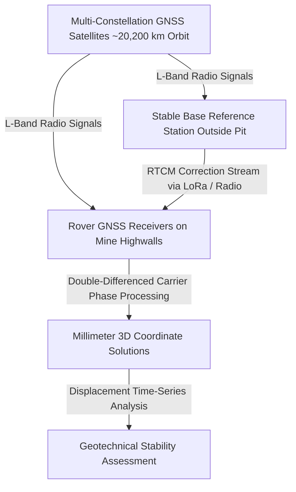
*Figure 1.1: High-level operational workflow of differential GNSS slope monitoring.*

### Difference Between GPS and GNSS
* **GPS (Global Positioning System):** The specific United States satellite navigation constellation (NAVSTAR) developed by the US Department of Defense.
* **GNSS:** The comprehensive global ecosystem comprising all operational international satellite constellations:
 1. **GPS (USA):** ~31 active satellites (L1, L2, L5 frequencies).
 2. **GLONASS (Russia):** ~24 satellites (G1, G2, G3 frequencies).
 3. **Galileo (European Union):** ~30 satellites (E1, E5a, E5b, E6 frequencies).
 4. **BeiDou (BDS, China):** ~35 satellites (B1, B2, B3 frequencies).
 5. **NavIC / IRNSS (India):** Regional Indian constellation (L5, S-band) optimized for the Indian subcontinent.

### Why is GNSS Considered a Geodetic Technique?
In mining geotechnical engineering, geodetic monitoring refers to techniques that measure absolute or relative geometric coordinates $(X, Y, Z)$ referenced directly to a global or local terrestrial reference frame (such as ITRF2020 or WGS84). Unlike remote sensing radars that measure 1D line-of-sight range changes, GNSS provides **unambiguous, direct 3D vector displacement components**.

---

## 2. Basic Working Principle

The end-to-end operational pipeline of GNSS slope monitoring progresses from satellite microwave reception to actionable hazard alerting:

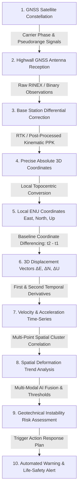
*Figure 2.1: Step-by-step GNSS slope monitoring and risk assessment pipeline.*

### Simple Language Explanation:
1. Satellites in space continuously broadcast exact time and orbit data.
2. A GNSS receiver anchored to an unstable highwall bench picks up these signals.
3. Because atmospheric delays and satellite clock errors affect accuracy, a second "Base Station" receiver on solid, unmoving ground outside the pit calculates real-time corrections.
4. Applying these corrections enables the system to calculate the exact position of the highwall sensor down to a few millimeters.
5. By comparing positions every minute, the software detects if the rock bench is shifting East, North, or sinking downward.

---

## 3. GNSS Coordinates and 3D Movement

### Global vs. Local Coordinate Systems
Raw GNSS calculations output coordinates in global geocentric Cartesian coordinates **$(X, Y, Z)$ (Earth-Centered, Earth-Fixed — ECEF)** or ellipsoidal coordinates **(Latitude $\varphi$, Longitude $\lambda$, Ellipsoidal Height $h$)** based on the WGS84 ellipsoid.

For open-pit mine engineering, ECEF coordinates are transformed into a **Local Topocentric Coordinate System (ENU — East, North, Up)** referenced to a fixed mine origin $(X_0, Y_0, Z_0)$:

$$\begin{bmatrix} \Delta E \\ \Delta N \\ \Delta U \end{bmatrix} = \mathbf{R} \cdot \begin{bmatrix} X - X_0 \\ Y - Y_0 \\ Z - Z_0 \end{bmatrix}$$

where $\mathbf{R}$ is the coordinate rotation matrix defined by the local latitude and longitude:

$$\mathbf{R} = \begin{bmatrix} -\sin\lambda & \cos\lambda & 0 \\ -\sin\varphi\cos\lambda & -\sin\varphi\sin\lambda & \cos\varphi \\ \cos\varphi\cos\lambda & \cos\varphi\sin\lambda & \sin\varphi \end{bmatrix}$$

```
 Local Up (U - Vertical Axis)
 
 Monitored GNSS Point (E, N, U)
 /
 / 
 / Local North (N)
 / /
 / /
 Local East (E)
 /
 /
```
*Figure 3.1: Local Topocentric East-North-Up (ENU) coordinate frame on a mine bench.*

* **East ($\Delta E$):** Horizontal lateral motion in the East-West direction.
* **North ($\Delta N$):** Horizontal lateral motion in the North-South direction.
* **Up ($\Delta U$):** Vertical motion (positive = heave/uplift, negative = subsidence/settlement).

---

## 4. How GNSS Detects Slope Movement

By recording ENU positions continuously over time, the system compares the current epoch $(E(t), N(t), U(t))$ against the initial baseline setup epoch $(E_0, N_0, U_0)$:

$$\Delta E(t) = E(t) - E_0, \quad \Delta N(t) = N(t) - N_0, \quad \Delta U(t) = U(t) - U_0$$

> **Important Data Disclaimer:** 
> *The following table represents **Synthetic / Illustrative Data** designed solely to explain 3D coordinate displacement calculations. It does not represent real measurements from any specific mine.*

### Illustrative Synthetic GNSS Coordinate Time Series

| Time Epoch | Elapsed Time ($t$, days) | East Position ($E$, m) | North Position ($N$, m) | Up Elevation ($U$, m) | $\Delta E$ (mm) | $\Delta N$ (mm) | $\Delta U$ (mm) | Total 3D Disp. ($D$, mm) |
| :---: | :---: | :---: | :---: | :---: | :---: | :---: | :---: | :---: |
| **$T_1$** | 0 | 1500.000 | 2500.000 | 320.000 | 0.0 | 0.0 | 0.0 | **0.00** |
| **$T_2$** | 5 | 1500.003 | 2500.002 | 319.999 | +3.0 | +2.0 | -1.0 | **3.74** |
| **$T_3$** | 10 | 1500.006 | 2500.004 | 319.998 | +6.0 | +4.0 | -2.0 | **7.48** |
| **$T_4$** | 15 | 1500.011 | 2500.008 | 319.995 | +11.0 | +8.0 | -5.0 | **14.50** |
| **$T_5$** | 20 | 1500.020 | 2500.014 | 319.991 | +20.0 | +14.0 | -9.0 | **26.02** |

---

## 5. 3D Displacement Calculations

The 3D movement of a monitored rock mass is fully described by its displacement vector $\Delta \mathbf{r}$:

$$\Delta \mathbf{r}(t) = \begin{pmatrix} \Delta E(t) \\ \Delta N(t) \\ \Delta U(t) \end{pmatrix}$$

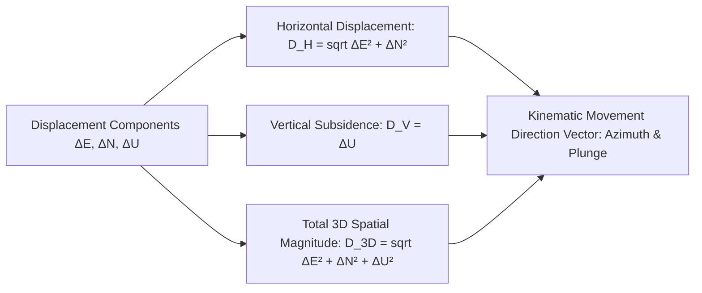
*Figure 5.1: Derivation of horizontal, vertical, and total 3D scalar displacement magnitudes.*

### Mathematical Formulations:
1. **Total 3D Spatial Displacement Magnitude ($D_{\text{3D}}$):**
 $$D_{\text{3D}}(t) = \sqrt{(\Delta E(t))^2 + (\Delta N(t))^2 + (\Delta U(t))^2}$$
2. **Horizontal Displacement Magnitude ($D_{\text{H}}$):**
 $$D_{\text{H}}(t) = \sqrt{(\Delta E(t))^2 + (\Delta N(t))^2}$$
3. **Horizontal Movement Azimuth ($\theta_{\text{azimuth}}$):**
 $$\theta_{\text{azimuth}} = \text{atan2}(\Delta E, \Delta N) \quad (\text{indicates sliding direction in degrees from True North})$$
4. **Dip / Plunge Angle of Motion ($\beta_{\text{plunge}}$):**
 $$\beta_{\text{plunge}} = \arctan\left(\frac{|\Delta U|}{D_{\text{H}}}\right) \quad (\text{identifies whether motion is toppling, planar sliding, or rotational})$$

---

## 6. GNSS Monitoring Setup in an Open-Pit Mine

A production-grade GNSS monitoring deployment comprises five key infrastructure blocks:

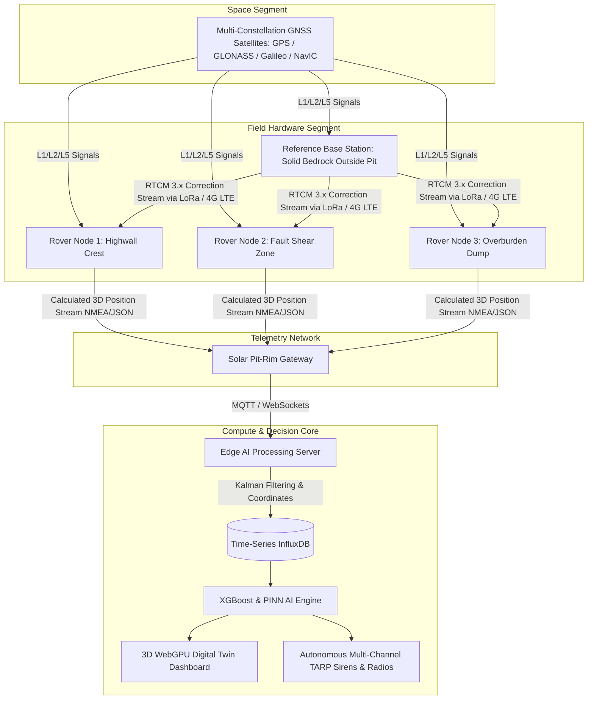
*Figure 6.1: End-to-end hardware, telemetry, and compute architecture of an open-pit GNSS monitoring system.*

---

## 7. Reference Stations and Differential GNSS (DGNSS)

### Why a Single Standalone Receiver is Insufficient
A standalone standard GNSS receiver without corrections has a typical positioning error of **$3.0\text{ to } 10.0\text{ meters}$** due to:
* Ionospheric signal refraction ($\Delta_{\text{iono}} \approx 2 - 10\text{ m}$).
* Tropospheric water vapor delay ($\Delta_{\text{tropo}} \approx 1 - 3\text{ m}$).
* Satellite orbit ephemeris errors ($\Delta_{\text{orbit}} \approx 0.5 - 2\text{ m}$).
* Satellite clock drift ($\Delta_{\text{clock}} \approx 1 - 2\text{ m}$).

### The Differential Concept
Because these atmospheric and orbital errors are spatially correlated over distances up to 20 km, two receivers located nearby experience nearly identical errors:

```text
Satellite Constellation
 
 
 
[Base Reference Station] [Rover Monitoring Point]
(Fixed on solid ground) (Installed on highwall)
 
Calculates Real-Time Error 
ΔError = Position_known - Position_obs 
 
 [RTCM Correction] 
 
 Eliminates 99% of atmospheric errors!
```

---

## 8. Real-Time Kinematic (RTK) GNSS

### How RTK Achieves Millimeter Accuracy
Standard GPS measures the **Pseudorange** (using the coarse C/A code, where one binary chip is ~300 meters long). **RTK (Real-Time Kinematic)** measures the **Carrier Phase** of the actual radio wave (where one full wavelength is only $\lambda \approx 19.0\text{ cm}$ for L1 frequency).

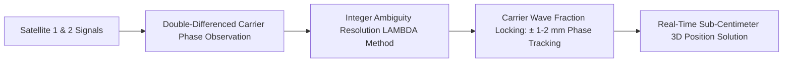
*Figure 8.1: RTK carrier-phase double-differencing and integer ambiguity resolution.*

### The Double-Difference Formulation:
$$\nabla\Delta \Phi_{AB}^{jk} = \nabla\Delta \rho_{AB}^{jk} + \lambda \nabla\Delta N_{AB}^{jk} + \nabla\Delta \epsilon$$

where:
* $\nabla\Delta \Phi_{AB}^{jk}$ = Double-differenced carrier phase between receivers $A, B$ and satellites $j, k$.
* $\nabla\Delta \rho_{AB}^{jk}$ = True geometric distance difference.
* $\nabla\Delta N_{AB}^{jk}$ = Integer cycle ambiguity (solved via the **LAMBDA algorithm**).
* $\nabla\Delta \epsilon$ = Residual multipath and hardware noise.

Solving the integer ambiguity converts the receiver into a millimeter-precision electronic gauge operating at **1 to 20 Hz update rates**.

---

## 9. Static vs. Continuous vs. Periodic GNSS Monitoring

| Parameter | Static GNSS Surveying | Continuous Real-Time Kinematic (RTK) | Periodic Automated GNSS |
| :--- | :--- | :--- | :--- |
| **Operational Mode** | Manual tripod setup logging raw data for 2–6 hours per epoch. | Permanent fixed receiver streaming coordinates continuously 24/7. | Automated solar receiver waking every 1–6 hours, solving RTK, and sleeping. |
| **Typical Precision** | **$\pm 2\text{ to } 5\text{ mm}$** (Post-Processed). | **$\pm 5\text{ to } 10\text{ mm}$** (Real-Time). | **$\pm 5\text{ to } 8\text{ mm}$** (RTK / PPK). |
| **Temporal Frequency** | Monthly or quarterly surveys. | **Continuous (1 Hz to 1 reading/min)**. | 4 to 24 readings per day. |
| **Power Consumption** | Manual battery charge. | High (Continuous solar + battery required). | **Ultra-Low** (Runs 2–5 years on lithium battery). |
| **Life-Safety Suitability**| Low (Post-analysis only). | **Maximum (Immediate early warning)**. | High for progressive secondary creep. |
| **Open-Cast Mine Role** | Regional lease boundary control pillars. | Critical active highwall crests above shovels. | Waste dumps and low-risk overburden piles. |

---

## 10. GNSS Kinematic Time-Series Analysis

Continuous GNSS monitoring produces individual component time-series curves that reveal the directional dynamics of slope deformation.

```mermaid
---
config:
 xyChart:
 width: 700
 height: 350
 themeVariables:
 xyChart:
 plotColorPalette: "#d9534f"
---
xychart-beta
 title "Illustrative Example: GNSS 3D Displacement Components vs Time (Synthetic Data)"
 x-axis "Elapsed Time (days)" [0, 5, 10, 15, 20]
 y-axis "Displacement (mm)" 0 --> 30
 line [0.0, 3.0, 6.0, 11.0, 20.0]
 line [0.0, 2.0, 4.0, 8.0, 14.0]
 line [0.0, 1.0, 2.0, 5.0, 9.0]
```
*Figure 10.1: Illustrative time-series curves showing East ($\Delta E$, red), North ($\Delta N$, orange), and Vertical ($|\Delta U|$, yellow) displacement.*

```mermaid
---
config:
 xyChart:
 width: 700
 height: 350
 themeVariables:
 xyChart:
 plotColorPalette: "#0275d8"
---
xychart-beta
 title "Illustrative Example: Total 3D Spatial Displacement (D_3D) vs Time (Synthetic Data)"
 x-axis "Elapsed Time (days)" [0, 5, 10, 15, 20]
 y-axis "Total 3D Displacement (mm)" 0 --> 30
 line [0.0, 3.74, 7.48, 14.50, 26.02]
```
*Figure 10.2: Illustrative total 3D scalar displacement surge.*

---

## 11. Velocity and Acceleration Analysis

### Formulations:
1. **Component Velocity ($v_E, v_N, v_U$):**
 $$v_E(t) = \frac{\Delta E(t_2) - \Delta E(t_1)}{t_2 - t_1}, \quad v_N(t) = \frac{\Delta N(t_2) - \Delta N(t_1)}{t_2 - t_1}, \quad v_U(t) = \frac{\Delta U(t_2) - \Delta U(t_1)}{t_2 - t_1}$$
2. **Total 3D Velocity Magnitude ($v_{\text{3D}}$):**
 $$v_{\text{3D}}(t) = \sqrt{v_E(t)^2 + v_N(t)^2 + v_U(t)^2}$$
3. **Acceleration Magnitude ($a_{\text{3D}}$):**
 $$a_{\text{3D}}(t) = \frac{v_{\text{3D}}(t_2) - v_{\text{3D}}(t_1)}{t_2 - t_1}$$

```mermaid
---
config:
 xyChart:
 width: 700
 height: 350
 themeVariables:
 xyChart:
 plotColorPalette: "#f0ad4e"
---
xychart-beta
 title "Illustrative Example: GNSS 3D Velocity Acceleration Surge (Synthetic Data)"
 x-axis "Elapsed Time (days)" [5, 10, 15, 20]
 y-axis "3D Velocity (mm/day)" 0.0 --> 2.5
 line [0.75, 0.75, 1.40, 2.30]
```
*Figure 11.1: Illustrative velocity curve demonstrating acceleration in tertiary creep.*

---

## 12. Detecting Abnormal Movement Regimes

```mermaid
flowchart LR
 RAW[Raw Real-Time GNSS Coordinates] --> KALMAN[Edge Adaptive Kalman Filter]
 KALMAN --> RES[Kinematic Residuals & Velocity Calculation]
 RES --> EVAL{Statistical Anomaly Evaluation}
 EVAL -->|Velocity <= 1.0 mm/day| NORM[[NORMAL / GREEN] Normal State: Background Creep]
 EVAL -->|1.0 < Velocity <= 5.0 mm/day| WATCH[[ADVISORY / YELLOW] Watch State: Secondary Creep]
 EVAL -->|Velocity > 5.0 mm/day OR a > 0| WARN[[CRITICAL / RED] Critical Anomaly: Tertiary Creep]
```
*Figure 12.1: Statistical anomaly detection workflow on GNSS coordinate streams.*

### Anomaly Comparison:
* **Normal Background Noise:** Coordinates fluctuate within sensor precision bounds ($\sigma \approx \pm 2\text{ mm}$ around a static mean).
* **True Slope Instability:** Coordinates exhibit a **statistically significant monotonic trend** across multiple consecutive epochs exceeding the $3\sigma$ confidence envelope.

---

## 13. Spatial Network of GNSS Monitoring Points

Rather than treating GNSS receivers as isolated instruments, open-pit mines deploy a spatial cluster of points across active benches:

```
 North Crest
 P1 P2
 \ /
 \ Fault /
 \ Zone /
 P3 P4
 
 Active Bench
 P5
```

### Illustrative Multi-Point Status Matrix

| Monitoring Point | Target Highwall Location | East Rate ($\text{mm/day}$) | North Rate ($\text{mm/day}$) | Vertical Rate ($\text{mm/day}$) | Total 3D Rate ($\text{mm/day}$) | Active Risk Status |
| :---: | :--- | :---: | :---: | :---: | :---: | :---: |
| **$P_1$** | North-East Stable Crest | +0.2 | +0.1 | -0.1 | 0.24 | [NORMAL / GREEN] **Low / Stable** |
| **$P_2$** | North-East Stable Crest | +0.3 | +0.2 | -0.2 | 0.41 | [NORMAL / GREEN] **Low / Stable** |
| **$P_3$** | Central Bench (Near Fault) | +4.2 | +3.1 | -2.8 | 5.92 | [WARNING / ORANGE] **High / Warning** |
| **$P_4$** | Central Bench (Active Shear) | +12.5 | +8.9 | -6.4 | 16.63 | [CRITICAL / RED] **Critical / Evacuate** |
| **$P_5$** | Lower Bench Toe | +1.8 | +1.2 | +0.8 | 2.31 | [ADVISORY / YELLOW] **Medium / Watch** |

---

## 14. Advantages of GNSS Slope Monitoring

* **Direct 3D Kinematics:** Delivers absolute East, North, and Up displacement components, eliminating 1D line-of-sight ambiguity.
* **All-Weather, 24/7 Continuity:** Radio waves operate unaffected by darkness, thick mining dust, rain, fog, and diesel smoke.
* **Continuous High-Frequency Logging:** Real-time RTK solutions stream at up to 1–10 Hz, catching rapid dynamic failure onsets.
* **Geodetic Ground-Truth Anchor:** Provides absolute spatial reference points to calibrate satellite InSAR and drone DEMs.

---

## 15. Limitations of GNSS in Open-Cast Mines

```mermaid
mindmap
 root((GNSS Mining Limitations))
 Spatial Point Sparsity
 Only monitors exact spots where masts are bolted
 Completely blind to rockfalls between stations
 Deep Pit Satellite Occlusion
 Steep 70° highwalls block 50% of sky constellation
 Poor Dilution of Precision DOP inside deep pits
 Multi-Path Reflection Errors
 Microwaves bounce off mineralized rock faces
 Creates false displacement noise of ±20 mm
 Operational & Blasting Hazards
 Masts shattered by blasting flyrock
 Heavy solar panels covered by coal / ore dust
 High Deployment Capex
 ₹1.5L - ₹4.0L per node
 Deploying 20 nodes costs ₹50 Lakh+
```
*Figure 15.1: Structural, geometric, and operational limitations of GNSS monitoring in open-cast mines.*

---

## 16. Comprehensive Comparison: GNSS vs. InSAR vs. GB-InSAR vs. SSR

| Feature / Dimension | GNSS Monitoring | Satellite InSAR | Ground-Based InSAR (GB-InSAR) | Slope Stability Radar (SSR) |
| :--- | :--- | :--- | :--- | :--- |
| **Primary Measurement** | **Direct 3D Vector** $(\Delta E, \Delta N, \Delta U)$ | 1D Line-of-Sight (LOS) Phase | 1D Line-of-Sight (LOS) Phase | 1D Line-of-Sight (LOS) Phase |
| **Spatial Coverage** | Discrete Installed Points | **Regional ($100+\text{ km}^2$)** | Wide Pit Sector (2D Heatmap) | Localized Target Bench Sector |
| **Sampling Frequency** | **Continuous (1 Hz to 1 min)** | Periodic (Every 6 to 12 days) | Every 2 to 10 minutes | **Every 1 to 5 minutes** |
| **Deep Pit Vulnerability**| Sky-view occlusion & multi-path | Radar shadowing & layover | Stationary base geometry | Line-of-sight shadowing |
| **Hardware Footprint** | Physical mast bolted on rock | **Zero On-Site Hardware** | Mobile trailer on stable base | Mobile diesel trailer |
| **Capital Expenditure** | ₹1.5L – ₹4.0L per point | Free (Sentinel) to $$ Commercial | **₹4.0 Cr – ₹10.0 Cr** | **₹3.5 Cr – ₹8.0 Cr** |
| **SIH Strategic Role** | High-precision 3D point ground truth | Macro regional stress prior | Spatial grid benchmark | Spatial velocity kinematics |

---

## 17. Open-Source GNSS Research Software Toolkits

To build our SIH25071 prototype, we evaluated verified open-source GNSS processing packages:

### Benchmarked Open-Source GNSS Frameworks

| Tool Name | Official URL / Organization | Programming Language | Core GNSS Capabilities | Supported Input / Output | SIH25071 Transferability | License |
| :--- | :--- | :--- | :--- | :--- | :--- | :--- |
| **[RTKLIB](https://github.com/tomojitakasu/RTKLIB)** | Tomoji Takasu / Open-Source | C, C++ | Standard open-source RTK, DGNSS, and PPP positioning engine. Supports multi-constellation (GPS, GLONASS, Galileo, BeiDou, NavIC). | RINEX, RTCM 3.x, NMEA, UBX binary | **Core Processing Engine:** Embeds directly into our edge gateway for real-time RTK coordinate solving. | BSD-2-Clause |
| **[GNSSTk](https://github.com/SGL-UT/gnsstk-apps)** | University of Texas / ARL:UT | C++, Python | Research library for GNSS processing, cycle-slip detection, atmospheric modeling, and coordinate transformation. | RINEX 2/3, SP3 ephemeris | Used for automated local ENU coordinate transformations and quality metrics. | LGPL-3.0 |
| **[pygnss / Georinex](https://github.com/geospace-code/georinex)** | Open Research Community | Python, NumPy, Xarray | Pythonic parser for RINEX observation and navigation files into pandas/xarray DataFrames. | RINEX 2.x / 3.x | **Directly used:** Rapid parsing of raw GNSS logs into machine learning time-series arrays. | MIT |
| **[BKG Ntrip Client (BNC)](https://igs.bkg.bund.de/ntrip/download)** | German Federal Agency (BKG) | C++ / Qt | Streams real-time RTCM correction data over the internet via NTRIP protocol. | RTCM 2/3, NTRIP | Enables cloud-based RTK corrections for distributed low-cost field nodes. | GPL-3.0 |
| **[GAMIT / GLOBK](http://geoweb.mit.edu/gg/)** | MIT / Scripps | Fortran, C | Scientific high-precision post-processing package for millimeter-level crustal and slope deformation networks. | RINEX, SINEX | Scientific benchmark for validating baseline post-processing accuracy. | Open Academic |

---

## 18. GNSS Data Formats in Open-Pit Monitoring

| Format Standard | Description | Typical Data Content | SIH25071 Implementation Role |
| :--- | :--- | :--- | :--- |
| **RINEX (Receiver Independent Exchange)** | Standard international ASCII format for raw satellite observations. | Carrier phase ($L_1, L_2$), pseudorange ($C_1, P_2$), Doppler, and SNR. | Stored in daily archive for post-processed kinematic (PPK) baseline audits. |
| **NMEA-0183** | Standard ASCII serial sentence protocol output by GNSS receivers. | `$GNGGA` (Latitude, Longitude, Height, Fix Quality, Satellite Count). | Parsed in real-time by edge Python scripts for instantaneous position streaming. |
| **RTCM SC-104 (v3.x)** | Compact binary protocol for streaming differential corrections. | Message Types 1004 (GPS L1/L2), 1012 (GLONASS), 1074–1084 (MSM). | Streamed from base station to rovers over wireless LoRa mesh links. |
| **GeoJSON / JSON** | Lightweight spatial data interchange format. | Standardized feature object: `{"type": "GNSS_Point", "ENU": [E, N, U], "vel": v}`. | Feeds the WebGPU 3D Digital Twin and AI risk classifier. |

---

## 19. Complete SIH GNSS Data Flow Pipeline

```mermaid
flowchart LR
 A[Low-Cost Multi-Band GNSS Node] -->|NMEA $GNGGA / RTCM| B[Edge LoRa Gateway]
 B -->|MQTT JSON Stream| C[Data Preprocessing & Kalman Filtering]
 C -->|ECEF to Local ENU Matrix| D[Local Metric Coordinates E, N, U]
 D -->|Coordinate Subtraction| E[Displacement Vectors ΔE, ΔN, ΔU]
 E -->|Temporal Rolling Derivatives| F[Velocity v & Acceleration a]
 F -->|Inter-Node Baseline Differencing| G[Relative Shear Strain ΔL_ij]
 G --> H[Multi-Modal Feature Synchronization Engine]
 H --> I[AI Risk Prediction & TARP Alerts]
```
*Figure 19.1: Edge-to-cloud data processing pipeline for GNSS sensor streams.*

---

## 20. GNSS + Satellite InSAR Data Fusion

GNSS and Satellite InSAR have complementary physical characteristics:

```
+---------------------------------------------------------------------------------------------------+
| THE GNSS + InSAR FUSION ADVANTAGE |
+---------------------------------------------------------------------------------------------------+
| [ SATELLITE InSAR ] + [ FIELD GNSS NODES ] = [ UNIFIED GEODETIC MESH ] |
| - Continuous Spatial Coverage - Continuous Temporal Stream (1 Hz)- 24/7 Total Highwall Safety|
| - 1D Line-of-Sight Vector - Direct 3D Coordinate Vector (ENU)- Multi-Vector Resolved |
| - Subject to Atmospheric Delay - Absolute Ground-Truth Anchor - Atmospheric Calibrated |
+---------------------------------------------------------------------------------------------------+
```

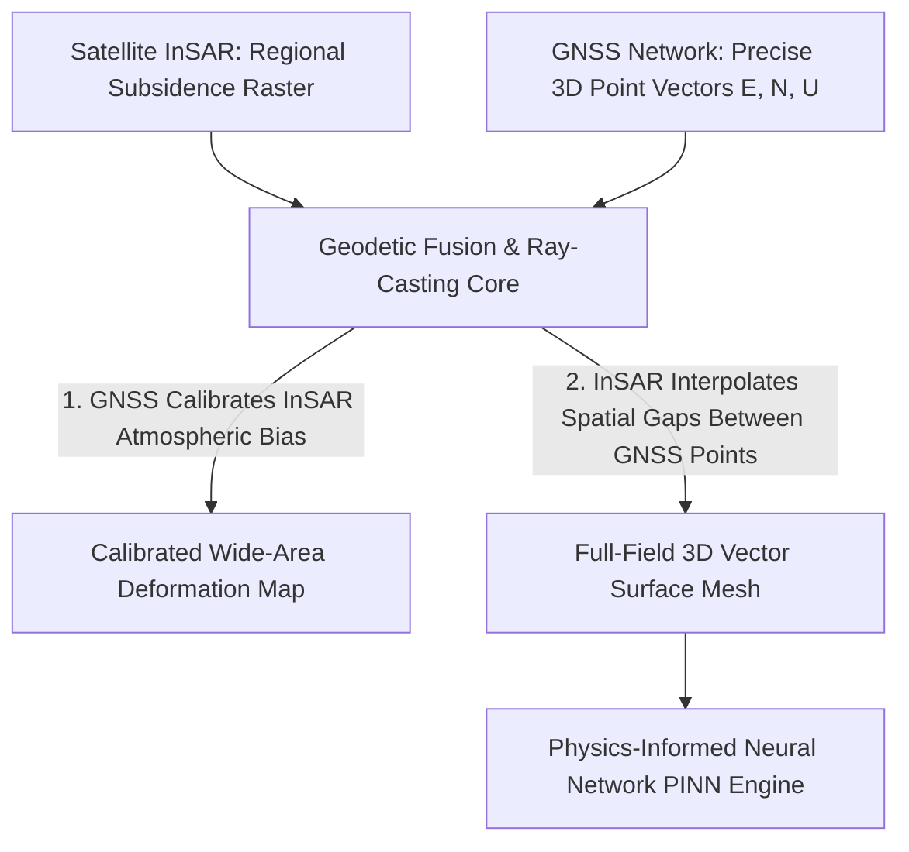
*Figure 20.1: Geodetic fusion workflow combining spaceborne InSAR and terrestrial GNSS.*

---

## 21. Multi-Sensor Data Fusion Architecture

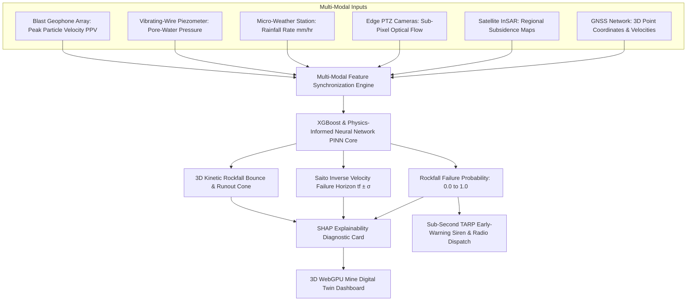
*Figure 21.1: Master multi-sensor data fusion architecture for SIH25071.*

---

## 22. GNSS Feature Vector for Machine Learning

| Feature Name | Symbol | Mathematical Definition | Unit | SIH25071 Geotechnical Role |
| :--- | :--- | :--- | :--- | :--- |
| **East Displacement** | $\Delta E(t)$ | $E(t) - E_0$ | $\text{mm}$ | Lateral horizontal shear component. |
| **North Displacement** | $\Delta N(t)$ | $N(t) - N_0$ | $\text{mm}$ | Lateral horizontal shear component. |
| **Vertical Subsidence** | $\Delta U(t)$ | $U(t) - U_0$ | $\text{mm}$ | Direct crest settlement or toe bulging. |
| **Total 3D Displacement** | $D_{\text{3D}}(t)$| $\sqrt{\Delta E^2 + \Delta N^2 + \Delta U^2}$ | $\text{mm}$ | Overall magnitude of rock mass movement. |
| **3D Velocity** | $v_{\text{3D}}(t)$ | $d(D_{\text{3D}})/dt$ | $\text{mm/day}$ | Primary kinematic early-warning feature. |
| **3D Acceleration** | $a_{\text{3D}}(t)$ | $dv_{\text{3D}}/dt$ | $\text{mm/day}^2$| Detects transition into accelerating tertiary creep. |
| **Movement Direction** | $\theta_{\text{azimuth}}$| $\text{atan2}(\Delta E, \Delta N)$ | $\text{degrees}$ | Validates failure direction against geological joint dip. |
| **Inter-Point Baseline Strain**| $\varepsilon_{ij}$ | $\frac{L_{ij}(t) - L_{ij}(0)}{L_{ij}(0)}$ | $\text{mm/m}$ | Detects differential tension crack opening between nodes. |

---

## 23. Relative Movement Between GNSS Points (Inter-Node Strain)

Monitoring the **relative distance change between adjacent GNSS nodes ($P_i$ and $P_j$)** is far more diagnostic than monitoring single points in isolation:

$$L_{ij}(t) = \sqrt{(E_j(t) - E_i(t))^2 + (N_j(t) - N_i(t))^2 + (U_j(t) - U_i(t))^2}$$

$$\Delta L_{ij}(t) = L_{ij}(t) - L_{ij}(0)$$

```
Node P1 (Stable Crest) Baseline L_12 Node P2 (Moving Block)
 [Tension Crack Dilates]
 ΔL_12 increases rapidly Shear Strain Warning!
```

* **Dilation ($\Delta L_{ij} > 0$):** Indicates opening of tension cracks between nodes.
* **Compression ($\Delta L_{ij} < 0$):** Indicates toe bulging or buckling at the base of the slope.

---

## 24. AI-Based GNSS Anomaly Detection

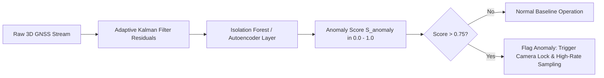
*Figure 24.1: Unsupervised anomaly detection workflow on GNSS coordinate residuals.*

### Evaluated Techniques:
1. **Kalman Filter Innovation Residuals:** Measures deviation of real-time position from the physical kinematic state prediction model.
2. **Isolation Forests:** Detects multi-dimensional $(\Delta E, \Delta N, \Delta U, v)$ outliers in microsecond inference time.
3. **Autoencoders:** Neural network trained on stable diurnal temperature-expansion cycles; reconstruction error spikes during genuine structural slope slips.

---

## 25. Explainable AI (XAI) Diagnostic Breakdown

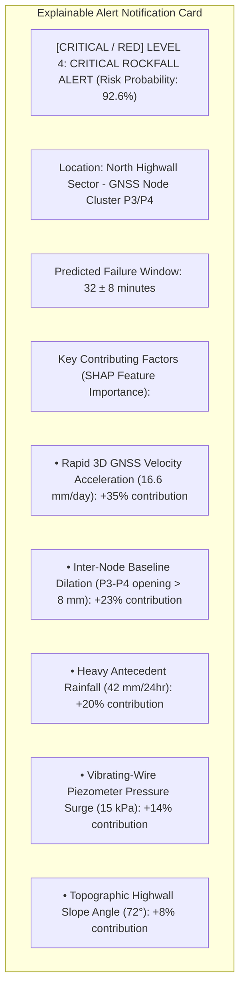
*Figure 25.1: Conceptual SHAP explainable alert diagnostic card for GNSS alerts.*

---

## 26. Proposed SIH Decision-Support Dashboard

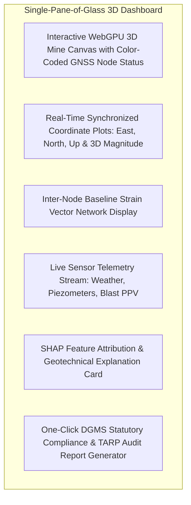
*Figure 26.1: Functional architecture of the unified 3D decision-support dashboard.*

---

## 27. GNSS Early-Warning Logic & TARP Execution

```mermaid
flowchart TD
 A[Raw GNSS Position Solution] --> B[Coordinate Transformation to ENU]
 B --> C[3D Displacement & Velocity Calculation]
 C --> D{Velocity Threshold Exceeded?}

 D -->|v < 1.0 mm/day| T1[[NORMAL / GREEN] TARP Level 1: Normal Shift Logging]
 D -->|1.0 <= v < 5.0 mm/day| T2[[ADVISORY / YELLOW] TARP Level 2: Advisory to Geotechnical Officer]
 D -->|5.0 <= v < 20.0 mm/day| T3[[WARNING / ORANGE] TARP Level 3: Warning - Machinery Relocation]
 D -->|v >= 20.0 mm/day OR tf < 30 min| T4[[CRITICAL / RED] TARP Level 4: CRITICAL EMERGENCY DISPATCH]

 T4 -->|Sub-Second Trigger <1.0s| ACT1[Sound 120 dB Pit Sirens]
 T4 -->|Sub-Second Trigger <1.0s| ACT2[Synthesized VHF Walkie-Talkie Broadcast]
 T4 -->|Sub-Second Trigger <1.0s| ACT3[SMS / WhatsApp Push to All Personnel]
```
*Figure 27.1: Automated TARP escalation logic based on GNSS kinematic velocity.*

---

## 28. Research Gap Analysis

```
+---------------------------------------------------------------------------------------------------+
| BRIDGING THE RESEARCH GAP |
+---------------------------------------------------------------------------------------------------+
| [ STANDALONE GNSS LIMITATION ] High precision, but discrete point blindness in gaps. |
| [ REMOTE RADAR / InSAR LIMITATION ] Full coverage, but 1D line-of-sight & weather noise. |
| [ PROPOSED SIH25071 INNOVATION ] Fuses low-cost LoRa RTK GNSS point anchors with |
| Edge Computer Vision & InSAR, providing full-field 3D |
| kinematics with zero spatial blind spots! |
+---------------------------------------------------------------------------------------------------+
```

---

## 29. Concepts Adopted from GNSS for SIH25071

| GNSS Concept | Technical Mechanism | Proposed SIH25071 Implementation |
| :--- | :--- | :--- |
| **True 3D Vector Kinematics** | Resolving East, North, and Up displacement components. | Ingests 3D vectors as core features in the XGBoost and PINN predictive engines. |
| **Inter-Node Baseline Strain** | Calculating relative distance change between station pairs. | Implements spatial graph neural network (GNN) edges tracking highwall shear dilation. |
| **Carrier-Phase Kinematics** | RTK double-differencing for millimeter resolution. | Uses low-cost multi-band GNSS modules (u-blox ZED-F9P, ~$150) connected via wireless LoRa. |
| **Absolute Geodetic Anchoring**| Fixed global coordinate reference frame (WGS84). | Georeferences the 3D Digital Twin, camera ray-casting, and drone point clouds to global UTM. |

---

## 30. Benchmark: Traditional GNSS vs. Proposed SIH Platform

| Feature / Dimension | Traditional GNSS Monitoring | Proposed SIH25071 Multi-Modal Platform |
| :--- | :--- | :--- |
| **Spatial Coverage** | Discrete Installed Points Only | **Hybrid:** GNSS Points + Full-Field Edge Vision + Satellite InSAR |
| **Spatial Gaps** | Completely blind between masts | **Interpolated** via sub-pixel optical flow and 3D DEM ray-casting |
| **Environmental Ingestion** | External standalone logs | **Synchronized real-time rainfall rate ($mm/hr$) & pore pressure** |
| **Predictive AI Engine** | Manual threshold alarms | **Physics-Informed Neural Network + Saito Inverse Velocity $t_f$** |
| **Explainability** | Coordinate plots only | **SHAP feature attribution card** explaining geotechnical drivers |
| **Hardware Cost** | ₹1.5L – ₹4.0L per node (Expensive) | **₹15,000 – ₹25,000 per low-cost LoRa RTK node (85% cheaper)** |
| **Emergency Alerting** | Email / SMS notifications | **Autonomous Sub-Second Multi-Channel Dispatch (Sirens, Radio, SMS)**|

---

## 31. Final Proposed System Architecture

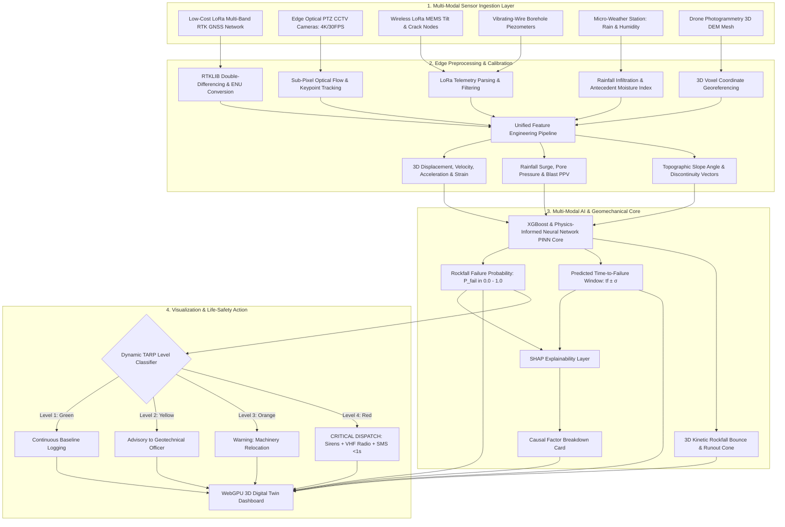
*Figure 31.1: Master architecture of the proposed AI-based rockfall prediction and early-warning platform.*

---

## 32. Summary of Visualizations Included

1. **Figure 1.1:** Operational workflow of differential GNSS slope monitoring (Mermaid).
2. **Figure 2.1:** Detailed step-by-step GNSS processing and risk assessment pipeline (Mermaid).
3. **Figure 3.1:** Local Topocentric East-North-Up (ENU) coordinate frame (ASCII).
4. **Figure 5.1:** Derivation of horizontal, vertical, and total 3D scalar displacement magnitudes (Mermaid).
5. **Figure 6.1:** Hardware, telemetry, and compute architecture of an open-pit GNSS monitoring system (Mermaid).
6. **Figure 8.1:** RTK carrier-phase double-differencing workflow (Mermaid).
7. **Figure 10.1:** GNSS 3D displacement components vs. time graph (Mermaid xychart — synthetic data).
8. **Figure 10.2:** Total 3D spatial displacement ($D_{\text{3D}}$) vs. time graph (Mermaid xychart — synthetic data).
9. **Figure 11.1:** GNSS 3D velocity acceleration surge vs. time graph (Mermaid xychart — synthetic data).
10. **Figure 12.1:** Statistical anomaly detection workflow on GNSS coordinate streams (Mermaid).
11. **Section 13:** Spatial network topology diagram ($P_1$ to $P_5$).
12. **Figure 15.1:** GNSS limitations mindmap (Mermaid).
13. **Figure 19.1:** Edge-to-cloud GNSS data processing pipeline (Mermaid).
14. **Figure 20.1:** Geodetic fusion workflow combining spaceborne InSAR and terrestrial GNSS (Mermaid).
15. **Figure 21.1:** Master multi-sensor data fusion architecture (Mermaid).
16. **Figure 24.1:** Unsupervised anomaly detection workflow on GNSS residuals (Mermaid).
17. **Figure 25.1:** SHAP explainable alert diagnostic card (Mermaid).
18. **Figure 26.1:** Unified 3D decision-support dashboard architecture (Mermaid).
19. **Figure 27.1:** Automated TARP escalation logic based on GNSS kinematic velocity (Mermaid).
20. **Figure 31.1:** Master system architecture flowchart (Mermaid).

---

## 33. Conclusion

GNSS monitoring provides an essential geodetic foundation for open-pit slope stability, delivering **direct 3D vector displacement components $(\Delta E, \Delta N, \Delta U)$, millimeter-level carrier-phase precision, and all-weather 24/7 continuous operation**.

However, standalone GNSS is constrained by **discrete point-based coverage, deep pit satellite occlusion, and high installation costs**.

Our **SIH25071 platform** does not deploy GNSS in isolation. Instead, we use **low-cost RTK GNSS nodes as absolute 3D geodetic anchors and fuse them with full-field edge computer vision, satellite InSAR, and physics-informed AI**. This overcomes the spatial limitations of point sensors, delivering comprehensive, sub-second rockfall prediction and automated life-safety protection for the Ministry of Mines.

---

## 34. References & Verified Open-Source Repositories

### Research Papers & Official Publications:
1. **Wang, G.** (2013). *Millimeter-accuracy GPS monitoring of active landslides: system design and results*. Journal of Geodesy, 87(1), pp. 1–16. [DOI: 10.1007/s00190-012-0574-8](https://doi.org/10.1007/s00190-012-0574-8) — *Demonstrates high-precision continuous GPS kinematic processing for landslide displacement tracking.*
2. **Teunissen, P. J. G.** (1995). *The least-squares ambiguity decorrelation adjustment: a method for fast GPS integer ambiguity estimation (LAMBDA)*. Journal of Geodesy, 70(1–2), pp. 65–82. [DOI: 10.1007/BF00863419](https://doi.org/10.1007/BF00863419) — *Foundational paper establishing the LAMBDA method for carrier-phase integer ambiguity resolution in RTK.*
3. **Hoffmann-Wellenhof, B., Lichtenegger, H., & Wasle, E.** (2008). *GNSS – Global Navigation Satellite Systems: GPS, GLONASS, Galileo, and more*. Springer-Verlag Wien. [DOI: 10.1007/978-3-211-73017-1](https://doi.org/10.1007/978-3-211-73017-1) — *Comprehensive geodetic reference textbook on multi-constellation GNSS signal theory.*
4. **Benoit, L., et al.** (2015). *A low-cost GPS network for real-time landslide monitoring*. Journal of Sensors, 2015, Article ID 438024. [DOI: 10.1155/2015/438024](https://doi.org/10.1155/2015/438024) — *Validates low-cost wireless GNSS mesh networks for automated slope hazard monitoring.*
5. **Directorate General of Mines Safety (DGMS).** (2020). *DGMS (Tech) Circular No. 02 of 2020: Standard Operating Procedures for scientific slope stability monitoring in open-cast mines*. Ministry of Labour & Employment, Government of India.
6. **Lundberg, S. M., & Lee, S.-I.** (2017). *A unified approach to interpreting model predictions*. Advances in Neural Information Processing Systems (NeurIPS 2017), 30, pp. 4765–4774.

### Verified Open-Source Frameworks & Repositories:
1. **RTKLIB (Open Source Program Package for GNSS Positioning):** [https://github.com/tomojitakasu/RTKLIB](https://github.com/tomojitakasu/RTKLIB) — *Standard open-source C/C++ engine for RTK, DGNSS, and PPP positioning.*
2. **GNSSTk (GNSS Toolkit by University of Texas ARL:UT):** [https://github.com/SGL-UT/gnsstk-apps](https://github.com/SGL-UT/gnsstk-apps) — *C++ research suite for GNSS processing and coordinate transformations.*
3. **GeoRinex (Python RINEX 2/3 Parser):** [https://github.com/geospace-code/georinex](https://github.com/geospace-code/georinex) — *High-throughput Python parser for GNSS observation data into pandas DataFrames.*
4. **BKG Ntrip Client (BNC):** [https://igs.bkg.bund.de/ntrip/download](https://igs.bkg.bund.de/ntrip/download) — *Real-time RTCM data streaming tool over NTRIP protocol.*
